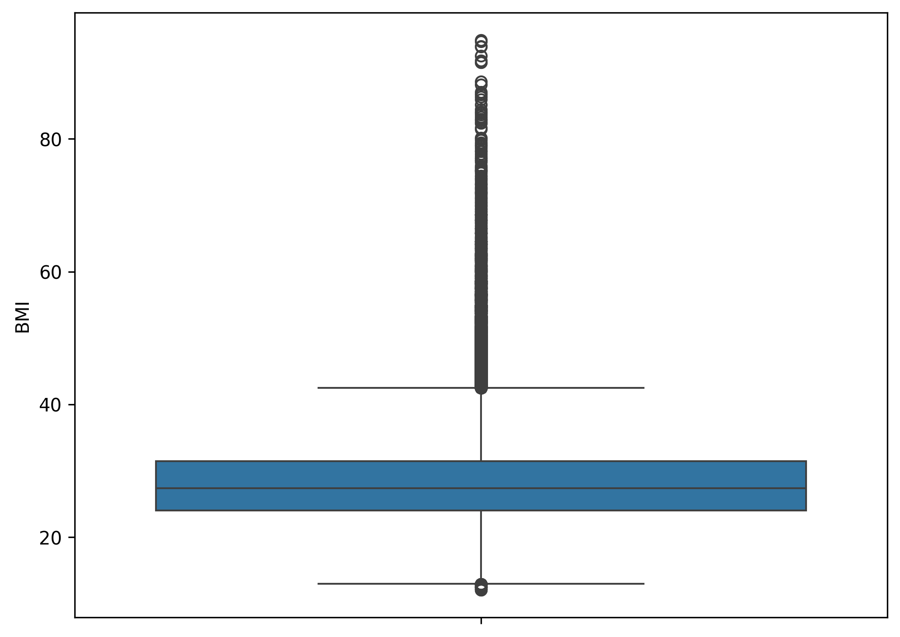
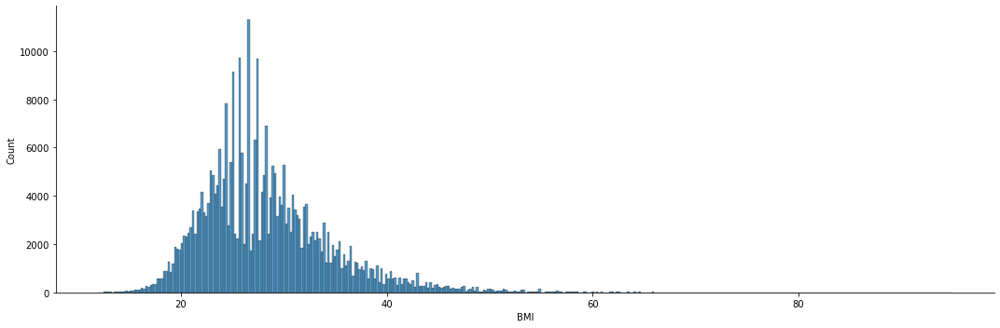
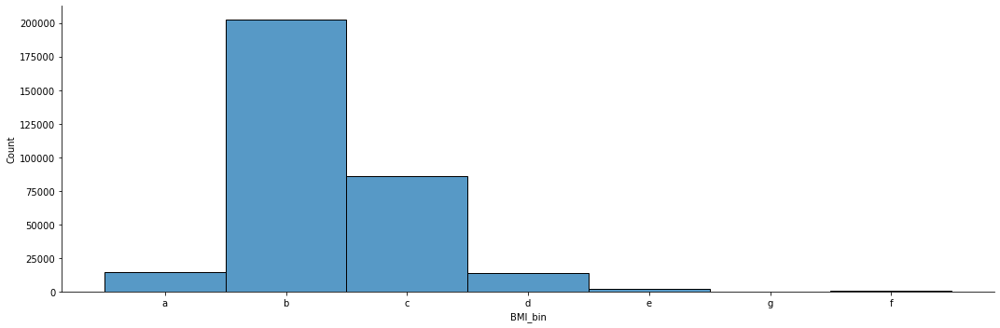
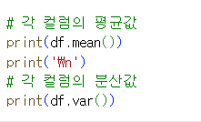
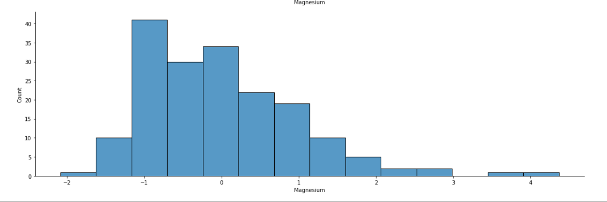
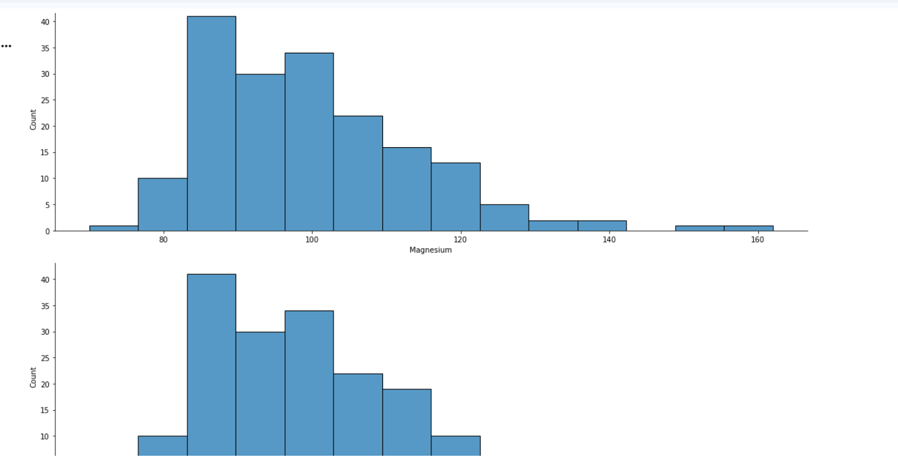

# 통계학 6주차 정규과제

📌통계학 정규과제는 매주 정해진 분량의 『*데이터 분석가가 반드시 알아야 할 모든 것*』 을 읽고 학습하는 것입니다. 이번 주는 아래의 **Statistics_6th_TIL**에 나열된 분량을 읽고 `학습 목표`에 맞게 공부하시면 됩니다.

아래의 문제를 풀어보며 학습 내용을 점검하세요. 문제를 해결하는 과정에서 개념을 스스로 정리하고, 필요한 경우 추가자료와 교재를 다시 참고하여 보완하는 것이 좋습니다.

6주차는 `2부-데이터 분석 준비하기`를 읽고 새롭게 배운 내용을 정리해주시면 됩니다


## Statistics_6th_TIL

### 2부. 데이터 분석 준비하기

### 11. 데이터 전처리와 파생변수 생성

<!-- 11. 데이터 전처리와 파생변수 생성에서 11.1 결측값 처리부터 11.4 데이터 표준화와 정규화 스케일링 파트까지 진행해주시면 됩니다. -->

## Study ScheduleStudy Schedule

| 주차  | 공부 범위     | 완료 여부 |
| ----- | ------------- | --------- |
| 1주차 | 1부 p.2~46    | ✅         |
| 2주차 | 1부 p.47~81   | ✅         |
| 3주차 | 2부 p.82~120  | ✅         |
| 4주차 | 2부 p.121~167 | ✅         |
| 5주차 | 2부 p.168~202 | ✅         |
| 6주차 | 2부 p.203~250 | ✅         |
| 7주차 | 2부 p.251~299 | 🍽️         |

> 과제가 많이 남지 않았습니다. 조금만 더 화이팅해주세요!

<!-- 여기까진 그대로 둬 주세요-->


---

# 1️⃣ 개념 정리 

## 11.데이터 전처리와 파생변수 생성

```
✅ 학습 목표 :
* 결측값과 이상치를 식별하고 적절한 방법으로 처리할 수 있다.
* 데이터 변환과 가공 기법을 학습하고 활용할 수 있다.
* 모델 성능 향상을 위한 파생 변수를 생성하고 활용할 수 있다.
```

### 11.1. 결측값 처리

<!-- 새롭게 배운 내용을 자유롭게 정리해주세요. -->
- 결측치는 발생하는 특성에 따라 세 가지 종류로 분류된다. 
    * 완전 무작위 결측(MCAR: missing completely as random): 순수하게 결측값이 무작위로 발생한 경우 -> 데이터를 제거해도 편향이 거의 발생되지 않음 
    * 무작위 결측(MAR: missing at random): 다른 변수의 특성에 의해 변수의 결측치가 체계적으로 발생한 경우
    * 비무작위 결측(NMAR: missing at not random): 결측값들이 해당 변수 자체의 특성을 갖고 있는 경우 
- 가장 간단한 결측값 처리 방법 결측값이 심하게 많은 변수를 제거하거나 결측값이 포함된 행을 제외하고 데이터 분석을 하는 표본 제거 방법을 사용
    (전체 데이터에서 결측값 비율으 10% 미만일 경우)
- 대부분의 결측치 처리는 연속형 변수에서 수행
    * 평균 대치법(Mean Imputation): 결측값을 제외한 온전한 값들의 평균을 구한 다음, 그 평균 값을 결측치 값들에 대치하는 것 
        장점: 사용하기 간단하고 결측 표본 제거 방법의 단점을 어느 정도 보완
        단점: 관측된 데이터의 평균을 사용하기 때문에 통계량의 표준오차가 왜곡되어 축소되어 나타나고 p=value가 부정확
        => 무작위 결측에서만
    * 보간법(interpolation): 데이터가 시계열적 특성 -  전 시점 혹은 다음 시점의 값으로 대치하거나 전 시점과 다음 시점의 평균 값으로 대치
        시점 인덱스의 간격이 불규칙하거나 결측값이 두 번 이상 연달아 있을 때는 선형적인 수치값을 계산하는 보간법 사용
        해당 변수와 다른 변수 사이의 관계성을 고려하여 결측값을 계산하면 보다 합리적으로 결측값 처리 가능 
    * 회귀 대치법(regression imputation): 추정하고자 하는 결측값을 가진 변수를 종속변수로 하고, 나머지 변수를 독립 변수로 하여 추정한 회귀식을 통해 결측값을 대치하는 것 
        단점: 변수의 분산을 과소 추정하는 문제
        => 확률적 회귀대치법(stochastic regression imputation): 인위적으로 회귀식에 확률 오차항을 추가하는 확률적 회귀 대치법
    * 다중 대치법(multiple imputation): 단순대치를 여러번 수행하여 n개의 가상적 데이터를 생성하여 이들의 평균으로 결측값을 대치하는 방법
        - 대치단계
        - 분석단계
        - 결합단계 


### 11.2. 이상치 처리

<!-- 새롭게 배운 내용을 자유롭게 정리해주세요. -->
- 이상치(outlier): 일부 관측치의 값이 전체 데이터의 범위에서 크게 벗어난 아주 작거나 큰 극단적인 값을 갖는 것
    * 전체 데이터의 양이 많을수록 튀는 값이 통계값에 미치는 영향력이 줄어들어 이상치 제거의 필요성이 낮아짐
    * 극단적이 값은 데이터 분석 모델의 예측력을 약화시키는 주요 원인이 됨 
    * 평균(중위수)으로부터 +-n 표준편차 이상 떨어져 있는 값(보통 n=3)
- 이상치 해결 방법: 
    * 관측값 변경(value modification): 하한 값과 상한 값을 결정한 후 하한 값보다 작으면 하한 값으로 대체하고 상한 값보다 크면 상한 값으로 대체
    * 가중치 조정(weight modification): 이상치의 영향을 감소시키는 가중치를 줌
    * 평균은 이상치에 통계량이 민감하게 변하기 때문에, 이상치에 보다 강건한 중위수와 중위수 절대 편차(MAD: median abdolute deviation)를 사용하는 것이 효과적


### 11.3. 변수 구간화

<!-- 새롭게 배운 내용을 자유롭게 정리해주세요. -->
- 변수 구간화(Binning): 데이터 분석의 성능을 향상시키기 위해 혹은 해석의 편리성을 위해 이산형 변수를 범주형 변수로 변환
    * 이산형 변수를 범주형 변수로 비즈니스적 상황에 맞도록 변환시킴으로써 데이터의 해석이나 예측, 분류 모델을 의도에 맞도록 유도할 수 있는 것
- 평활화(smoothing): 단순한 이산 값으로 변환시키는 기법 - 변수의 값을 일정한 폭이나 빈도로 구간을 나누어 값을 변환 
    * WOE: 변수값이 효과적으로 구간화 됐는지 측정 


### 11.4. 데이터 표준화와 정규화 스케일링

<!-- 새롭게 배운 내용을 자유롭게 정리해주세요. -->
- 독립 변수들이 서로 단위가 다르거나 편차가 심할 때 값의 스케일을 일정한 수준으로 변환시켜주는 표준화(standardization)와 정규화(normalization) 스케일링 진행
- 표준화: 각 관측치의 값이 전체 평균을 기준으로 어느 정도 떨어져 있는지 나타낼 때 사용
- 정규화: 데이터의 범위를 0부터 1까지로 변환하여 데이터 분포를 조정하는 방법 - 전체 데이터 중에서 해당 값이 어떤 위치에 있는지 파악하는 데 유용
- 기본 표준화, 정규화 방식은 이상치에 민감하다는 단점을 보완한 스케일링 기법인 RobustScaler도 많이 쓰임: Q2를 0으로 잡고 Q1과 Q3 사분위수와의 IQR차이 = 1
    => 이상치의 영향력을 최소화하여 일반적으로 표준화, 정규화보다 성능이 우수


<br>
<br>

---

# 2️⃣ 확인 과제

> **교재에 있는 실습 파트를 직접 따라 해보세요. 실습을 완료한 뒤, 결과화면(캡처 또는 코드 결과)을 첨부하여 인증해 주세요.**
>
> **단순 이론 암기보다, 직접 손으로 따라해보면서 실습해 보는 것이 가장 확실한 학습 방법입니다.**
>
> > **인증 예시 : 통계 프로그램 결과, 시각화 이미지 캡처 등**

11.1 결측치 처리 실습

- 결측치를 시각적으로 확인할 수 있음
- info() 함수를 결측치 값이 아닌 수를 나타내기때문에 정확한 결측값 확인이 어렵다 -> isnull().sum()함수 활용

- 결측값의 함수를 제거할 때는 dropna()함수 사용
- how='all' -> 모든 칼럼이 결측값인 행을 제외할 때
- how='any -> 한 컬럼이라도 결측값인 행을 제외할 때 


11.2 이상치 처리 실습



11.3 변수 구간화


- 20부터 10 단위로 70까지 구간 설정 + 70 이상부터는 하나의 범주 

- cut()함수: 간단하게 구간화 수행 가능

- qcut(): 구간별로 포함되는 관측치의 수가 유사한 구간화를 적용 - 나누고자 하는 범주의 수와 각 범주의 명칭만 설정해 주면 자동으로 구간화가 적용

11.4 데이터 표준화와 정규화 스케일링 실습

- .mean(): 평균값
- .var(): 분산값

- StandardScaler(): 표준화된 값으로 변환!



~~~
인증 이미지가 없으면 과제 수행으로 인정되지 않습니다.
~~~


### 🎉 수고하셨습니다.
