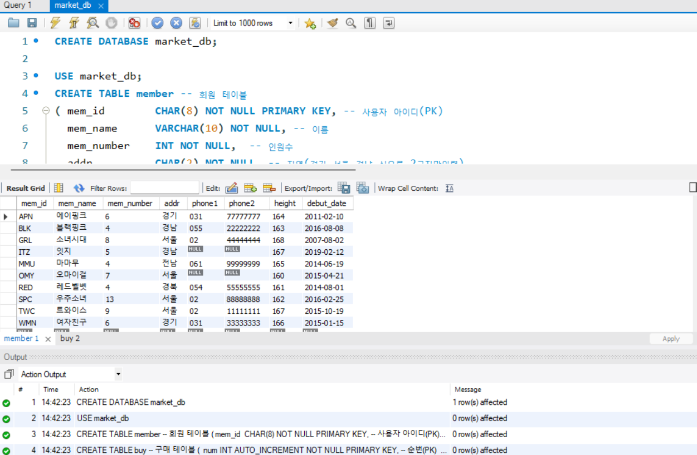
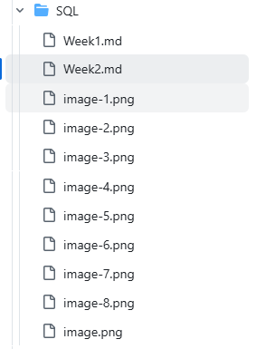
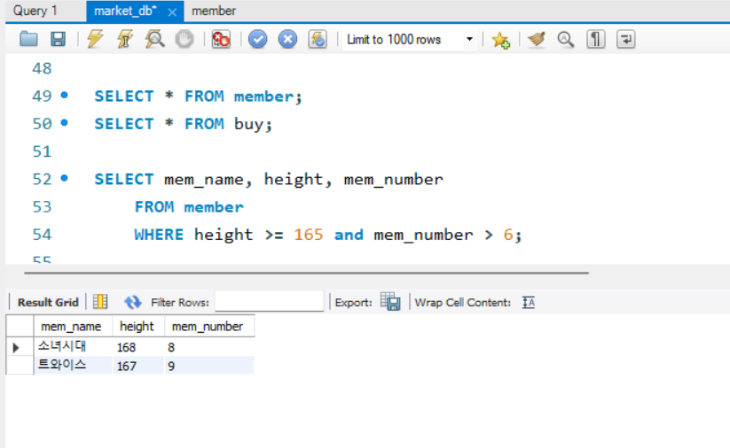
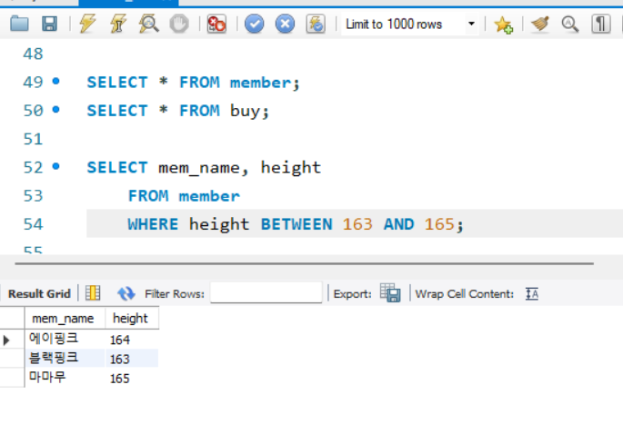
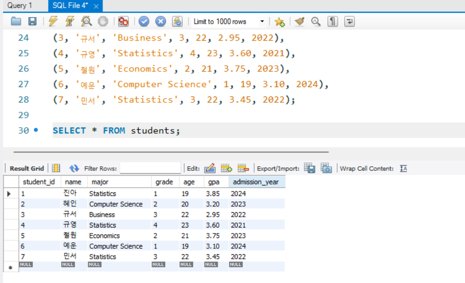
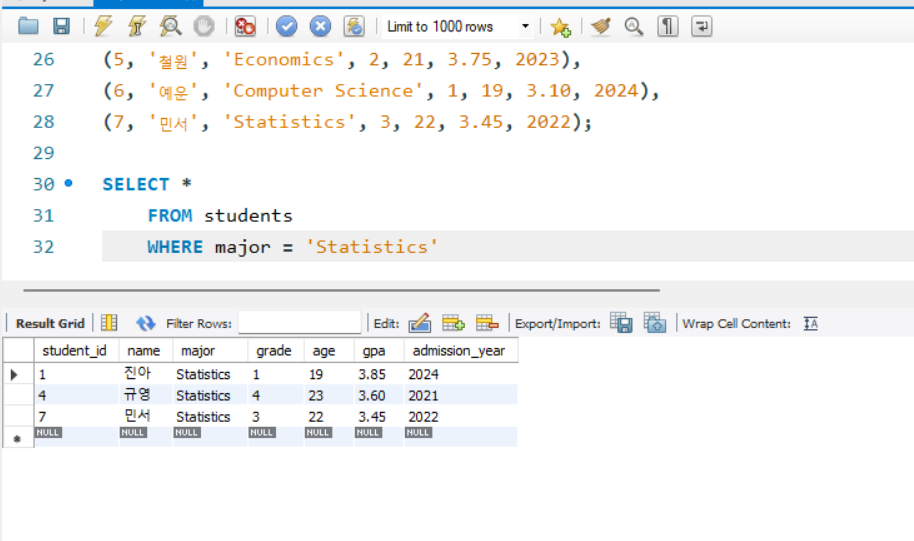
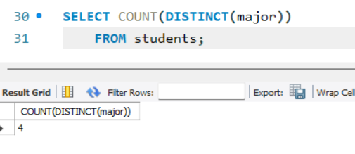
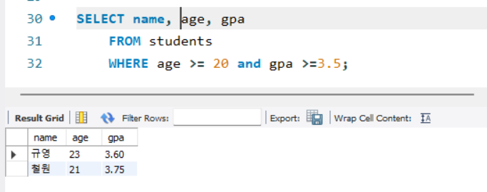
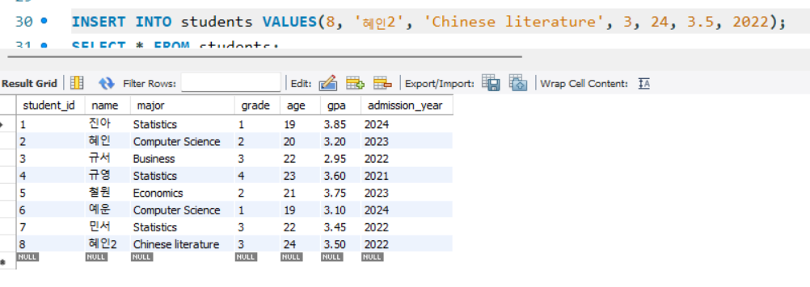

# SQL_ADVANCED 2주차 정규 과제 

📌SQL_ADVANCED 정규과제는 매주 정해진 분량의 『*혼자 공부하는 SQL*』 을 읽고 학습하는 것입니다. 이번주는 아래의 **SQL_ADVANCED_2nd_TIL**에 나열된 분량을 읽고 공부하시면 됩니다.

아래의 문제를 풀어보며 학습 내용을 점검하세요. 문제를 해결하는 과정에서 개념을 스스로 정리하고, 필요한 경우 제시된 강의를 참고하여 보완하는 것이 좋습니다.

<!-- 강의 링크는 아래와 같습니다.
https://www.youtube.com/watch?v=_JURyg_KzHE&list=PLVsNizTWUw7GCfy5RH27cQL5MeKYnl8Pm&index=7
https://www.youtube.com/watch?v=6qkPy7RfLqQ&list=PLVsNizTWUw7GCfy5RH27cQL5MeKYnl8Pm&index=8
https://www.youtube.com/watch?v=WWAFAm9op2U&list=PLVsNizTWUw7GCfy5RH27cQL5MeKYnl8Pm&index=9
-->

**교재 실습 예제 파일은 07_SQL_ADVANCED_Template 레포지토리의 src 폴더에 업로드되어 있습니다. market_db 파일도 해당 폴더에 함께 포함되어 있으니 참고하시기 바랍니다.**

**👀(수행 인증샷은 필수입니다.)** 

## SQL_ADVANCED_2nd_TIL

### 3장 SQL 기본 문법
#### 01. 기본 중에 기본 SELECT ~ FROM ~ WHERE
#### 02. 좀 더 깊게 알아보는 SELECT문
#### 03. 데이터 변경을 위한 SQL문


## Study Schedule

| 주차  | 공부 범위     | 완료 여부 |
| ----- | ------------- | --------- |
| 1주차 | p.24~99    | ✅         |
| 2주차 | p.102~155   | ✅         |
| 3주차 | p.158~213  | 🍽️         |
| 4주차 | p.216~271 | 🍽️         |
| 5주차 | p.274~327 | 🍽️         |
| 6주차 | p.330~369 | 🍽️         |
| 7주차 | p.372~407 | 🍽️         |


<br>

<!-- 여기까진 그대로 둬 주세요-->

---

# 1️⃣ 학습 내용 정리

## 1. 기본 중에 기본 SELECT ~ FROM ~ WHERE

<!-- 기본적인 SQL 문법에 관해 배우게 된 점을 적어주세요. -->
- SELECT: 구축이 완료된 테이블에서 데이터를 추출하는 기능
    - 가장 기본 형식은 SELECT ~ FROM ~ WHERE
- VARCHAR와 CHAR = 문자를 입력하는 것
- AUTO_INCREMENT: 자동으로 숫자를 입력해준다는 뜻 (순번은 직접 입력할 필요없이 자동으로 증가)
- 기본 조회하기
    -  USE문(USE 데이터베이스_이름;): 현재 사용하는 데이터베이스를 지정 또는 변경하는 형식
    - SELECT ~ FROM(데이터베이스_이름.테이블 이름): 대괄호[]로 묶인 부분은 생략이 가능 
    - 열 이름에 별칭(alias)를 지정할 수 있음 - 열 이름 다름에 지정하고 싶은 별칭을 입력하면 됨 - 공백이 있으면 큰따옴표로 묶기
- 특정한 조건만 조회하기
    - 기본적인 WHERE절(SELECT 열_이름 FROM 테이블_이름 WHERE 조건식;)
    - 관계 연산자, 논리 연산자의 활용
        - 관게 연산자: <,>,>=,=.<= 등
        - 논리 연산자: or, and 등
    - BETWEEN ~ AND: 범위에 있는 값을 구하는 경우 사용
        - 조건식에서 여러 문자 중 하나의 포함되는지를 비교할 때는 IN()
    - LIKE: 문자열의 일부 글자를 검색할 때 
        - % / _ 사용


<!-- 이번 챕터에서 제시된 실습을 흐름에 맞게 진행한 후, 실습 과정이 보일 수 있도록 인증 사진을 3~4장 제출해 주세요. -->





> **확인문제: 다음 SQL문의 빈칸에 들어갈 WHERE절의 문법으로 틀린 것을 고르세요.**

```sql
SELECT *
FROM table_name
WHERE ________;
```

보기는 아래와 같습니다.
```
1. mem_number == 4
2. mem_number >= 4
3. mem_number <= 4
4. mem_number = 4
```

```
1번, == 가 아니라 = 를 사용해야 한다. 
```


## 2. 좀 더 깊게 알아보는 SELECT문

<!-- ORDER BY절과 GROUP BY절에 관해 배우게 된 점을 적어주세요. -->
- GROUP BY : 지정한 열의 데이터들을 같은 데이터끼리 묶어서 결과를 추출
    - 주로 그룹으로 묶는 경우에 합겨, 평균, 개수 등을 처리할 때 사용 하므로 집계 함수와 함께 사용
        - 집계함수: SUM(), AVG(), MIN(), MAX(), COUNT() COUNT(DISTINCT)
    - HAVING: WHERE과 비슷하지만 GROUP BY 절과 함께 사용
        - 집계 함수는 WHERE절에 나타날 수 없음 -> HAVING 절 사용 
- ORDER BY: 결과의 값이나 개수에 대해서는 영향을 미치지 않지만, 결과가 출력되는 순서를 조절 
    - ACS: 오름차순
    - DESC: 내림차순
    - WHERE 절과 함께 사용할 수 잇음, ORDERBY절이 WHERE절 다음에 나와야 함 
    - LIMIT(LIMIT 시작, 개수): 출력하는 개수를 제한 
- DISTINCT: 중복된 결과를 제거
    - 열 이름 앞에 DISTINCT를 써주기만 하면 중복된 데이터 1개만 남기고 제거 

> **확인문제: 다음 표는 주요 집계함수를 정리한 것입니다. 각 설명에 해당하는 올바른 함수명을 기호에 맞게 작성하세요.**

| 함수명 | 설명 |
|--------|------|
| SUM() | 합계를 구합니다. |
| (ㄱ) | 평균을 구합니다. |
| (ㄴ) | 최소값을 구합니다. |
| MAX() | 최대값을 구합니다. |
| (ㄷ) | 행의 개수를 셉니다. |
| (ㄹ) | 행의 개수를 셉니다 (중복은 1개만 인정). |

```
여기에 답을 적어주세요!
(ㄱ) AVG()
(ㄴ) MIN()
(ㄷ) COUNT()
(ㄹ) COUNT(DISTINCT)
```


## 3. 데이터 변경을 위한 SQL문

<!-- INSERT문, UPDATE문, DELETE문에 관해 배우게 된 점을 적어주세요. -->
- INSERT: 테이블에 행 데이터를 입력
    - INSERT INTO 테이블 [] VALUES ()
    - AUTO_INCREMENT 로 지정하는 열은 꼭 PK로 지정
        - AUTO_INCREMENT_INCREMENT = 증가값을 지정 
    - ALTER TABLE: 테이블을 변경 
- UPDATE: 데이터 수정
    - UPDATE 테이블_이름 SET 값 WHERE 조건;
    - WHERE 값이 없으면 모든 행의 값이 변경됨 
- DELETE: 데이터 삭제
    - DELETE FROM 테이블이름 WHERE 조건;

> **확인문제: 다음이 설명하는 SQL이 무엇인지 쓰세요.**

```
* 데이터를 삭제합니다.
* DELETE와 동일한 효과를 내지만 속도가 무척 빠릅니다.
* 삭제 후에 빈 테이블이 남아 있습니다.
```

```
TRUNCATE
```


---

# 2️⃣ 실습과제

## 1. 데이터베이스 구축

아래 코드를 MySQL Workbench에 붙여넣은 후,  
**전체 드래그 → 실행 (Ctrl + shift + Enter)** 하여 데이터베이스를 구축하세요.

```sql
-- 1. 데이터베이스 생성
CREATE DATABASE IF NOT EXISTS week2_db;

-- 2. 사용할 데이터베이스 선택
USE week2_db;

-- 4. 테이블 생성
CREATE TABLE students (
    student_id INT PRIMARY KEY,
    name VARCHAR(20),
    major VARCHAR(30),
    grade INT,
    age INT,
    gpa DECIMAL(3,2),
    admission_year INT
);

-- 5. 데이터 삽입
INSERT INTO students VALUES
(1, '진아', 'Statistics', 1, 19, 3.85, 2024),
(2, '혜인', 'Computer Science', 2, 20, 3.20, 2023),
(3, '규서', 'Business', 3, 22, 2.95, 2022),
(4, '규영', 'Statistics', 4, 23, 3.60, 2021),
(5, '철원', 'Economics', 2, 21, 3.75, 2023),
(6, '예운', 'Computer Science', 1, 19, 3.10, 2024),
(7, '민서', 'Statistics', 3, 22, 3.45, 2022);
```
## 2. 실습 문제

다음 SQL 문을 작성하고 실행 결과를 확인 후 인증 사진을 아래에 업로드하세요.

1. 모든 학생의 정보를 조회하시오.
2. 전공이 'Statistics'인 학생을 조회하시오.
3. 현재 students 테이블에 존재하는 서로 다른 전공의 개수를 구하시오.
4. 나이가 20 이상이고 GPA가 3.5 이상인 학생을 조회하시오.
5. students 테이블에 본인의 정보를 직접 INSERT 하시오. (INSERT 실행 후, 데이터가 정상적으로 추가되었는지 확인할 수 있도록 조회 결과까지 포함하여 캡처하시오.)

<!-- 이 부분을 지우고 인증사진을 제출해주세요.-->






### 🎉 수고하셨습니다.


