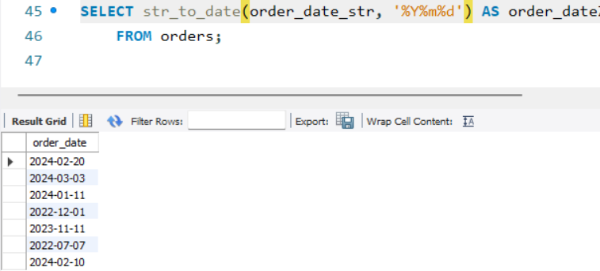
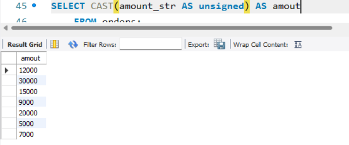
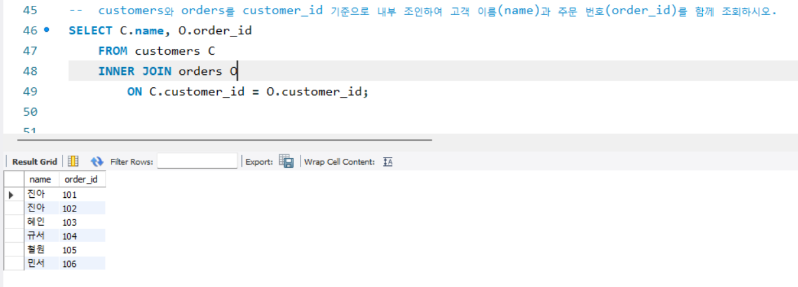
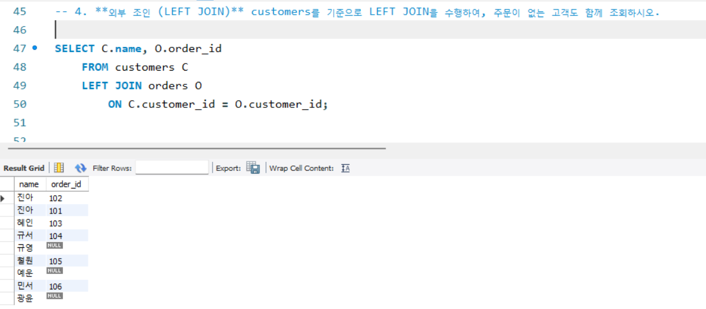
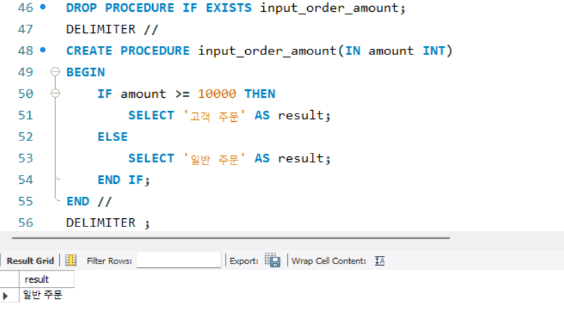

# SQL_ADVANCED 3주차 정규 과제 

📌SQL_ADVANCED 정규과제는 매주 정해진 분량의 『*혼자 공부하는 SQL*』 을 읽고 학습하는 것입니다. 이번주는 아래의 **SQL_ADVANCED_3rd_TIL**에 나열된 분량을 읽고 공부하시면 됩니다.

아래의 문제를 풀어보며 학습 내용을 점검하세요. 문제를 해결하는 과정에서 개념을 스스로 정리하고, 필요한 경우 제시된 강의를 참고하여 보완하는 것이 좋습니다.

<!-- 강의 링크는 아래와 같습니다.
https://www.youtube.com/watch?v=1YmWy-7-OhQ&list=PLVsNizTWUw7GCfy5RH27cQL5MeKYnl8Pm&index=10
https://www.youtube.com/watch?v=tuQFkzjqEGw&list=PLVsNizTWUw7GCfy5RH27cQL5MeKYnl8Pm&index=11
https://www.youtube.com/watch?v=IOCsreDYqFE&list=PLVsNizTWUw7GCfy5RH27cQL5MeKYnl8Pm&index=12
-->

**교재 실습 예제 파일은 07_SQL_ADVANCED_Template 레포지토리의 src 폴더에 업로드되어 있습니다. market_db 파일도 해당 폴더에 함께 포함되어 있으니 참고하시기 바랍니다.**

**👀(수행 인증샷은 필수입니다.)** 

## SQL_ADVANCED_3rd_TIL

### 4장 SQL 고급 문법
#### 01. MySQL의 데이터 형식
#### 02. 두 테이블을 묶는 조인
#### 03. SQL 프로그래밍 


## Study Schedule

| 주차  | 공부 범위     | 완료 여부 |
| ----- | ------------- | --------- |
| 1주차 | p.24~99    | ✅         |
| 2주차 | p.102~155   | ✅         |
| 3주차 | p.158~213  | ✅         |
| 4주차 | p.216~271 | 🍽️         |
| 5주차 | p.274~327 | 🍽️         |
| 6주차 | p.330~369 | 🍽️         |
| 7주차 | p.372~407 | 🍽️         |


<br>

<!-- 여기까진 그대로 둬 주세요-->

---

# 1️⃣ 학습 내용 정리

## 1. MySQL의 데이터 형식

<!-- MySQL의 데이터 형식에 관해 배우게 된 점을 적어주세요. -->
## 데이터 형식
### 정수형
- 소수점이 없는 숫자 
  - TINYINT: 바이트 수1
  - SMALLINT: 바이트 수2
  - INT: 바이트 수4
  - BIGINT: 바이트 수8

### 문자형
- 문자형은 글자를 저장하기 위해 사용, 입력할 최대 글자의 개수를 지정해야함
  - CHAR(개수): 바이트 수 1~255
    - 자릿수가 고정되어 있음 
  - VARCHAR(개수): 바이트 수 1~16383
    - 가변길이 문장 
- VARCHAR가 CHAR보다 공간을 효율적을 운영할 수 있지만, 성능 면에서는 CHAR로 설정하는 것이 좋음

### 대량의 데이터 형식
- TEXT  형식
  - TEXT
  - LONGTEXT
- BOLB(Binary Long Object; 글자가 아닌 이미지, 동영상 형식)
  - BOLB
  - LONGBOLB

### 실수형
- 소수점이 있는 숫자를 저장할 때 사용
- FLOAT 형식
  - 바이트 수 4
- DOUBLE 형식
  - 바이트 수 8

### 날짜형 
- 날짜 및 시간을 저장할 때 사용
- DATE 형식: 날짜만
- TIME 형식: 시간만
- DATETIME 형식: 날짜 및 시간을 저장

## 변수의 사용
- SET @변수이름 = 변수의 값; => 변수의 선언 및 값 대입
- SELECT @변수이름; => 변수의 값 출력
  - 변수를 선언하고 정수 또는 실수를 대입
  - 변수의 내용을 출력
  - 변수끼리 연산한 후에 출력
  - 변수를 선언하고 문자열 또는 정수를 대입
  - 테이블을 조회하면서 변수 활용
- LIMIT에서는 변수를 사용할 수 없음

### PREPARE & EXECUTE
- SQL을 미리 만들어두고 → 나중에 실행하는 방식
- PREPARE는 'SELECT~~LIMIT?'문을 실행하지 않음 
  - ?에 변수의 값을 대입 

## 데이터 형 변환 
### 명시적인 변환
- CAST(): CAST(값 AS 데이터_형식[(길이)])
- CONVERT(): CONVERT(값, EPDLXM_GUDTLR[(길이)])
- ()안에 올 수 있는 데이터 형식은 CHAR, SIGNED, UNSIGNED, DATE, TIME, DATETIME 등 


### 암시적인 변환 
- 자동으로 변환됨


> **확인문제: 다음 보기에서 데이터 형식의 변환에 사용되는 함수를 2개 고르세요.**

보기는 아래와 같습니다.
```
CONVERT() / DATA() / CAST() / MOVE() / TYPE() / SUM() / AVG() / CURRENT_DATE()
```

```
CONVERT(), CAST()
```


## 2. 두 테이블을 묶는 조인

<!-- 두 테이블을 묶는 조인에 관해 배우게 된 점을 적어주세요. -->
- 조인: 두 개의 테이블을 서로 묶어서 하나의 결과를 만들어 내는 것 

## 내부 조인
### 일대다 관계의 이해
- 두 테이블 조인을 위해서는 테이블이 일대다 관계로 연결되어야 한다. 
  - 일대다 관계는 주로 기본 키와 외래 키 관계로 맺어져 있음 (PK-FK관계)

### 내부 조인의 기본
```
SELECT <열 목록>
FROM <첫 번째 테이블>
    INNER JOIN <두 번째 테이블> (그냥 JOIN이라고만 써도 JOIN으로 인식)
    ON <조인될 조건>
  [WHERE 검색 조건] ;
```

## 외부 조인
### 외부 조인의 기본
- 두 테이블을 조인할 때 필요한 내용이 한쪽 테이블에만 있어도 결과를 추출할 수 있음 
- LEFT JOIN: 왼쪽 테이블의 내용은 모두 출력되어야 함
```
SELECT <열 목록>
FROM <첫 번째 테이블(LEFT 테이블)>
    <LEFT | RIGHT | FULL> OUTER JOIN <두 번째 테이블(RIGHT 테이블)>
    ON <조인될 조건>
  [WHERE 검색 조건] ;
```
- RIGHT JOIN: 왼쪽과 오른쪽 테이블의 위치만 바꾸면 됨 
- FULL OUTER JOIN: 왼쪽 외부 조인과 오른쪽 외부 조인이 합쳐진 것 

## 기타 조인
### 상호 조인
- 한쪽 테이블의 모든 행과 다른 쪽 테이블의 모든 행을 조인시키는 기능 
- 전체 행 개수는 두 테이블의 각 행의 개수를 곱한 개수
- ON 구문을 사용할 수 없음
- 결과의 내용은 의미가 없음 

### 자체 조인
- SELF JOIN: 자신이 자신과 조인된다는 의미


> **확인문제: 다음 SQL은 회원으로 가입만 하고, 한 번도 구매한 적이 없는 회원의 목록을 조회하는 쿼리입니다. 빈칸에 들어갈 가장 적절한 구문을 고르세요..**

```sql
SELECT DISTINCT M.mem_id, B.prod_name, M.mem_name, M.addr
  FROM member M
    LEFT OUTER JOIN buy B
    ON M.mem_id = B.mem_id
  __________
  ORDER BY M.mem_id;
```
보기는 아래와 같습니다. 
```
1. JOIN B.prod_name IS NULL
2. LIMIT B.prod_name IS NULL
3. HAVING B.prod_name IS NULL
4. WHERE B.prod_name IS NULL
```
```
4번, 한 번도 구매한 적이 없는 회원의 목록을 조회하는 쿼리이기 때문에 조건문이 필요하다. 
HAVING은 GROUP BY함수를 쓸 때 사용하는 조건문이기 때문에 WHERE이 적절하다. 
```

## 3. SQL 프로그래밍 

<!-- IF문, CASE문, WHILE문, 동적 SQL에 관해 배우게 된 점을 적어주세요. -->
## IF문
### IF문의 기본 형식
```
IF <조건식> THEN
        SQL
END IF;
```

### IF ~ ELSE 문
- 조건식이 참이면 SQL1 문장들 1을 실행하고, 그렇지 않으면 SQL2 문장들을 실행

### CASE문
- 여러 가지 조건 중에서 선택해야 하는 경우


> **확인문제: 다음은 CASE 문의 형식입니다. 빈칸에 들어갈 가장 적절한 명령어를 보기에서 고르세요..**

```sql
CASE
    (1) 조건 THEN
        SQL문장들1
    ELSE
        SQL문장들4
END (2);
```

보기는 아래와 같습니다.
```
WHEN / THEN / CURRENT / DATE / TIME / IF / END IF / CASE
```

```
여기에 답을 적어주세요!
(1) WHEN
(2) CASE
```


---

# 2️⃣ 실습과제

## 1. 데이터베이스 구축

아래 코드를 MySQL Workbench에 붙여넣은 후,  
**전체 드래그 → 실행 (Ctrl + shift + Enter)** 하여 데이터베이스를 구축하세요.

```sql
-- 1. 데이터베이스 생성
CREATE DATABASE IF NOT EXISTS week3_db;

-- 2. 사용할 데이터베이스 선택
USE week3_db;

-- 3. 기존 테이블 삭제 (초기화용)
DROP TABLE IF EXISTS orders;
DROP TABLE IF EXISTS customers;

-- 4. 테이블 생성 (조인 실습용)
CREATE TABLE customers (
    customer_id INT PRIMARY KEY,
    name VARCHAR(20),
    signup_date_str VARCHAR(8) 
);

CREATE TABLE orders (
    order_id INT PRIMARY KEY,
    customer_id INT,           
    order_date_str VARCHAR(8), 
    amount_str VARCHAR(10)     
);

-- 5. 데이터 삽입
INSERT INTO customers VALUES
(1, '진아', '20240218'),
(2, '혜인', '20230302'),
(3, '규서', '20220315'),
(4, '규영', '20210401'),
(5, '철원', '20230909'),
(6, '예운', '20240201'),
(7, '민서', '20220320'),
(8, '광윤', '20240105'); -- 주문 없는 고객(외부 조인용)

INSERT INTO orders VALUES
(101, 1, '20240220', '12000'),
(102, 1, '20240303', '30000'),
(103, 2, '20240111', '15000'),
(104, 3, '20221201', '9000'),
(105, 5, '20231111', '20000'),
(106, 7, '20220707', '5000'),
(107, 99, '20240210', '7000'); -- 고객 테이블에 없는 customer_id (외부 조인용)
```

## 2. 실습 문제

다음 SQL 문을 작성하고 실행 결과를 확인 후 인증 사진을 아래에 업로드하세요.

1. **데이터 형식 변환**
   - orders 테이블의 `order_date_str`을 DATE 형식으로 변환하여 조회하시오.
   (힌트: STR_TO_DATE 사용)

2. **데이터 형식 변환**
   - orders 테이블의 `amount_str`을 숫자형으로 변환하여 조회하시오.

3. **내부 조인 (INNER JOIN)**
   - customers와 orders를 customer_id 기준으로 내부 조인하여
     고객 이름(name)과 주문 번호(order_id)를 함께 조회하시오.

4. **외부 조인 (LEFT JOIN)**
   - customers를 기준으로 LEFT JOIN을 수행하여,
     주문이 없는 고객도 함께 조회하시오.

5. **스토어드 프로시저 (IF문 사용)**
   - 입력받은 금액이 10000 이상이면 '고액 주문',
     그렇지 않으면 '일반 주문'을 출력하는
     프로시저를 생성하시오.
   - 생성 후 CALL로 실행 결과를 확인하시오.


1. 


2. 


3. 


4. 


5. 
 


### 🎉 수고하셨습니다.


