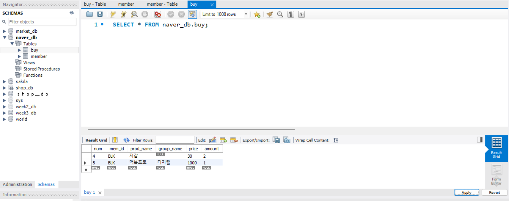
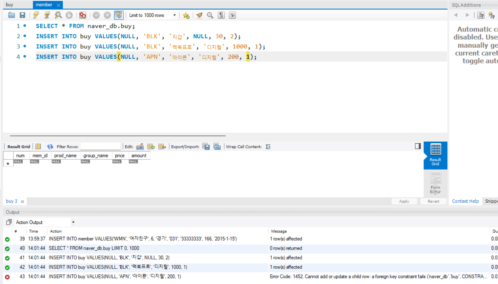
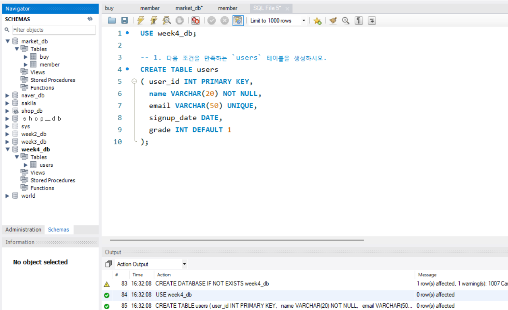
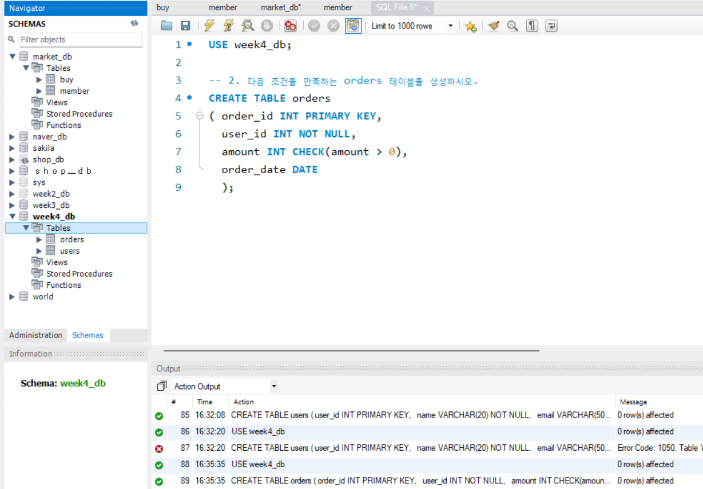
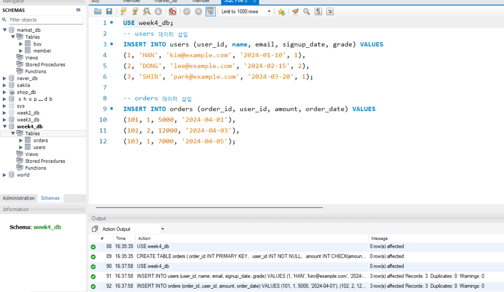
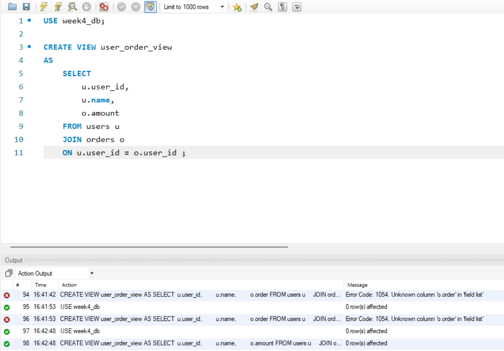
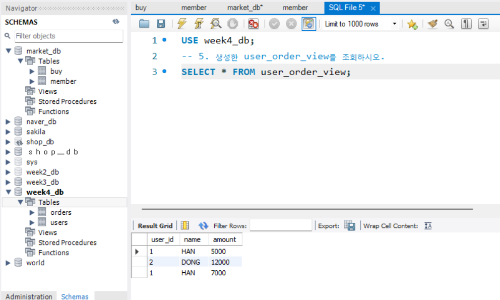

# SQL_ADVANCED 4주차 정규 과제 

📌SQL_ADVANCED 정규과제는 매주 정해진 분량의 『*혼자 공부하는 SQL*』 을 읽고 학습하는 것입니다. 이번주는 아래의 **SQL_ADVANCED_4th_TIL**에 나열된 분량을 읽고 공부하시면 됩니다.

아래의 문제를 풀어보며 학습 내용을 점검하세요. 문제를 해결하는 과정에서 개념을 스스로 정리하고, 필요한 경우 제시된 강의를 참고하여 보완하는 것이 좋습니다.

<!-- 강의 링크는 아래와 같습니다.
https://www.youtube.com/watch?v=DMNpkj_bZIs&list=PLVsNizTWUw7GCfy5RH27cQL5MeKYnl8Pm&index=13
https://www.youtube.com/watch?v=BUHj-behLyc&list=PLVsNizTWUw7GCfy5RH27cQL5MeKYnl8Pm&index=14
https://www.youtube.com/watch?v=JrXWxku7ZIM&list=PLVsNizTWUw7GCfy5RH27cQL5MeKYnl8Pm&index=15
-->

**교재 실습 예제 파일은 07_SQL_ADVANCED_Template 레포지토리의 src 폴더에 업로드되어 있습니다. market_db 파일도 해당 폴더에 함께 포함되어 있으니 참고하시기 바랍니다.**

**👀(수행 인증샷은 필수입니다.)** 

## SQL_ADVANCED_4th_TIL

### 5장 테이블과 뷰
#### 01. 테이블 만들기
#### 02. 제약조건으로 테이블을 견고하게
#### 03. SQL 가상의 테이블: 뷰 


## Study Schedule

| 주차  | 공부 범위     | 완료 여부 |
| ----- | ------------- | --------- |
| 1주차 | p.24~99    | ✅         |
| 2주차 | p.102~155   | ✅         |
| 3주차 | p.158~213  | ✅         |
| 4주차 | p.216~271 | ✅         |
| 5주차 | p.274~327 | 🍽️         |
| 6주차 | p.330~369 | 🍽️         |
| 7주차 | p.372~407 | 🍽️         |


<br>

<!-- 여기까진 그대로 둬 주세요-->

---

# 1️⃣ 학습 내용 정리

## 1. 테이블 만들기 

<!-- 이번 챕터에서 제시된 실습을 흐름에 맞게 진행한 후, 실습 과정이 보일 수 있도록 인증 사진을 2장 이상 제출해 주세요. -->
**테이블**: 표 형태로 구정된 2차원 구조
**행**: 로우(row), 레코드(record)
**열**: 컬럼(column), 필드(field)
**GUI**: Graphical User Interface의 약자로, 윈도에서 진행하는 작업을 의미 






## 2. 제약조건으로 테이블을 견고하게 

<!-- 제약조건에 관해 배우게 된 점을 적어주세요. -->
- 이메일, 휴대폰과 같이 중복되지 않는 열에는 **고유키**를 지정할 수 있음
- 제약조건 
    - **check**
    - **기본값**설정
    - **NOT NULL**

### 제약조건의 기본 개념과 종류
*제약조건*
- 데이터의 무결성을 지키기 위해 제한하는 조건
    - 데이터의 무결성: 데이터에 결함이 없음 
    - 이러한 결함을 미리 방지하기 위해 **기본키**를 지정할 수 있음 
    - *기본키*의 조건은 중복되지 않고, 비어 있지도 않음
    - 대표적인 제약 조건
    | 제약 조건 | 설명 | 특징 |
|-----------|------|------|
| PRIMARY KEY | 각 행을 고유하게 식별 | 중복 불가, NULL 불가 |
| FOREIGN KEY | 다른 테이블의 PK 참조 | 무결성 유지 |
| UNIQUE | 중복 값 방지 | NULL 허용 가능 |
| CHECK | 특정 조건 만족해야 함 | 조건식 사용 |
| DEFAULT | 기본값 설정 | 값 입력 안 하면 자동 적용 |
| NULL 허용 | 값 비어있음 허용 | 데이터 없을 수 있음 |

### 기본 키 제약 조건 
*기본 키*
- 데이터를 분할 수 있는 식별자 
- 기본키의 입력되는 값은 중복될 수 없으며, NULL 값이 입력될 수 없음 
- <u>테이블은 기본 키를 1개만 가질 수 있음</u>
- 테이블을 삭제할 때는 **외래키**가 설정된 테이블을 먼저 삭제해야 함 

### 외래 키 제약 조건
*외래키*
- 두 테이블 사이의 관계를 연결해주고, 데이터의 무결성을 보장해주는 역할
- 기본 키가 있는 테이블을 **기준 테이블**
- 외래 키가 있는 테이블을 **참조 테이블**
- 기준 테이블의 열은 반드시 기본기나, 고유키로 설정되어 있어야 함 
```
외래 키 기본 형식
FOREIGN KEY(열_이름) REFERENCES 기준_테이블(열_이름)
```
- <u>기본 키 - 외래 키로 맺어진 후에는 기준 테이블의 열 이름이 변경되거나 삭제되지 않음</u>
- **ON UPDATE CASCADE** / **ON DELETE CASCADE**: 기준 테이블의 데이터가 삭제(수정)되면 참고 테이블의 데이터도 삭제(수정)되는 기능 

### 기타 제약조건
*고유 키 제약 조건*
- 중복되지 않는 유일한 값을 입력해야 하는 조건
- NULL 값을 허용(여러 개가 입력 되어도 상관없음)
- 여러 개를 설정해도 됨

*체크 제약 조건*
- 입력되는 데이터를 점검하는 기능
- CHECK(열_이름 + 확인할 조건)

*기본 값 정의*
- 값을 입력하지 않았을 때 자동으로 입력될 값을 미리 지정해 놓는 방법
- DEFAULT 값

*널 값 허용*
- NOT NULL

> **확인문제: 다음 보기 중에서 각 문항이 설명하는 것을 고르세요.**

보기는 아래와 같습니다.
```
CHECK / DEFAULT / PRIMAY KEY / UNIQUE / NOT NULL / FOREIGN KEY
```

```
여기에 답과 그 이유를 적어주세요!
1. 입력되는 데이터가 조건에 맞는지 검사하는 기능: CHECK
이유: CHECK 제약조건은 입력되는 값이 지정한 조건식을 만족하는지 검사하기 때문이다.
2. 값을 입력하지 않으면 자동으로 들어갈 값: DEFAULT
이유: DEFAULT는 사용자가 값을 따로 입력하지 않았을 때 미리 설정한 기본값을 자동으로 넣어주기 때문이다.
3. 빈 값을 입력하는 것을 허용하지 않음: NOT NULL
이유: NOT NULL은 해당 컬럼에 반드시 값이 입력되어야 하므로 NULL 값을 허용하지 않기 때문이다.
```


## 3. 가상의 테이블: 뷰 

<!-- 뷰에 관해 배우게 된 점을 적어주세요. -->
**뷰**: 데이터베이스 개체 중 하나

### 뷰의 개념
```
CREATE VIEW 뷰_이름
AS
    SELECT 문;
```
```
SELECT 열_이름 FROM 뷰_이름
    [WHERE 조건];
```
*뷰의 작동*
- 뷰는 기본적으로 **읽기 전용**으로 사용되지만, 뷰를 통해 원본 테이블의 데이터를 수정할 수도 있음

*뷰를 사용하는 이유*
- 보안(security)에 도움이 됨 
- 복잡한 SQL을 단순하게 만들 수 있음 

### 뷰의 실제 작동
*뷰의 실제 생성, 수정, 삭제*
| 구분 | 설명 | 문법 / 특징 |
|------|------|------------|
| 생성 | 뷰 생성 시 열 이름을 다르게 지정 가능 | `CREATE VIEW view_name AS SELECT ...` |
|  | 열 이름 변경 시 `AS` 사용 | `SELECT col1 AS new_name` |
|  | 열 이름에 공백이 있을 경우 백틱 사용 | `` `열 이름` `` |
| 수정 | 기존 뷰 구조 변경 | `ALTER VIEW view_name AS SELECT ...` |
| 삭제 | 뷰 제거 | `DROP VIEW view_name` |
| 정보 확인 | 뷰의 구조(컬럼 정보) 확인 | `DESCRIBE view_name` |
| 소스 코드 확인 | 뷰 생성 SQL 확인 | `SHOW CREATE VIEW view_name` |

*뷰를 통한 데이터의 수정, 삭제*
- UPDATE
- DELETE

*뷰를 통한 데이터의 입력*
- INSERT INTO
- WITH CHECK OPTION: 뷰에 설정된 겂의 범위가 벗어나는 값은 입력되지 않도록 할 수 있음 

*뷰가 참조하는 테이블의 식제*
- DROP TABLE ~
> **확인문제: 다음은 뷰의 특징입니다. 거리가 먼 것을 하나 고르세요.**

보기는 아래와 같습니다.
```
1️⃣ 뷰에는 테이블의 모든 열을 포함시켜야 합니다.
2️⃣ 뷰는 복잡한 SQL을 단순하게 만드는 효과가 있습니다.
3️⃣ 뷰는 보안에 도움이 됩니다.
4️⃣ 일부 사용자가 테이블에는 접근하지 못하게 하고, 뷰에만 접근하도록 설정할 수 있습니다.
```

```
1번, 뷰는 테이블의 일부 열만 선택해서 생성할 수 있으므로, 모든 열을 반드시 포함할 필요가 없음 
```


---

# 2️⃣ 실습과제

## 1. 데이터베이스 구축

아래 코드를 MySQL Workbench에 붙여넣은 후,  
**전체 드래그 → 실행 (Ctrl + Shift + Enter)** 하여 데이터베이스를 생성하세요.

```sql
CREATE DATABASE IF NOT EXISTS week4_db;
USE week4_db;
```

## 2. 실습문제

1. 다음 조건을 만족하는 `users` 테이블을 생성하시오.
```
- user_id는 INT이며 **기본키(Primary Key)**로 설정합니다.
- name은 VARCHAR(20)이며 NULL을 허용하지 않습니다.
- email은 VARCHAR(50)이며 중복을 허용하지 않습니다.
- signup_date는 DATE 타입으로 설정합니다.
- grade는 INT이며 기본값(Default)을 1로 설정합니다.
```

2. 다음 조건을 만족하는 orders 테이블을 생성하시오.
```
- order_id는 INT이며 기본키(Primary Key)로 설정합니다.
- user_id는 INT이며 NULL을 허용하지 않습니다.
- amount는 INT이며 0보다 커야 합니다.
- order_date는 DATE 타입으로 설정합니다.
```

3. 다음 조건을 만족하여 데이터를 삽입하시오.
```
- users 테이블에 3명 이상의 데이터를 직접 INSERT 하시오.
- orders 테이블에 3건 이상의 데이터를 직접 INSERT 하시오.
```

4. users와 orders 테이블을 활용하여 다음 컬럼을 보여주는 뷰 user_order_view를 생성하시오.
```
- user_id
- name
- amount
```

5. 생성한 user_order_view를 조회하시오.

## 3. 제출 방법

1. 각 문제의 실행 결과가 보이도록 화면을 캡처합니다.
2. 테이블 생성 결과, 데이터 삽입 결과, 뷰 생성 및 조회 결과가 모두 보이도록 제출합니다.

1. 


2. 


3. 


4. 


5. 



### 🎉 수고하셨습니다.


