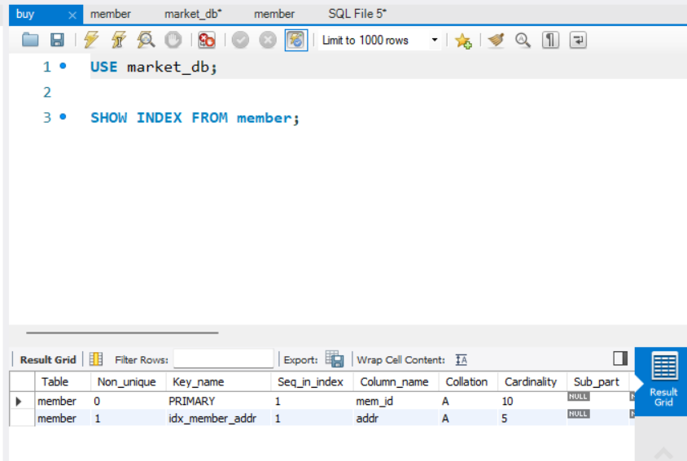
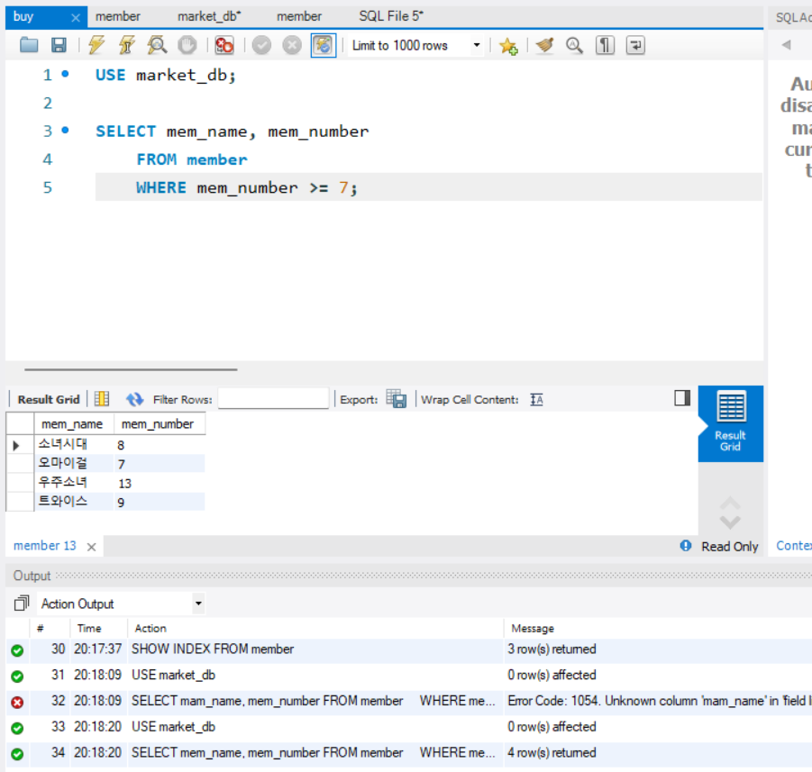
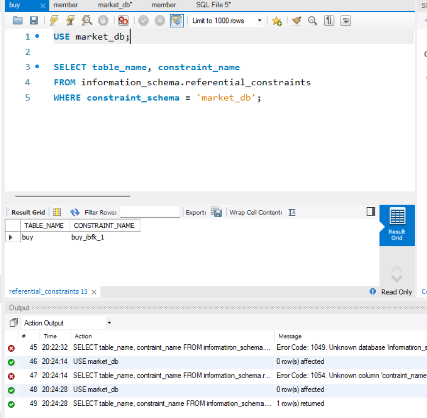
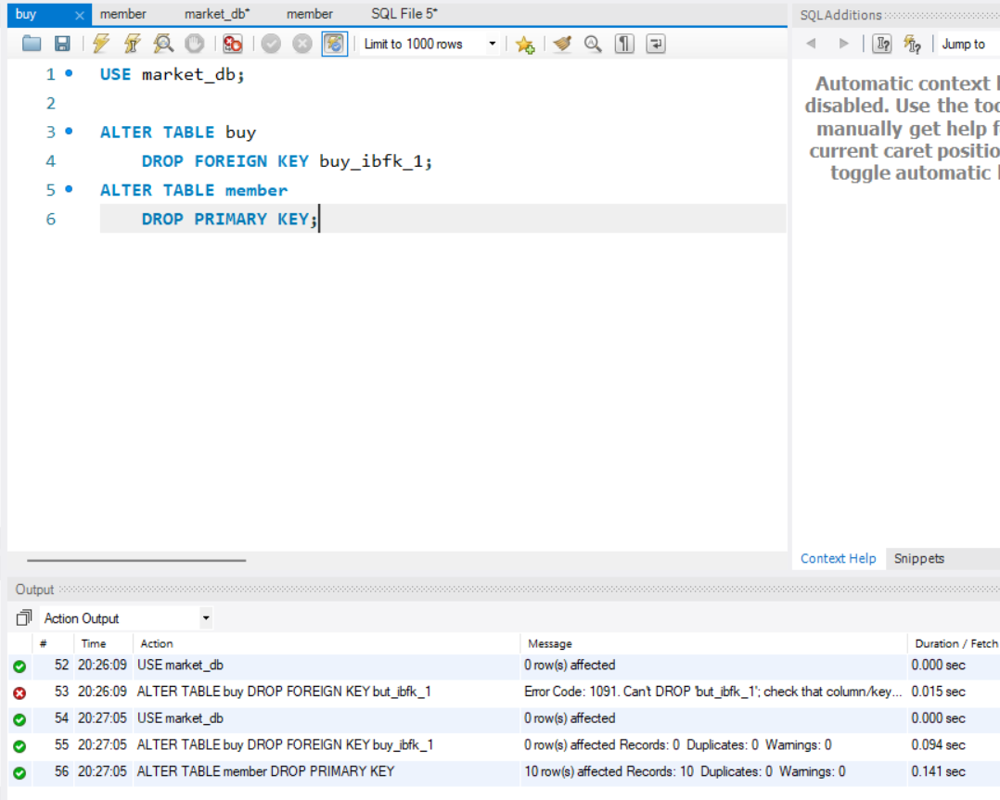
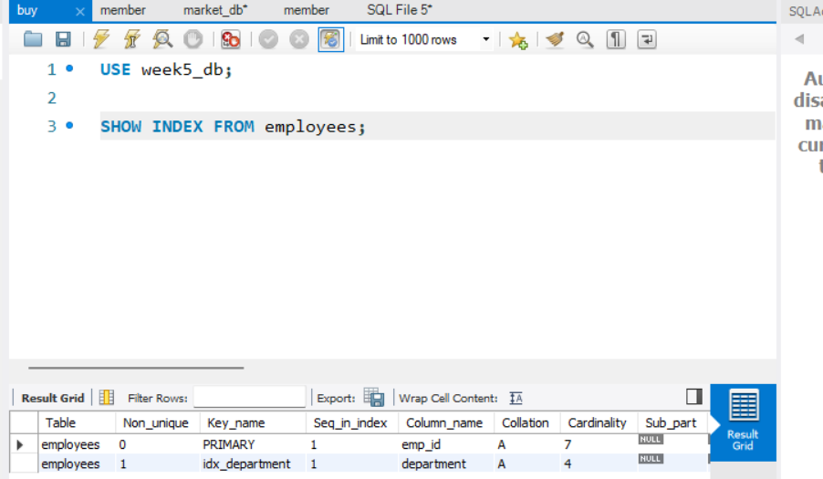
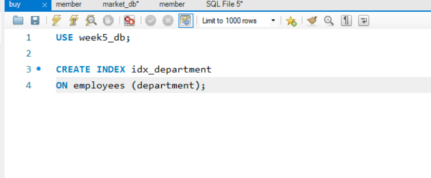
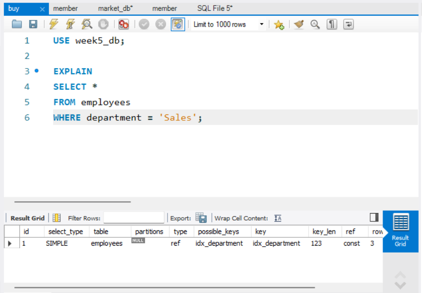
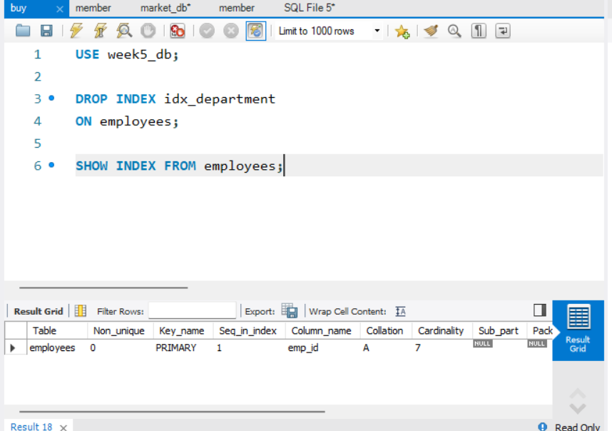

# SQL_ADVANCED 5주차 정규 과제 

📌SQL_ADVANCED 정규과제는 매주 정해진 분량의 『*혼자 공부하는 SQL*』 을 읽고 학습하는 것입니다. 이번주는 아래의 **SQL_ADVANCED_5th_TIL**에 나열된 분량을 읽고 공부하시면 됩니다.

아래의 문제를 풀어보며 학습 내용을 점검하세요. 문제를 해결하는 과정에서 개념을 스스로 정리하고, 필요한 경우 제시된 강의를 참고하여 보완하는 것이 좋습니다.

<!-- 강의 링크는 아래와 같습니다.
https://www.youtube.com/watch?v=KZmW6VaY5BU&list=PLVsNizTWUw7GCfy5RH27cQL5MeKYnl8Pm&index=16
https://www.youtube.com/watch?v=vWTDuoSG-YQ&list=PLVsNizTWUw7GCfy5RH27cQL5MeKYnl8Pm&index=17
https://www.youtube.com/watch?v=aiMSluMNzI8&list=PLVsNizTWUw7GCfy5RH27cQL5MeKYnl8Pm&index=18
-->

**교재 실습 예제 파일은 07_SQL_ADVANCED_Template 레포지토리의 src 폴더에 업로드되어 있습니다. market_db 파일도 해당 폴더에 함께 포함되어 있으니 참고하시기 바랍니다.**

**👀(수행 인증샷은 필수입니다.)** 

## SQL_ADVANCED_5th_TIL

### 6장 인덱스
#### 01. 인덱스 개념을 파악하자
#### 02. 인덱스의 내부 작동
#### 03. 인덱스의 실제 사용  


## Study Schedule

| 주차  | 공부 범위     | 완료 여부 |
| ----- | ------------- | --------- |
| 1주차 | p.24~99    | ✅         |
| 2주차 | p.102~155   | ✅         |
| 3주차 | p.158~213  | ✅         |
| 4주차 | p.216~271 | ✅         |
| 5주차 | p.274~327 | ✅         |
| 6주차 | p.330~369 | 🍽️         |
| 7주차 | p.372~407 | 🍽️         |


<br>

<!-- 여기까진 그대로 둬 주세요-->

---

# 1️⃣ 학습 내용 정리

## 1. 인덱스 개념을 파악하자 
<!-- 인덱스에 관해 배우게 된 점을 적어주세요. -->
### 인덱스
- 데이터를 빠르게 찾을 수 있도록 도와주는 도구, 실무에서는 현실적으로 인덱스 없이 데이터 운영이 불가함
- 종류

| 구분            | 설명                                                                 | 특징                          |
|-----------------|----------------------------------------------------------------------|-------------------------------|
| 클러스터형 인덱스 | 기본키(PK)로 지정하면 자동 생성되며, 테이블당 1개만 생성 가능              | 데이터가 자동 정렬됨           |
| 보조 인덱스      | 고유 키(UNIQUE)로 지정하면 자동 생성되며, 여러 개 생성 가능                | 데이터는 자동 정렬되지 않음    |

#### 인덱스의 개념

**인덱스의 문제점**
- 필요 없는 인덱스를 만드는 바람에 데이터베이스가 차지하는 공간만 더 늘어나고, 인덱스를 이용해서 데이터를 찾는 것이 전체 테이블을 찾아보는 것보다 느려짐

**인덱스의 장점과 단점**

[장점]
- 적절한 인덱스를 생성하고 이를 활용한 SQL을 사용하면 **검색 속도가 크게 향상됨**
- 특히 `SELECT` 문에서 **데이터 조회 속도가 매우 빨라짐**
- 그 결과, **시스템의 전체적인 부하가 줄어들고 성능이 향상됨**

---

[단점]
- 인덱스는 별도의 저장 공간을 사용하므로 **추가적인 디스크 공간이 필요함**
- 인덱스를 처음 생성할 때 **시간이 오래 소요될 수 있음**
- `INSERT`, `UPDATE`, `DELETE`와 같은 **데이터 변경 작업이 많을 경우 오히려 성능이 저하될 수 있음**

#### 인덱스의 종류
**자동으로 생성되는 인덱스**

[기본 개념]
- 인덱스는 테이블의 열(column) 단위로 생성됨
- 하나의 열에는 하나의 인덱스만 생성 가능

[클러스터형 인덱스]
- 기본 키(PK)로 지정하면 자동 생성됨
- 테이블당 1개만 생성 가능
- 데이터가 정렬된 상태로 저장됨
- 중복값을 허용하지 않음

→ 정리: 기본키를 설정하면 클러스터형 인덱스가 자동 생성됨

[보조 인덱스]
- KEY_name에 열 이름이 표시된 경우 해당
- 여러 개 생성 가능
- 데이터는 자동 정렬되지 않음
- 중복값을 허용하지 않음 (UNIQUE 기준)

→ 정리: UNIQUE 설정 시 보조 인덱스가 자동 생성됨

**자동으로 정렬되는 클러스터형 인덱스**
- 클러스터형 인덱스는 테이블에 1개만 생성할 수 있음.
    - 이는 기본 키가 테이블에 1개인 것과 마찬가지임

**정렬되지 않는 보조 인덱스**
- 보조 인덱스를 생성해도, 데이터의 순서는 변경되지 않음
    - 별도로 만들어야 함
- 여러개를 만들 수 있지만, 보조 인덱스를 만들 때마다 데이터베이스의 공간을 차지하게 되고, 전반적으로 시스템에 오히려 나쁜 영향을 미치게 됨


> **확인문제: 다음은 인덱스 종류와 관련된 설명입니다. 가장 거리가 먼 것을 하나 고르세요.**

보기는 아래와 같습니다.
```
1️⃣ 클러스터형 인덱스는 영어사전과 비슷한 개념입니다.
2️⃣ 보조 인덱스는 일반 책의 찾아보기와 비슷한 개념입니다.
3️⃣ 클러스터형 인덱스는 기본 키를 설정하면 자동 생성됩니다.
4️⃣ 보조 인덱스는 NOT NULL을 설정하면 자동 생성됩니다.
```

```
4️⃣. 보조 인덱스는 고유키로 지정하면 생성되게 된다.
    따라서 NOT NULL이 아니라 UNIQUE를 설정하면 된다. 
```


## 2. 인덱스의 내부 작동 
<!-- 인덱스의 내부 작동에 관해 배우게 된 점을 적어주세요. -->
- 균형 트리: 자료 구조에 나오는 범용적으로 사용되는 데이터의 구조 
    - 인덱스는 균형 트리의 자료 구조로 구성되어 있음

### 인덱스의 내부 작동 원리
**균형 트리의 개념**
| 구분        | 설명                                      |
|-------------|-------------------------------------------|
| 노드        | 균형 트리 구조에서 데이터가 저장되는 공간   |
| 루트 노드   | 트리의 가장 상위에 위치한 노드             |
| 중간 노드   | 루트 노드와 리프 노드 사이에 있는 노드     |
| 리프 노드   | 트리의 가장 마지막에 위치한 노드           |

*페이지는 비어있는 노트 1장이라고 생각하며 됨.*
*노드라는 용어는 개념적인 설명에서 주로 나오는 용어이며, 페이지라고 부름*

**균형 트리의 페이지 분할**
- 인덱스를 구성하면 데이터 변경 작업시 성능이 나빠짐
    - 특히 INSERT 작업이 일어날 때 더 느리게 입력될 수 있음
    - 이유는 *페이지 분할*이라는 작업 때문

### 인덱스의 구조
**클러스터형 인덱스 구성하기**
1. 클러스터형 인덱스를 구성하기 위해 행 데이터를 지정한 열로 정렬
2. 각 페이지의 인덱스로 지정된 열의 첫 번째 값을 가지고 루트 페이지를 만듦

**보조 인덱스 구성하기**
- 보조 인덱스는 데이터 페이지를 건들이지 않음
    - 별도의 장소에 인덱스 페이지를 생성했음
1. 인덱스 페이지의 리프 페이지에 인덱스로 구성한 열을 정렬
2. 실제 데이터가 있는 위치를 준비
*데이터의 위치는 페이지 번호 + #위치로 기록되어 있음*

**인덱스에서 데이터 검색하기**
- 인덱스 검색은 클러스터형 또는 보조 인덱스를 이용해서 데이터를 검색하는 것
- 속도는 인덱스를 사용하지 않았을 때보다 빠르다. 

> **확인문제: 다음 설명에서 빈칸에 공통으로 들어갈 용어를 쓰시오.**

```
인덱스를 구성하게 되면 데이터의 변경 작업(INSERT, UPDATE, DELETE)시에 성능이 나빠지는 단점이 있습니다.  
특히 INSERT 작업이 일어날 때 더 느리게 입력될 수 있는데요, 이유는 (           ) 이라는 작업이 발생하기 때문입니다.  
(            ) 작업이 일어나면 MySQL이 느려지고 너무 자주 일어나면 성능에 큰 영향을 줍니다.
```

```
페이지 분할
```


## 3. 인덱스의 실제 사용 

*인덱스를 생성할 때는 CREATE INDEX 문을 사용*
- UNIQUE는 중복이 안되는 고유 인덱스를 만듦
*인덱스를 제거할 때는 DROP INDEX 문을 사용*


<!-- 이번 챕터에서 제시된 실습을 흐름에 맞게 진행한 후, 실습 과정이 보일 수 있도록 인증 사진을 2장 이상 제출해 주세요. -->






---

# 2️⃣ 실습과제

## 1. 데이터베이스 구축

아래 코드를 MySQL Workbench에 붙여넣은 후,  
**전체 드래그 → 실행 (Ctrl + Shift + Enter)** 하여 데이터베이스를 생성하세요.

```sql
CREATE DATABASE IF NOT EXISTS week5_db;
USE week5_db;

DROP TABLE IF EXISTS employees;

CREATE TABLE employees (
    emp_id INT PRIMARY KEY,
    name VARCHAR(20),
    department VARCHAR(30),
    salary INT,
    hire_date DATE
);

INSERT INTO employees VALUES
(1, '진아', 'Sales', 3500, '2022-03-01'),
(2, '혜인', 'HR', 3200, '2021-06-15'),
(3, '규서', 'Sales', 4000, '2020-09-10'),
(4, '규영', 'IT', 5000, '2019-01-20'),
(5, '철원', 'Marketing', 3800, '2023-04-01'),
(6, '예운', 'IT', 4500, '2022-12-01'),
(7, '민서', 'Sales', 3700, '2021-08-18');
```

## 2. 실습 문제

다음 문제를 수행하고 실행 결과를 캡처하여 제출하세요.

1. department 컬럼에 보조 인덱스를 생성하시오.
    - 인덱스 생성 후, `SHOW INDEX FROM employees;` 실행 결과가 보이도록 캡처합니다.
    - (idx_department 인덱스가 존재하는지 확인되어야 합니다.)
2. employees 테이블의 인덱스를 확인하시오.
3. department가 'Sales'인 직원을 조회하시오.
   - 'Sales' 조회 시, 반드시 `EXPLAIN`을 함께 실행한 화면을 캡처합니다.
   - (key 컬럼에 idx_department가 표시되어야 합니다.)
4. 생성한 인덱스를 삭제하시오.
   - 인덱스 삭제 후, 다시 `SHOW INDEX FROM employees;`를 실행하여 idx_department가 사라진 것을 확인한 화면을 캡처합니다.

## 3. 제출방법

인덱스 생성 결과, EXPLAIN 실행 결과, 인덱스 삭제 결과가 모두 보이도록 캡처하여 제출하세요.

1.  


2. 


3. 


4. 


### 🎉 수고하셨습니다.


