# SQL_ADVANCED 6주차 정규 과제 

📌SQL_ADVANCED 정규과제는 매주 정해진 분량의 『*혼자 공부하는 SQL*』 을 읽고 학습하는 것입니다. 이번주는 아래의 **SQL_ADVANCED_6th_TIL**에 나열된 분량을 읽고 공부하시면 됩니다.

아래의 문제를 풀어보며 학습 내용을 점검하세요. 문제를 해결하는 과정에서 개념을 스스로 정리하고, 필요한 경우 제시된 강의를 참고하여 보완하는 것이 좋습니다.

<!-- 강의 링크는 아래와 같습니다.
https://www.youtube.com/watch?v=cw1wGN0ZdFA&list=PLVsNizTWUw7GCfy5RH27cQL5MeKYnl8Pm&index=19
https://www.youtube.com/watch?v=bMQ_dAoaMzA&list=PLVsNizTWUw7GCfy5RH27cQL5MeKYnl8Pm&index=20
https://www.youtube.com/watch?v=bggWVsBmKag&list=PLVsNizTWUw7GCfy5RH27cQL5MeKYnl8Pm&index=21
-->

**교재 실습 예제 파일은 07_SQL_ADVANCED_Template 레포지토리의 src 폴더에 업로드되어 있습니다. market_db 파일도 해당 폴더에 함께 포함되어 있으니 참고하시기 바랍니다.**

**👀(수행 인증샷은 필수입니다.)** 

## SQL_ADVANCED_6th_TIL

### 7장 스토어드 프로시저
#### 01. 스토어드 프로시저 사용 방법
#### 02. 스토어드 함수와 커서
#### 03. 자동 실행되는 트리거 


## Study Schedule

| 주차  | 공부 범위     | 완료 여부 |
| ----- | ------------- | --------- |
| 1주차 | p.24~99    | ✅         |
| 2주차 | p.102~155   | ✅         |
| 3주차 | p.158~213  | ✅         |
| 4주차 | p.216~271 | ✅         |
| 5주차 | p.274~327 | ✅         |
| 6주차 | p.330~369 | ✅         |
| 7주차 | p.372~407 | 🍽️         |


<br>

<!-- 여기까진 그대로 둬 주세요-->

---

# 1️⃣ 학습 내용 정리

## 1. 스토어드 프로시저 사용 방법 
<!-- 스토어드 프로시저에 관해 배우게 된 점을 적어주세요. -->
**스토어드 프로시저**: SQL에 프로그래밍 기능을 추가해서 일반 프로그래밍 언어와 비슷한 효과를 낼 수 있음

### 스토어드 프로시저 기본
#### 스토어드 프로시저의 개념과 형식
- 스토어드 프로시저는 *쿼리 문의 집합*으로도 볼 수 있으며, 어떠한 동작을 일괄 처리하기 위한 용도로도 사용
- 스토어드 프로시저 기본 형식

```sql
DELIMITER $$

CREATE PROCEDURE 스토어드_프로시저_이름( IN 또는 OUT 매개변수 )
BEGIN

    -- 이 부분에 SQL 프로그래밍 코드를 작성

END $$

DELIMITER ;

- 세미콜론을 SQL의 끝으로만 표시하고, $$는 프로시저의 끝으로 사용 / 마지막 행에서 DELIMITER를 세미콜론으로 바꿔주면 원래대로 구분자가 다시 돌아옴
### 스토어드 프로시저 실습 
#### 매개변수 사용
- 스토어드 프로시저 실행 시 입력 **매개변수**를 지정할 수 있음 
- 매개변수 지정 형식
```sql
IN 입력_매개변수_이름 데이터_형식
```
- 출력 매개변수 형식
``sql
OUT 출력_매개변수_이름 데이터_형식 ;


<!-- 이번 챕터에서는 확인문제를 실습 인증으로 대체하여 진행합니다. 제시된 실습을 흐름에 맞게 진행한 후, 실습 과정이 보일 수 있도록 인증 사진을 2장 이상 제출해 주세요. -->
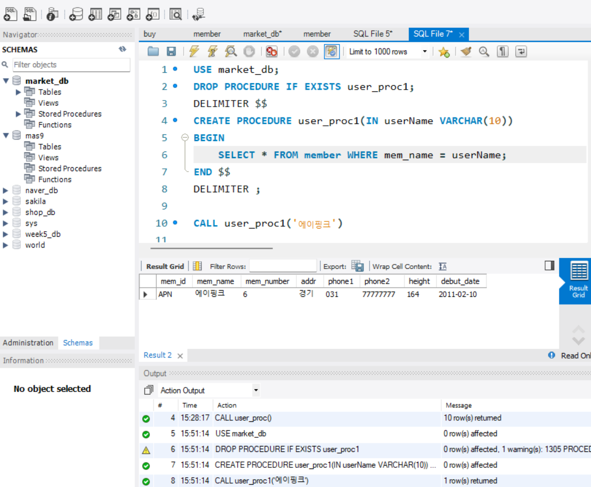
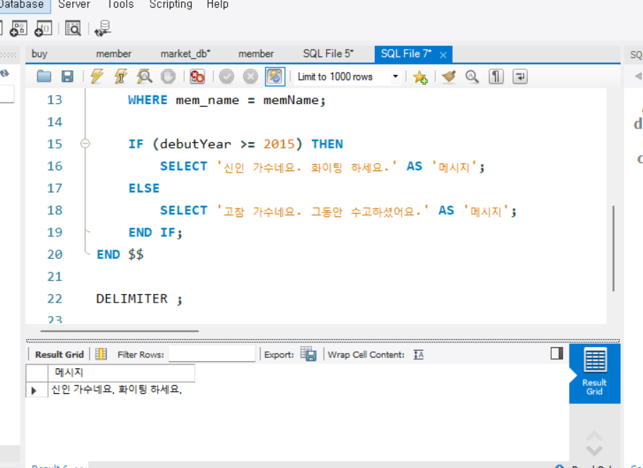
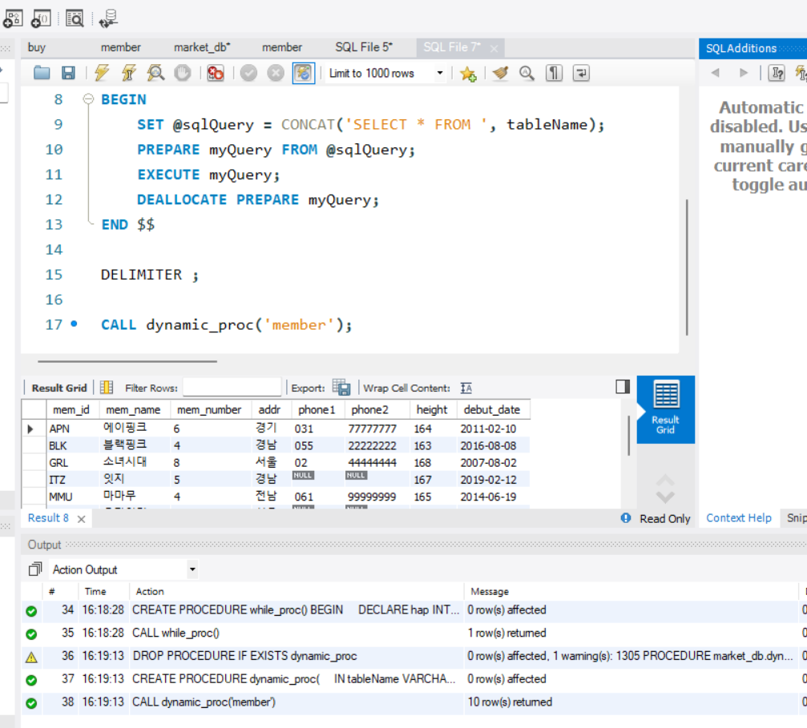


## 2. 스토어드 함수와 커서 
<!-- 스토어드 함수와 커서에 관해 배우게 된 점을 적어주세요. -->
**스토어드 함수**: MySQL에서 제공하는 내장 함수 외에 직접 함수를 만드는 기능을 제공

### 스토어드 함수
- 스토어드 함수 구성
```sql
DELIMITER $$
CREATE FUNCTION 스토어드_함수_이름(매개변수)
  RETURNS 반환형식
BEGIN
  RETURNS 반환값;

END $$
DELIMITER ;
SELECT 스토어드_함수_이름();
```
| 구분 | 내용 |
|---|---|
| 반환값 지정 | `RETURNS`문으로 반환할 값의 데이터 형식을 지정 |
| 반환 방식 | 본문 안에서 `RETURN`문으로 하나의 값을 반환 |
| 매개변수 | 모두 입력 매개변수이며 `IN`을 붙이지 않음 |
| 호출 방식 | 스토어드 프로시저는 `CALL`, 스토어드 함수는 `SELECT`문 안에서 호출 |
| SELECT 사용 | 함수 안에서는 결과 집합을 반환하는 `SELECT`문 사용 불가 

### 커서로 하나 행씩 처리하기
#### 커서의 기본 개념
- 커서는 첫 번째 행을 처리한 후에 마지막 행까지 한 행씩 접근해서 값을 처리함
- DECLARE로 선언할 수 있으며, 그 내용은 SELECT 문
- 커서는 행이 끝날 때까지 계속 반복함. 행의 끝을 판단하기 위해 `endOFRow`를 준비하고 TRUE 값인지 체크하는 방식 사용

<!-- 이번 챕터에서는 확인문제를 실습 인증으로 대체하여 진행합니다. 제시된 실습을 흐름에 맞게 진행한 후, 실습 과정이 보일 수 있도록 인증 사진을 2장 이상 제출해 주세요. -->
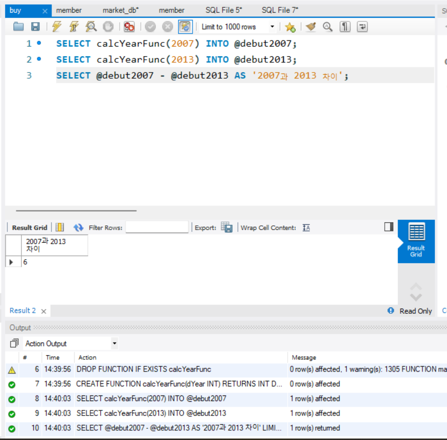
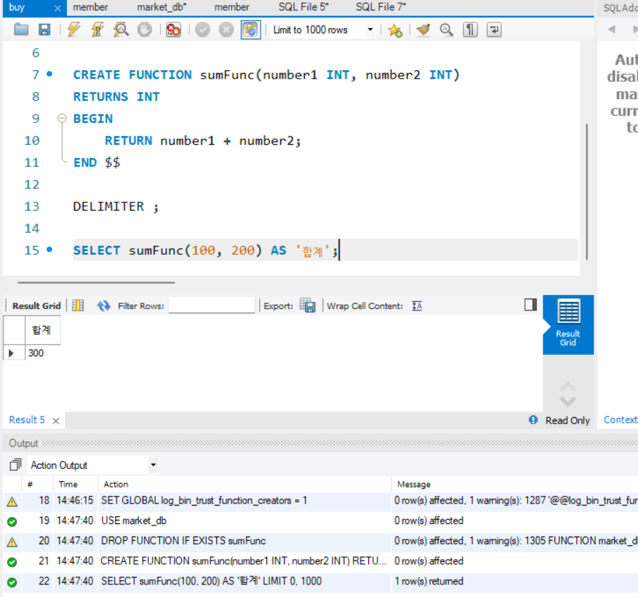
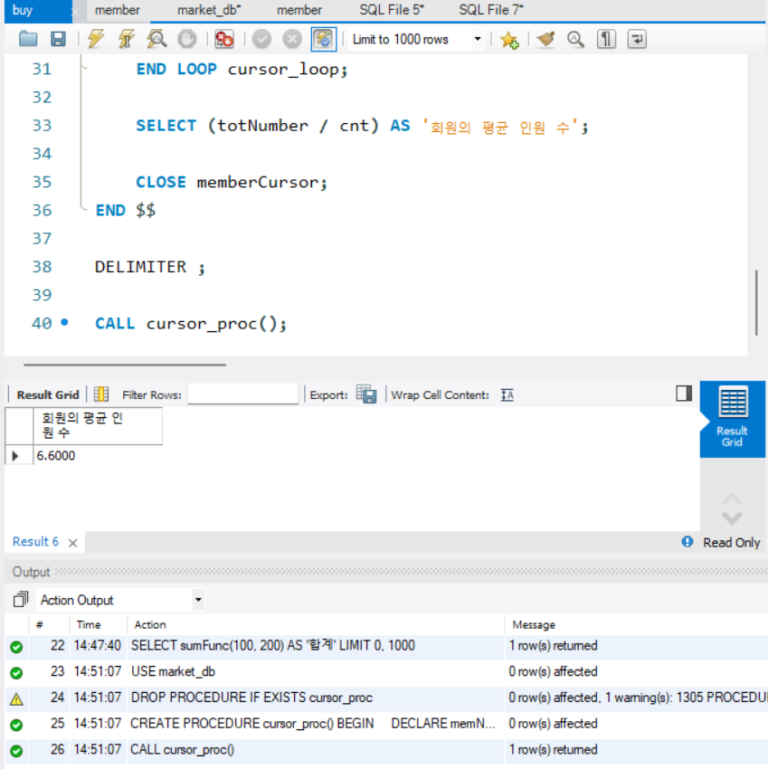


## 3. 자동 실행되는 트리거 

<!-- 트리거에 관해 배우게 된 점을 적어주세요. -->
**트리거**: 자동으로 수행하여 사용자가 추가 작업을 잊어버리는 실수를 방지해줌 => *데이터의 무결성* 보장 가능 
### 트리거 기본
#### 트리거의 개요
- 트리거랑 테이블에 INSERT나 UPDATE 또는 DELETE 작업이 발생하면 실행되는 코드 

#### 트리거의 기본 작용
트리거는 특정 테이블에서 `INSERT`, `UPDATE`, `DELETE`와 같은  
**DML(Data Manipulation Language)** 이벤트가 발생했을 때 자동으로 실행되는 객체이다.

| 구분 | 내용 |
|---|---|
| 작동 조건 | `INSERT`, `UPDATE`, `DELETE` 등의 DML 이벤트 발생 시 작동 |
| 실행 방식 | `CALL`문으로 직접 실행할 수 없음 |
| 실행 시점 | 테이블에 이벤트가 발생하면 자동 실행 |
| 매개변수 | `IN`, `OUT` 매개변수를 사용할 수 없음 |

<!-- 이번 챕터에서는 확인문제를 실습 인증으로 대체하여 진행합니다. 제시된 실습을 흐름에 맞게 진행한 후, 실습 과정이 보일 수 있도록 인증 사진을 2장 이상 제출해 주세요. -->
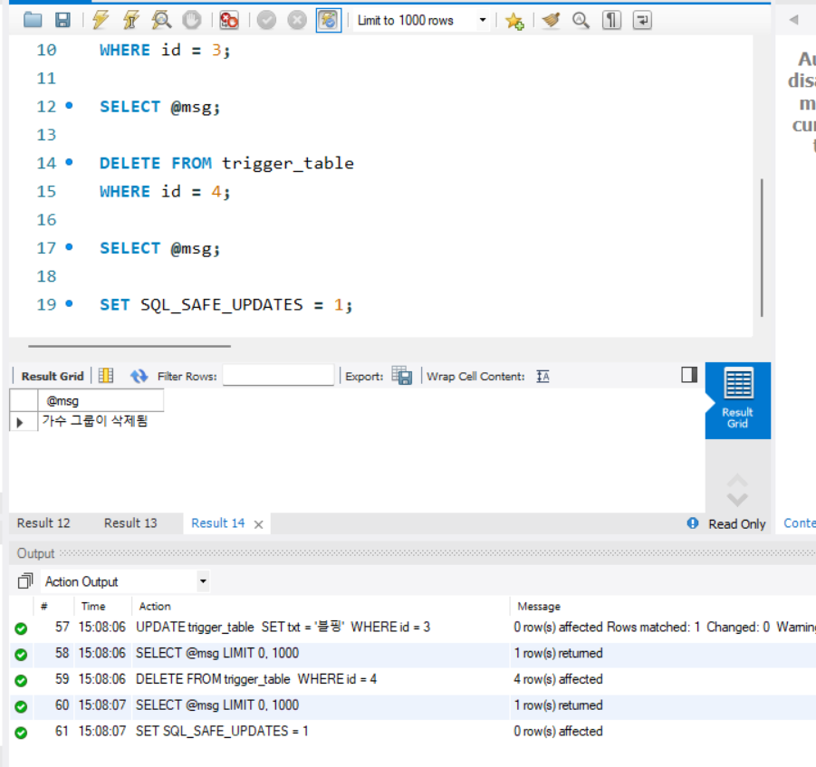
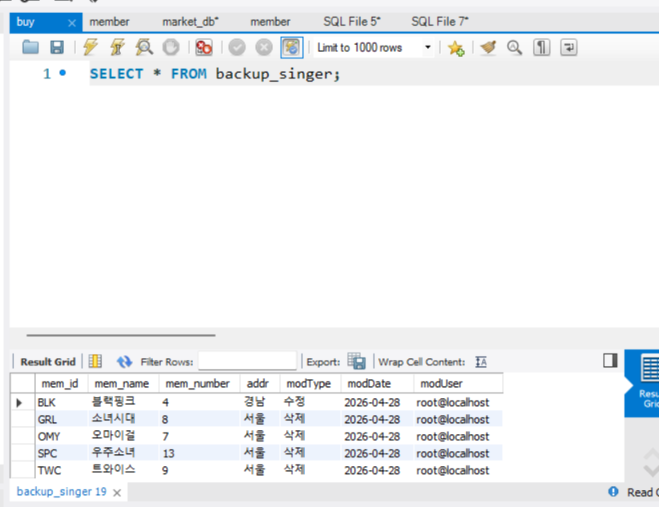


---

# 2️⃣ 실습과제

## 1. 데이터베이스 구축

아래 코드를 MySQL Workbench에 붙여넣은 후,  
**전체 드래그 → 실행 (Ctrl + Shift + Enter)** 하여 데이터베이스를 구축하세요.

```sql
CREATE DATABASE IF NOT EXISTS week6_db;
USE week6_db;

-- 초기화
DROP TABLE IF EXISTS transactions;
DROP TABLE IF EXISTS accounts;

-- 계좌 테이블
CREATE TABLE accounts (
    acc_id INT PRIMARY KEY,
    name VARCHAR(20) NOT NULL,
    balance INT NOT NULL DEFAULT 0 CHECK (balance >= 0)
);

-- 거래 테이블
CREATE TABLE transactions (
    tx_id INT PRIMARY KEY,
    acc_id INT NOT NULL,
    amount INT NOT NULL,
    tx_date DATETIME NOT NULL DEFAULT CURRENT_TIMESTAMP
);

-- 샘플 데이터
INSERT INTO accounts VALUES
(1, '진아', 20000),
(2, '혜인', 8000),
(3, '규서', 55000),
(4, '규영', 12000);
```

## 2. 실습 문제

다음 문제를 수행하고 실행 결과를 확인 후 인증 사진을 아래에 업로드하세요.
(추가 수행도 필수입니다.)


### 1. 스토어드 프로시저

**다음 요구사항을 만족하는 프로시저 `sp_add_balance`를 생성하시오.**
- 입력값: `p_acc_id INT`, `p_amount INT`
- 기능:
  - 해당 계좌의 `balance`에 `p_amount`를 더합니다.

**추가 수행**
- 프로시저를 1회 이상 CALL 하시오.
- 실행 후 `accounts` 테이블을 조회하여 잔액이 변경되었는지 확인하시오.

---

### 2. 스토어드 함수

**다음 요구사항을 만족하는 함수 `fn_is_vip`를 생성하시오.**
- 입력값: `p_balance INT`
- 반환값:
  - `p_balance >= 50000` 이면 `'VIP'`
  - 그렇지 않으면 `'일반'`

**추가 수행**
- `accounts` 테이블을 조회하면서 `fn_is_vip(balance)` 결과를 함께 출력하시오.

---

### 3. 커서(Cursor)

**accounts 테이블의 모든 계좌를 커서로 순회하면서 각 계좌의 `name`과 `balance`를 출력하는 프로시저를 작성하시오.**

**추가 수행**
- 프로시저를 CALL 하여 결과를 확인하시오.

---

### 4. 트리거(Trigger)

**transactions 테이블에 새로운 데이터가 INSERT 될 때 해당 `acc_id`의 `accounts.balance`가 자동으로 증가하도록 트리거를 생성하시오.**

**추가 수행**
- transactions에 직접 INSERT 하시오.
- accounts 잔액이 자동으로 증가하는지 확인하시오.


1. 
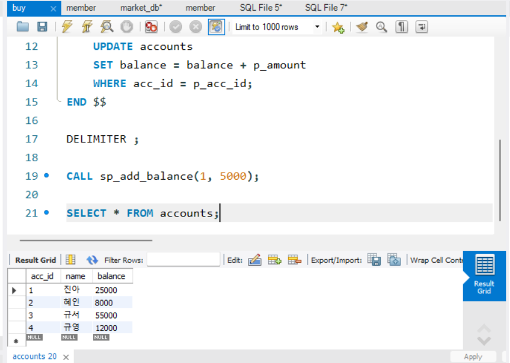

2. 
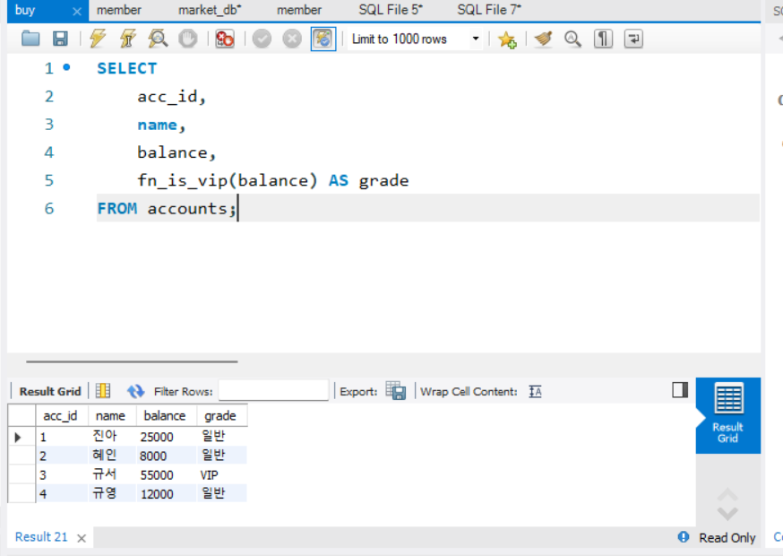

3. 
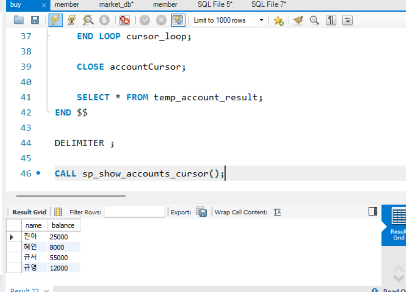

4. 
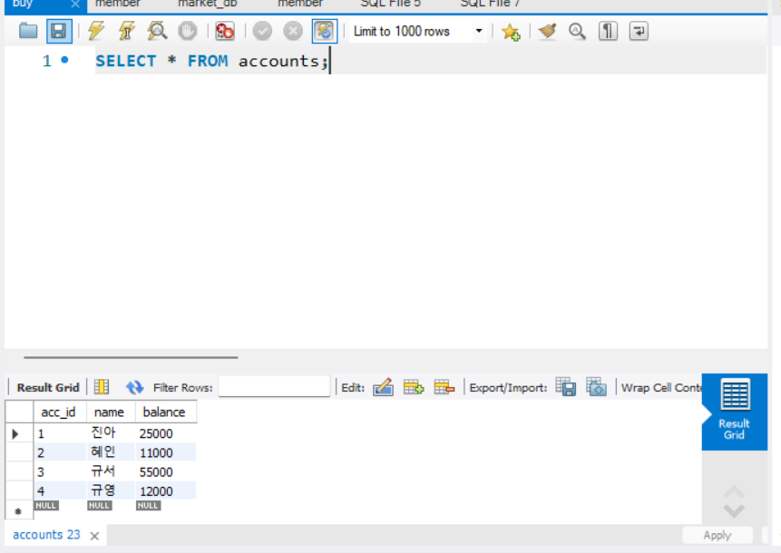

### 🎉 수고하셨습니다.


