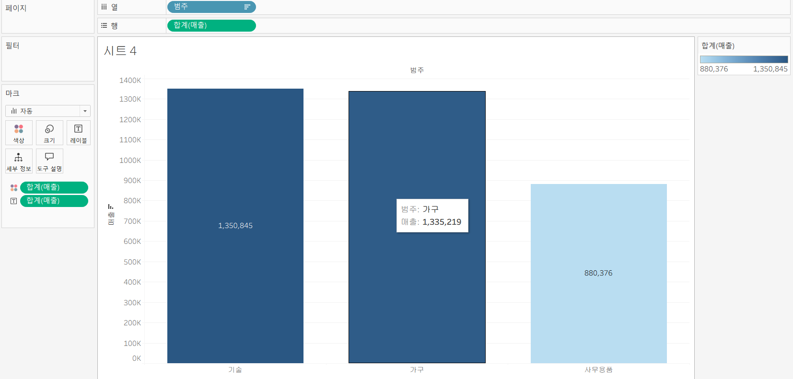
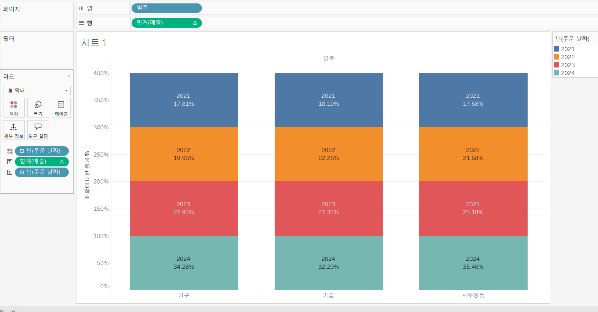
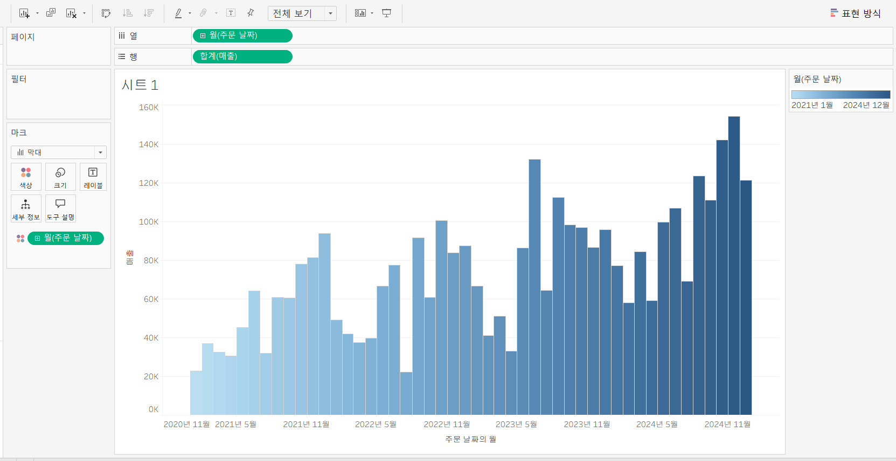
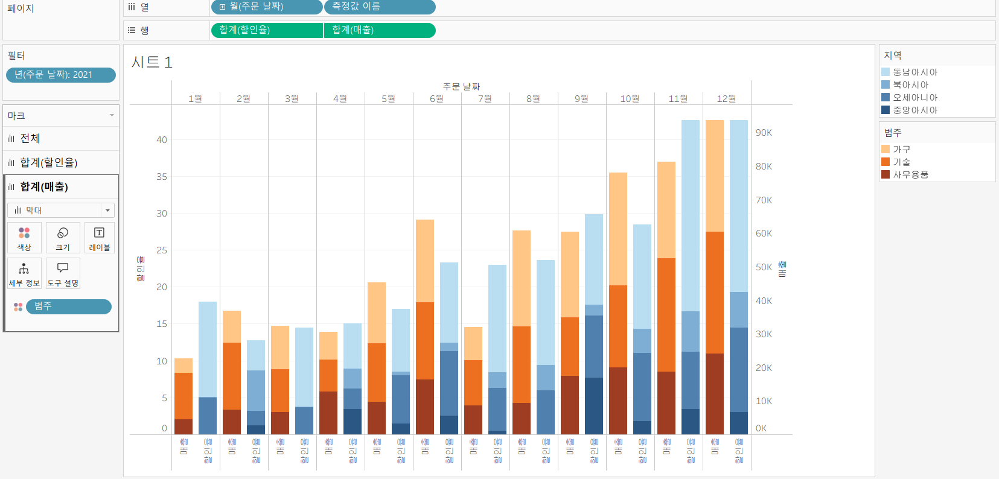
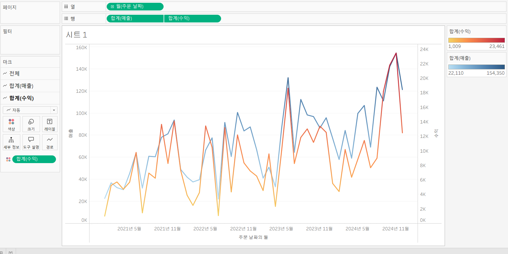
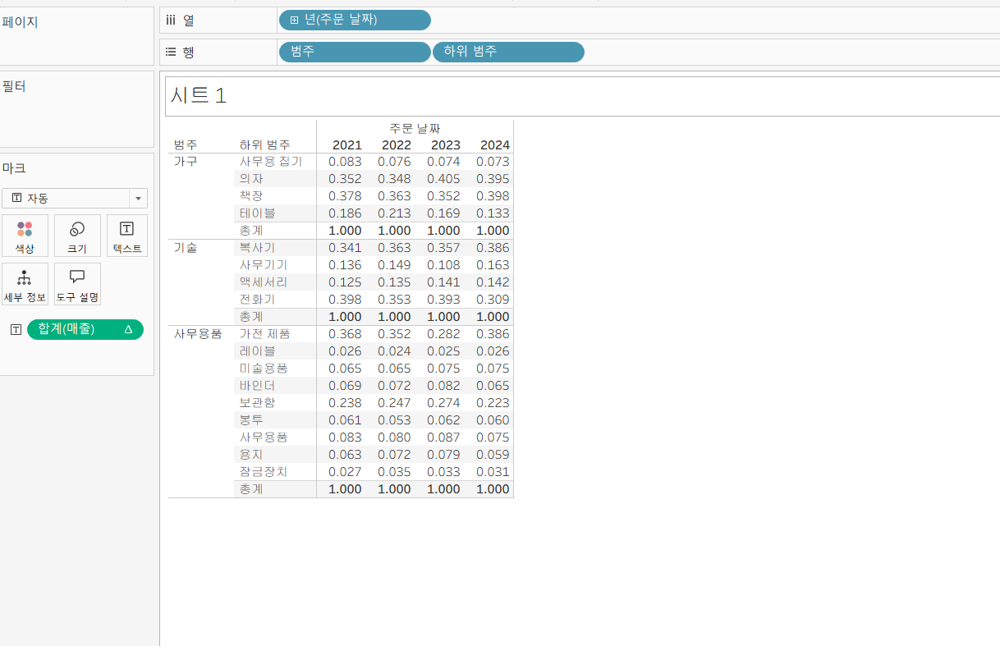
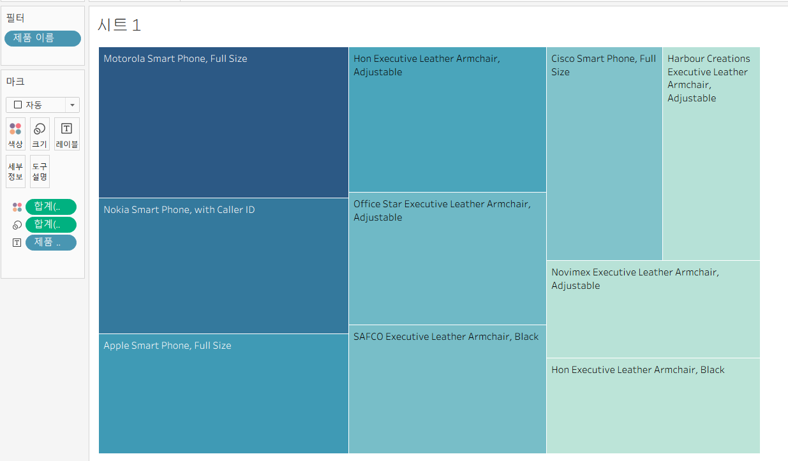
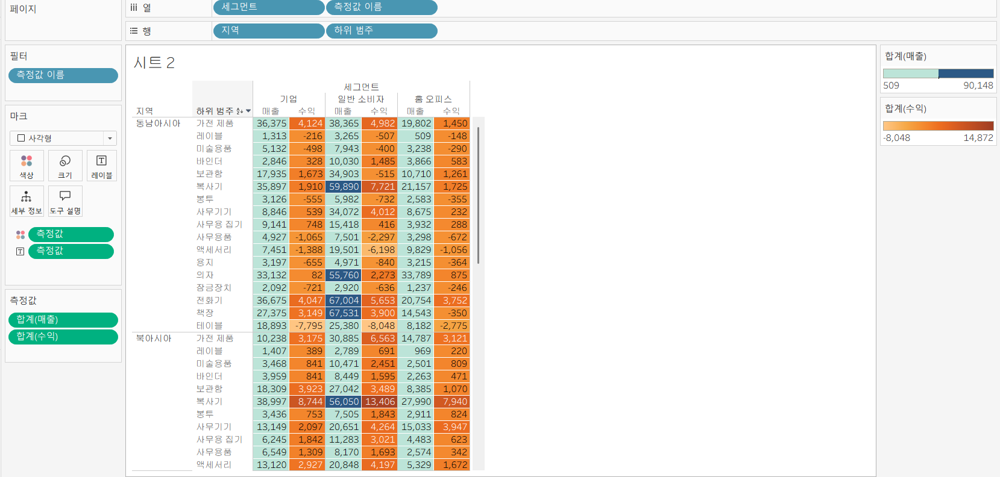

# Tableau 2주차 정규과제

📌Tableau 정규과제는 매주 정해진 **유튜브 강의를 통해 태블로 이론 및 기능을 학습한 후, 실습 문제를 풀어보며 이해도를 높이는 학습 방식**입니다. 

이번주는 아래의 **Tableau_2nd_TIL**에 명시된 유튜브 강의를 먼저 수강해주세요. 학습 중에는 주요 개념을 스스로 정리하고, 이해가 어려운 부분은 강의 자료나 추가 자료를 참고해 보완하세요. 과제 작성이 끝난 이후에는 **Github에 TIL과 실습 인증 결과를 업로드 후, 과제 시트에 제출해주세요.**


**👀(수행 인증샷은 필수입니다.)** 

> 태블로를 활용하는 과제인 경우, 따로 캡쳐도구를 사용하여 이미지를 첨가해주세요.


## Tableau_2nd_TIL

### 10. 차원과 측정값

### 11. 시각화

### 12. 막대 그래프

### 13. 누적막대 그래프

### 14. 병렬막대 그래프

### 15. 누적병렬막대 그래프

### 16. 라인 그래프

### 17. 맵 작성

### 18. 텍스트 레이블

### 19. 트리맵과 하이라이트 테이블


<br>

## 주차별 학습 (Study Schedule)

| 주차  | 공부 범위          | 완료 여부 |
| ----- | ------------------ | --------- |
| 1주차 | **강의 1 ~ 9강**   | ✅         |
| 2주차 | **강의 10 ~ 19강** | ✅         |
| 3주차 | **강의 20 ~ 29강** | 🍽️         |
| 4주차 | **강의 30 ~ 39강** | 🍽️         |
| 5주차 | **강의 40 ~ 49강** | 🍽️         |
| 6주차 | **강의 50 ~ 59강** | 🍽️         |
| 7주차 | **강의 60 ~ 69강** | 🍽️         |

<!-- 여기까진 그대로 둬 주세요-->


---

# 1️⃣ 학습 내용 정리

## 10강: 차원과 측정값

<!-- 차원과 측정값에 관해 배우게 된 점을 적어주세요 -->
- 태블로는 데이터의 열을 필드로 만들고 데이터의 유형에 따라 필드를 차원 또는 측정값으로 할당함
- 중간 라인을 기준으로 위쪽 영역이 차원, 아래쪽 영역이 필드값
- 차원으로 분류되는 데이터는 : 정성적인 값을 가지고 있는 필드 => 불연속형 필드(개별적으로 구분되는 값)
- 측정값으로 분류되는 데이터는 : 정량적인 수치값을 가지고 있음(집계될 수 있는) => 연속형 필도(단절이 없는 무한한 범위)
- 차원과 측정값은 독립됨 
- 필드는 사용하고자 하는 방식에 따라 변경할 수 있음 

> **🧞‍♀️ 차원과 측정값의 고유한 특성에 대해 설명해주세요.**

```
- 차원은 데이터를 분류하고 구분하는 역할을 하는 필드이다. 
    - 차원으로 분류되는 데이터는 정성적 데이터를 포함하며
    - 기본적으로 불연속형 데이터이다. 
- 측정값은 수치 데이터를 기반으로 계산이나 집계가 가능한 필드이다.
    - 측정값으로 분류되는 데이터는 정량적 데이터이며
    - 기본적으로 연속형 데이터이다. 
```

*Quiz: 차원은 불연속형이고, 측정값은 연속형이다 (o)*


## 11강: 시각화

<!-- 시각화 관해 배우게 된 점을 적어주세요 -->
- 뷰를 작성할 때는 데이터 패널의 필드를 시트로 추가하면 됨
    - 방법1: 별다른 동작을 추가하지 않아도 데이터를 자동으로 시각화
    - 방법2: 데이터를 선반으로 직접 끌어오기
    - 방법3: ctrl키로 측정값에 드래그하여 끌어오기
- 차원: 독립적인 값 - 표 형태로 시각화를 진행했을 때 머리글로 표시가 됨
- 측정값: 차원의 세부항목 - 패널로 표시가 됨 

*Quiz: 차원은 대부분 불연속형이며 표 형태로 시각화했을 때 머리글로 표시되고, 측정값은 대부분 연속형이므로 표 형태로 시각화 진행했을 때 패널로 추가된다.(o)*


## 12강: 막대그래프

<!-- 막대그래프에 관해 배우게 된 점을 적어주세요 -->
- 메뉴에서 내림차순 버튼을 누르면 바로 정렬 가능
- 그래프에서 색상을 바꾸고 싶으면 마크에서 진행하면 됨 
- 마크 > 레이블 : 막대그래프에 표시할 수 있음 

실습 사진



## 13강: 누적막대그래프

<!-- 누적막대그래프에 관해 배우게 된 점을 적어주세요 -->
- 열 선반에 있는 것을 마크 > 세부 정보로 이동
- 퀵 테이블 계산을 활용하면 계산 유영을 변경할 수 있음 
    - 표시하려는 뷰에서 데이터 유형을 변경하는 것이 좋음

실습 사진



<!-- 테이블(아래로)와 테이블(옆으로)의 계산 방식을 습득해보세요. 이에 관련해 아래 참고자료도 있습니다 :) -->


## 14강: 병렬막대그래프

<!-- 병렬막대그래프에 관해 배우게 된 점을 적어주세요 -->
- 날짜는 기본적으로 불연속형인데, 병렬 그래프를 그랠 때 필드를 연속형으로 설정해야 각 막대의 수평 위치를 고정하여 그룹을 형성할 수 있음 
- 연속형 필드로 변경하게 되면: 시간의 흐름을 인지할 수 있게 됨 

실습사진




> *🧞‍♀️ 끊어진 색상으로 배치되어 표현되는 경우와 이어지는 그라데이션 색으로 표현되는 경우 두 가지가 있습니다. 위 사진의 경우 왜 색깔이 끊어지는 색상으로 표시되지 않고 그라데이션으로 표시되었나요? 데이터의 특성과 관련하여 이야기해 봅시다.*

```
월은 원래 차원 데이터로 불연속적인 값을 가지지만, 위 사진에서는 연속형 데이터로 변경했다. 이는 해당 필드가 측정값이 됐다는 것을 의미하는데, 측정값은 정량적인 수치 데이터로 연속적인 값을 가지며 집계가 가능한 데이터이기 때문에 태블로에서는 이를 연속형 데이터로 인식하여 색상을 그라데이션 형태로 표현한다. 
```


## 15강: 누적병렬막대그래프

<!-- 누적병렬막대그래프에 관해 배우게 된 점을 적어주세요 -->
- 연도를 연속형으로 바꿔도 큰 의미가 없음

실습 사진




> *🧞‍♀️ 위 사진에서는 Profit과 Sales를 측정값으로 두었습니다.  개별 칼럼(태블로에서는 #필드라 명칭합니다)을 열/행에 두는 대신, '측정값'을 사용하고 측정값 선반에 필드를 올려둡니다. 이런 방식을 사용하는 이유가 무엇일지, 어떻게 사용할 수 있을지 고민해보세요*

```
여러 개의 측정값을 하나의 시각화에서 동시에 비교하기 위해서이다. 측정값을 사용하면 여러 수치 데이터를 하나의 축이나 동일한 그래프에서 함께 표시할 수 있어 데이터 간 비교가 용이해진다. 또한 측정값 선반에 필드를 올리면 여러 측정값을 하나의 시각화에서 통합적으로 관리하고 표현할 수 있기 때문에 효율적인 분석이 가능하다. 
```

<!-- 정답은 없습니다 -->


## 16강: 라인그래프

<!-- 라인그래프에 관해 배우게 된 점을 적어주세요 -->
- 라인차트: 데이터의 시간별 추세를 확인하거나 해당 데이터를 통해 미래 값을 예측하는 경우에 많이 사용

실습 사진




## 17강: 맵작성

<!-- 맵차트 관해 배우게 된 점을 적어주세요 -->
- 태블로에서 자동으로 위도경도를 인식하여 맵으로 표시함
- 다양한 위치를 추가하는 방법: 맵에 여러 계층의 지리적 데이터를 추가하는 경우 마크 계층을 활용할 수 있음 

```js
## 참고
Country/Region - 나라/지역
State/Province - 시/도
City - 시
County - 군
Postal Code - 우편번호
Area Code - 지역 코드
Airport - 공항
MSA/CBSA (Metropolitan Statistical Area) - 광역 통계 지역
Longitude - 경도
Latitude - 위도
```


## 18강: 텍스트테이블

<!-- 텍스트테이블에 관해 배우게 된 점을 적어주세요-->
실습 사진




## 19강: 트리맵과 하이라이트테이블





> *🧞‍♀️하이라이트 테이블 등에서 두개 이상의 측정값을 사용하는 경우, 함께 색을 표현하게 되면 단위가 달라 정확한 값을 표현할 수 없습니다. 이때 클릭해야 하는 항목은?*

```
개별 범례
```


<br>

# 2️⃣ 확인문제

## 문제1

```js
혜인이는 superstore의 한국 수출 관리 업무를 맡고 있습니다. 국가/지역이 우리나라, 즉 'South Korea'인 데이터만을 필터링하여, 상품 하위범주 별로 각 하위범주가 매출의 비율 중 얼마만큼을 차지하는지를 트리맵으로 확인하고 싶습니다. 트리맵의 각 네모 안에 표시되는 텍스트에는 **해당 범주의 이름과 전체에서 해당 범주가 차지하는 비율**이 표시되었으면 합니다.

혜인이를 도와주세요! (풀이를 찾아가는 과정을 기술해주세요)
```

```
먼저, 국가에 필터링을 걸어야 한다. 데이터 패널에서 국가/지역 필드를 필터 선반으로 드래그하며 필터 목록에서 south korea만 선택한다. 
이후 상품 하위범주별 매출 비율을 보기 위해 트리맵을 생성해야 한다. 상품 하위 범주를 마크 카드의 레이블에 드래그 하고 매출을 마크 카드의 크기에 드래그 하여, 마크 유형을 트리맵으로 변경한다. 
다음으로, 각 하위범주가 전체 매출에서 차지하는 비율을 계산하기 위해 매출 필드를 클릭하여 퀵 테이블 계산> 구성비율을 선택한다.
마지막으로 레이블 편집에서 "해당 범주의 이름과 전체에서 해당 범주가 차지하는 비율"이 표시되도록 설정한다. 
```


## 문제2

```js
예운이는 국가/지역별로 매출과 수익의 증감을 시간에 흐름에 따라 표현하고자 합니다. 특히 **한국/중국/일본**을 비교하고자 해당 3국을 남기고 필터링했고, 3개 국가를 매출과 수익이라는 두 가지 지표로 확인해보았습니다.

아래는 위 설명을 표현해본 예시입니다.
```


```js
레퍼런스와 꼭 같지 않아도 자유롭게 표현하고, 그 과정을 기술해주세요.
```

```
먼저 국가별 매출과 수익의 변화를 비교하기 위해 국가/지역 필드를 필터 선반으로 드래그 한 뒤, 한국/중국/일본만 선택하여 필터링한다. 이후, 시간에 따른 변화를 확인하기 위해 배송날짜를 열 선반에 드래그 하고 월 단위로 설정한다. 다음으로 매출과 수익을 행 선반에 드래그하여 두 지표를 시각화 한다. 두 지표를 동시에 비교하기 위해 측정값을 사용하거나 이중축을 활용하여 하나의 그래프에 함께 표현할 수 있다. 또한 국가별 비교를 위해 국가/지역 필드를 열 선반에 추가하여 각 국가가 각각의 패널로 나타나도록 설정한다. 마지막으로 마크 유형을 선으로 설정하면 시간 흐름에 따른 매출과 수익의 증감 추이를 국가별로 비교하는 시계열 그래프를 확인할 수 있다. 
```


### 참고 자료

```js
테이블 계산에서 '다음을 사용하여 계산'에는 테이블 당 계산과 패널 당 계산이 있습니다. 이에 대해 이해하는 것이 꼭 필요하기 때문에, 외부 레퍼런스를 참고하여 이 단계에서 꼭! 학습 후, 넘어가주세요 :)
```


[참고 외부자료 링크는여기를클릭하십시다](https://velog.io/@eunsuh/Tableau-%EB%A0%88%EB%B2%A8UP-%EA%B0%95%EC%9D%98-%EC%A0%95%EB%A6%AC-1-%ED%85%8C%EC%9D%B4%EB%B8%94-%EA%B3%84%EC%82%B0)

<br>

<br>

### 🎉 수고하셨습니다.
