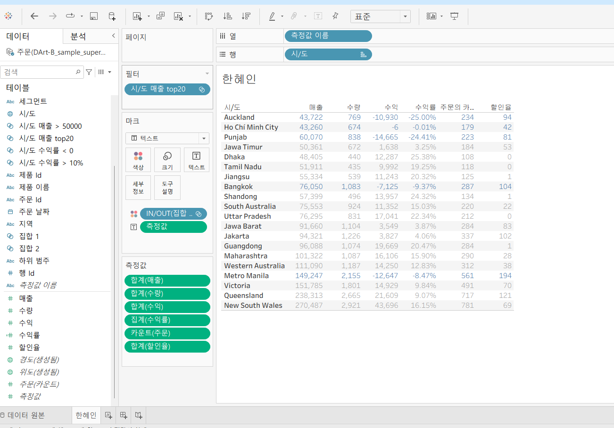

# Tableau 4주차 정규과제

📌Tableau 정규과제는 매주 정해진 **유튜브 강의를 통해 태블로 이론 및 기능을 학습한 후, 실습 문제를 풀어보며 이해도를 높이는 학습 방식**입니다. 

이번주는 아래의 **Tableau_4th_TIL**에 명시된 유튜브 강의를 먼저 수강해주세요. 학습 중에는 주요 개념을 스스로 정리하고, 이해가 어려운 부분은 강의 자료나 추가 자료를 참고해 보완하세요. 과제 작성이 끝난 이후에는 **Github에 TIL과 실습 인증 결과를 업로드 후, 과제 시트에 제출해주세요.**


**👀(수행 인증샷은 필수입니다.)** 

> 태블로를 활용하는 과제인 경우, 따로 캡쳐도구를 사용하여 이미지를 첨가해주세요.


## Tableau_4th_TIL

### 30. 계층

### 31. 집합

### 32. 결합집합

### 33. 계산된 필드

### 34. 행수준계산

### 35. 집계계산

### 36. 테이블 계산

### 37. 퀵테이블 계산(1)

### 38. 퀵테이블 계산(2)


<br>

## 주차별 학습 (Study Schedule)

| 주차  | 공부 범위          | 완료 여부 |
| ----- | ------------------ | --------- |
| 1주차 | **강의 1 ~ 9강**   | ✅         |
| 2주차 | **강의 10 ~ 19강** | ✅         |
| 3주차 | **강의 20 ~ 29강** | ✅         |
| 4주차 | **강의 30 ~ 38강** | ✅         |
| 5주차 | **강의 39 ~ 49강** | 🍽️         |
| 6주차 | **강의 50 ~ 59강** | 🍽️         |
| 7주차 | **강의 60 ~ 69강** | 🍽️         |

> **🧞‍♀️ 오늘의 스터디는 지니와 함께합니다.**

<!-- 여기까진 그대로 둬 주세요-->


---

# 학습 내용 정리

## 30. 계층
<!-- 계층 구조와 관련된 개념, 사용 방법 등을 적어주세요. -->
*계층*
- 뷰에서 데이터를 drill down 해, 값을 세부적으로 찾을 때 유용한 방법
- 태블로에서 날짜 데이터와 함께 제공되는 경우에 자동으로 계층을 생성함


## 31. 집합
<!-- 집합의 정의 및 활용 방법에 대해 알게 된 점을 적어주세요. -->
*집합*
- 데이터를 표시하는 방법
- 사용자가 직접 어떤 조건을 설정하고 그 조건을 기반으로 데이터를 구분
- 집합 만들기
    - 일반 탭: 수동으로 데이터를 묶을 수 있음
    - 조건 탭: 사용자가 설정한 조건이 충족되면 데이터를 묶어줌
    - 상위 탭: 상위 또는 하위 순서로 묵어줌


## 32. 결합집합
<!-- 결합집합의 개념 및 사용 사례를 적어주세요. -->
*결합된 집합*
- 집합을 활용하면 지정한 조건에 따라 데이터 구분 가능
- 기본적으로 집합을 적용할 때는 하나의 조건
- 두 개 이상을 원하면 결합된 집합 사용
- 옵션
    - 집합의 모든 멤버
    - 두 집합의 공유 멤버
    - 공유 멤버를 제외한 둘 중 하나의 멤버

## 33. 계산된 필드
<!-- 계산된 필드를 사용하는 방법과 예시를 적어주세요. -->
*계산된 필드*
- 기존 데이터 이외에 계산해야 할 데이터가 추가로 필요할 경우에 만들어 사용
- 생성 방법 3가지
    - 데이터 패널을 통해 생성
    - 분석 탭을 활용해 생성
    - 사용하고자 하는 필드 위에 마우스 우클릭해서 만들기
- 입력하는 방법
    - 해당 필드를 드래그 앤 드랍
    - 입력창에 필드 이름을 입력


## 34. 행수준계산
<!-- 행수준 계산의 의미와 적용 방법을 적어주세요. -->
*기본계산*
- 계산된 필드
    - 기본 계산
    - 테이블 계산
    - LOD 표현식
- **기본 계산**: 기본 계산은 원본에 대한 행 수준 계산 또는 집계 계산
    - 행 수준 데이터를 각 레코드를 통해 계산하는 방식
    - 집계 계산: 현재 뷰에서 보이는 기준으로 계산


## 35. 집계계산
<!-- 집계계산의 정의 및 활용 사례에 대해 알게 된 점을 적어주세요. -->
*집계계산*
- 현재 뷰에서 보이는 기준으로 계산(뷰에서 보이는 기준을 따라서 계산)
- 태블로는 뷰에서 필드 레벨에 따라 해당 레벨에 관련된 레코드를 통해 계산에서 원한 값을 반환해서 확인 
- 사용자가 집계 계산된 필드를 만들면 해당 필드에 집계를 나타나고, 우클릭으로 변경이 안됨


## 36. 테이블계산
<!-- 테이블 계산의 개념 및 사용 방법을 적어주세요. -->
- 기본 계산은 데이터 원본에 대한 계산이라면
*테이블 계산*
- 뷰에 보이는 내용을 바탕으로 데이터가 계산됨
- 월마나 누적 매출을 계산: RUNNING_SUM(SUM(매출))
- 옵션을 변경할 때마다 태블로는 자동으로 해당 옵션에 계산 방향을 하이라이트를 통해 범위를 알려줌
- 정렬 순서도 변경할 수 있음 > 사용자 지정 선택


## 37. 퀵테이블계산(1)
<!-- 퀵테이블 계산의 원리 및 예제에 대해 알게 된 점을 적어주세요. -->
*퀵 테이블 계산*
- 테이블 계산에서 가장 많이 쓰이는 테이블 계산 유형들을 클릭만으로 가능하도록 만들어 놓은 기능
- 작동 방식
    - 사용하고자 하는 필드 위에 마우스 우 클릭 후 "퀵 테이블 계산" 선택
    - 필드 옆에 나타난 세모 표시는 퀵 테이블 계산이 되었다는 의미임 
- 차이: 측정값이 기준값과 어느 정도 차이가 있는지 값을 표현
- 비율 차이: 측정값들 사이의 성장률 또는 % 차이를 표현 


## 38. 퀵테이블계산(2)
<!-- 이동평균, YTD 총계, 전년 대비 성장률, YTD 성장률 등 본 강의에서 알게 된 점을 적어주세요. -->
*아동평균*
이전의 값부터 현재까지 값에 대한 평균을 낼 때 사영하며 주식 데이터에서 많이 활용

*YTD 총계*
- Year to Date: 특정 시점을 기준으로 해당 연도부터 그 시점까지 총계를 의미함
- 누계와 같은 개념이지만 연도보다 하위 레벨임

*통합 성장률(Compound Growth Rate)*


*전년 대비 성장률*
같은 월을 기준으로 이전 연도 대비 얼마나 성장했는지

*YTD 성장률*
- 단일 계산식이어야 함 
- 성장율 안에는 총계가 숨겨져 있음 


# 확인문제

## 문제 1.

푸앙이는 이제껏 매출을 올리는 데에 힘썼었지만, 왠지 모르게 주머니에 들어오는 돈이 없어 속상합니다. 

그래서 매출이 상위 20곳에 속하지만, 수익률(%)이 마이너스인 시/도를 확인하려고 합니다.

> **수익률은 SUM([수익]) / SUM([매출])로 정의합니다.**

어떤 집합을 만들었고, 어떤 결합을 하였는지를 중심으로 기술하고, 결과 자료를 첨부해주세요. (텍스트 표 형태이며, 색상으로 위 집합을 구분할 수 있게 만들어주세요.)

<!-- 아래 예시 이미지를 삭제하고, 직접 만든 시트 사진을 올려주세요. 시트의 이름은 본인 이름으로 기입해주세요-->
```
시/도를 기준으로 두 개의 집합을 생성하였다. 첫 번째로, SUM(매출)을 기준으로 상위 20개 시/도를 선정하여 ‘매출 Top20 집합’을 생성하였다.  두 번째로, SUM(수익) / SUM(매출)로 정의한 수익률이 0보다 작은 시/도들을 기준으로 ‘수익률 < 0 집합’을 생성하였다. 이후 두 집합을 결합하여 ‘두 집합에 모두 속하는 멤버’를 선택함으로써 교집합을 구성하였다.  이를 통해 매출은 상위 20위에 속하지만 수익률이 음수인 시/도들을 도출할 수 있었다.
```



## 문제 2.

> **푸앙이는 주문 Id별로 주문에서 배송까지에 걸리는 날짜 일수가 궁금했습니다. 
> 그래서 주문 ID별로 주문에서 배송까지 걸리는 일자를 '배송까지 걸린 일수'라는 계산된 필드로 만들고, 이를 마크에 올린 후 확인해보았습니다.  이때, 계산된 필드의 식은 'DATEDIFF' 함수를 이용하였습니다.**

**배송까지 걸린 일수 계산을 위한 DATEDIFF 함수 수식을 적어주세요.**


~~~
DATEDIFF('day', [주문 날짜], [배송 날짜])
~~~


>  **그런데 위 그림처럼 '주문 날짜'와 '배송 날짜'를 함께 행에 올려 확인해보니, 주문날짜와 배송날짜의 차이가 '배송까지 걸린 일수'와 다릅니다. ID-2021-11126을 보니, 11월 26일 배송에 11월 30일 배송이면 4일 차이인데, 12일이 걸렸다고 하네요. 왜 이런 문제가 생긴걸까요?**

~~~
해당 데이터는 주문 ID 하나에 여러 행(여러 상품)이 존재하는 구조이다. 
따라서 Tableau에서 DATEDIFF는 개별 행 기준이 아니라 현재 뷰의 집계 수준에서 계산된다. 
~~~


> **그리고 이를 해결하기 위해서는 어떻게 해야할까요?**

~~~
주문 ID 별로 날짜를 고정하여 계산해야 한다. -> LOD 사용
~~~


## 문제 3.

다음은 Tableau의 다양한 계산을 사용할 수 있는 경우를 빈칸으로 두고 문제를 작성한 것입니다. 각 빈칸에 적합한 계산 유형을 채워보세요.

> 보기 
>
> **누계, 차이, 비율 차이, 구성 비율, 순위, 백분위수, 이동 평균, YTD 총계, 통합 성장률, 전년 대비 성장률, YTD 성장률**


| 계산 유형     | 설명                      | 사용 예시                                                      |
| --------- | ----------------------- | ---------------------------------------------------------- |
| 누계        | 데이터의 누적 합계를 계산          | 한 기업이 월별 매출 데이터를 누적하여 연간 매출 추이를 보고 싶을 때 사용                 |
| 차이        | 연속 데이터 포인트 간의 차이를 계산    | 한 기업이 월별 매출 데이터에서 전월 대비 매출 증감량을 분석하고 싶은 경우                 |
| 비율 차이     | 연속 데이터 포인트 간의 비율 변화를 계산 | 한 기업이 월별 매출 데이터에서 전월 대비 매출 증감률(%)을 분석하고 싶은 경우              |
| 구성 비율     | 전체에서 각 데이터 포인트의 비율을 계산  | 한 기업이 전체 매출에서 각 제품군이 차지하는 비율을 보고 싶을 때 사용                   |
| 순위        | 데이터의 순위를 매깁니다           | 한 기업이 제품별 매출 데이터를 순위별로 정렬하여 상위 10개 제품을 분석하고 싶은 경우          |
| 백분위수      | 데이터의 백분위를 계산            | 한 기업이 고객별 구매 금액 데이터를 백분위수로 나누어 상위 25% 고객을 분석하고 싶은 경우       |
| 이동 평균     | 일정 기간의 평균을 계산           | 한 기업이 주간 매출 데이터에서 4주 이동 평균을 계산하여 트렌드를 분석하고 싶은 경우           |
| YTD 총계    | 연초부터 현재까지의 총계를 계산       | 한 기업이 월별 매출 데이터를 연초부터 현재까지 누적하여 연간 매출 목표 달성 여부를 분석하고 싶은 경우 |
| 통합 성장률    | 일정 기간 동안의 연평균 성장률을 계산   | 한 기업이 5년 간 매출 데이터를 바탕으로 연평균 성장률(CAGR)을 계산하고 싶은 경우          |
| 전년 대비 성장률 | 전년 동기간 대비 성장률을 계산       | 한 기업이 월별 매출 데이터에서 전년 동월 대비 매출 성장률을 분석하고 싶은 경우              |
| YTD 성장률   | 연초부터 현재까지의 성장률을 계산      | 한 기업이 올해 연초부터 현재까지의 매출이 전년 동기 대비 얼마나 성장했는지 분석하고 싶은 경우      |


> 사용 예시를 참고하여 실제 경우처럼 생각하며 고민해보아요!


<br>

<br>

### 🎉 수고하셨습니다.
