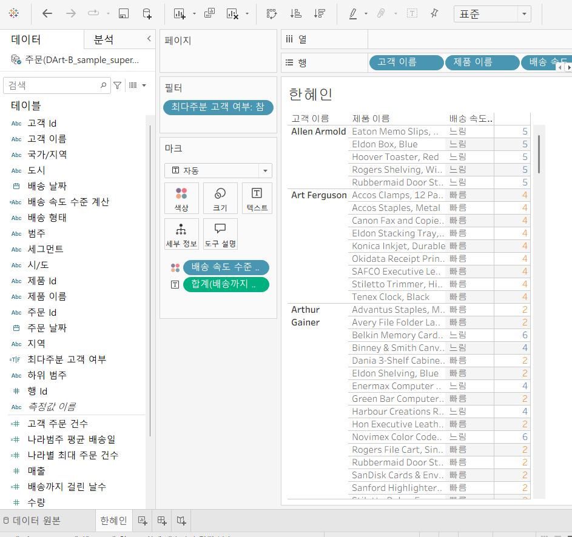
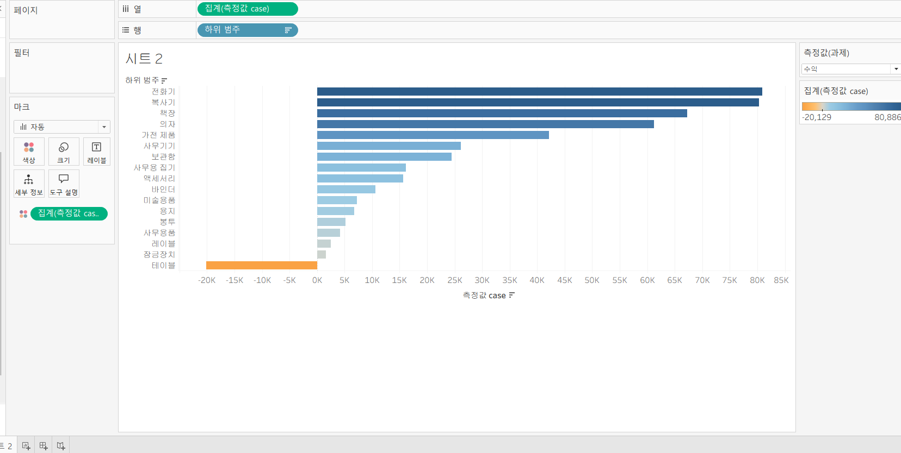

# Tableau 5주차 정규과제

📌Tableau 정규과제는 매주 정해진 **유튜브 강의를 통해 태블로 이론 및 기능을 학습한 후, 실습 문제를 풀어보며 이해도를 높이는 학습 방식**입니다. 

이번주는 아래의 **Tableau_5th_TIL**에 명시된 유튜브 강의를 먼저 수강해주세요. 학습 중에는 주요 개념을 스스로 정리하고, 이해가 어려운 부분은 강의 자료나 추가 자료를 참고해 보완하세요. 과제 작성이 끝난 이후에는 **Github에 TIL과 실습 인증 결과를 업로드 후, 과제 시트에 제출해주세요.**


**👀(수행 인증샷은 필수입니다.)** 

> 태블로를 활용하는 과제인 경우, 따로 캡쳐도구를 사용하여 이미지를 첨가해주세요.


## Tableau_5th_TIL

### 39. LOD

### 40. EXCLUDE

### 41. INCLUDE

### 42. 매개변수 

### 43. 매개변수 실습

### 44. 매개변수 실습

### 45. 마크카드

### 46. 서식계층

### 47. 워크시트 


<br>

## 주차별 학습 (Study Schedule)

| 주차  | 공부 범위          | 완료 여부 |
| ----- | ------------------ | --------- |
| 1주차 | **강의 1 ~ 9강**   | ✅         |
| 2주차 | **강의 10 ~ 19강** | ✅         |
| 3주차 | **강의 20 ~ 29강** | ✅         |
| 4주차 | **강의 30 ~ 38강** | ✅         |
| 5주차 | **강의 39 ~ 47강** | ✅         |
| 6주차 | **강의 48 ~ 59강** | 🍽️         |
| 7주차 | **강의 60 ~ 69강** | 🍽️         |

<!-- 여기까진 그대로 둬 주세요-->


---

# 학습 내용 정리

## 39강. LOD
<!-- INCLUDE, EXCLUDE, FIXED 등 본 강의에서 알게 된 LOD 표현식에 대해 알게 된 점을 적어주세요. -->
### LOD(Level of Detail)
- 현재 뷰에는 영향을 받지 않고 본인이 원하는 세부 수준에서 계산 가능
    - 계산할 수준을 세부적으로 제어 가능 
- LOD 표현식
    - FIXED: 현재 뷰에 있는 차원과 상관없이 계산된 필드에서 원하는 차원을 따라 계산함
    - 사용
        - FIXED 에서 설정한 차원이 뷰에 포함되어 있을 때
        - FIXED 에서 설정한 차원이 뷰에 포함되어 있지 않을 때


## 40. LOD EXCLUDE
<!-- INCLUDE, EXCLUDE, FIXED 등 본 강의에서 알게 된 LOD 표현식에 대해 알게 된 점을 적고, 아래 두 질문에 답해보세요 :) -->
- LOD 표현식2
    - EXCLUDE LOD: 현재 뷰에서 특정 차원을 제외하여 계산할 때 사용
- 차이점: FIXED는 현재 뷰와 관계 없이 특정 차원을 사용해 계산하기 때문에 필터의 영향을 받지 않지만, EXCLUDE는 뷰에 있는 차원을 따라 계산하기 때문에 관련 차원을 필터로 걸어보면 필터가 영향을 받음 

> **🧞‍♀️ FIXED와 EXCLUDE을 사용하는 경우의 차이가 무엇인가요?**

```
FIXED는 현재 뷰에 포함된 차원과 관계없이, 지정한 차원을 기준으로 계산되기 때문에 뷰의 구성이나 일부 필터의 영향을 받지 않는다. 따라서 특정 기준(예: 전체, 지역별 등)으로 값을 고정하여 비교할 때 사용된다.

반면 EXCLUDE는 현재 뷰에 포함된 차원을 기준으로 계산하되, 특정 차원을 제외하고 계산하는 방식이다. 따라서 뷰의 구조나 필터에 영향을 받으며, 현재 보고 있는 데이터 맥락 안에서 일부 차원을 제거하여 비교할 때 사용된다.
```

> **🧞‍♀️ 왜 ATTR 함수를 사용하나요?**

```
LOD 결과를 단일 값으로 만들어서 다른 집계값과 연산 가능하게 해준다. 
```


## 41. LOD INCLUDE
<!-- INCLUDE, EXCLUDE, FIXED 등 본 강의에서 알게 된 LOD 표현식에 대해 알게 된 점을 적고, 아래 두 질문에 답해보세요 :) -->
- LOD 표현식3
    - INCLUDE LOD: 현재 뷰에서 특정 차원을 추가하여 사용(차원필터를 통해 해당 값을 변경할 수 있음) 
- 언제 사용하는가?
    - 뷰의 표시되는 값이 차원 -> FIXED LOD(차원과 측정값 반환 가능)
        - INCLUDE, EXCLUDE은 측정값만 반환
    - 반환값이 차원값에 영향을 받는 경우 -> INCLUDE & EXCLUDE(차원 필터에 영향을 받음)

> **🧞‍♀️ 그렇다면 어떤 경우에 각 표현식을 사용하나요? 예시와 함께 적어보아요**

```
먼저 FIXED LOD는 현재 뷰에 포함된 차원과 관계없이, 지정한 차원을 기준으로 값을 고정하여 계산할 때 사용된다. 예를 들어, 뷰에 상품명이 포함되어 있어도 { FIXED [지역] : SUM([매출]) }을 사용하면 지역별 총매출을 일정하게 유지할 수 있다. 따라서 전체 기준이나 특정 차원 기준으로 값을 비교하고 싶을 때 적합하다.

다음으로 INCLUDE LOD는 현재 뷰에 없는 차원을 추가하여 더 세부적인 수준에서 계산할 때 사용된다. 예를 들어, 뷰가 지역 단위일 때 { INCLUDE [하위 범주] : SUM([매출]) }을 사용하면 하위 범주까지 고려한 평균이나 합계를 계산할 수 있다. 또한 INCLUDE는 차원 필터의 영향을 받기 때문에, 필터에 따라 값이 변해야 하는 경우에 적합하다.

마지막으로 EXCLUDE LOD는 현재 뷰에 포함된 특정 차원을 제외하고 계산할 때 사용된다. 예를 들어, 뷰에 지역과 하위 범주가 모두 포함되어 있을 때 { EXCLUDE [하위 범주] : SUM([매출]) }을 사용하면 하위 범주를 제외한 지역 단위 매출을 계산할 수 있다. 이를 통해 현재 값과 상위 수준 값의 차이를 비교하는 분석에 활용할 수 있다.
```


## 42. 매개변수
<!-- 매개변수에 대해 알게 된 점을 적어주세요 -->
### 매개변수
- 고정된 상수값이 아닌 동적인 값으로 변경하기 위해 활용
    - 반드시 계산식, 필터, 참조선과 함께 사용됨
- 만드는 방법
1. 필터
2. 원하는 필드위에 마우스 우클릭
3. 데이터 패널

> **🧞‍♀️ 집합에도 매개변수를 적용할 수 있나요? 시도해봅시다**
```
집합에도 적용할 수 있음 - 매개 변수 값에 따라 색상으로 구분되는 것을 확인할 수 있음
```


## 43. 매개변수 실습
- 계산식 활용 매개변수 실습


## 44. 매개변수 실습
<!-- 매개변수에 대해 알게 된 점을 적어주세요 -->
- 매개 변수 실습(참조선)


## 45. 워크시트 마크카드
<!-- 마크카드에 대해 알게 된 점을 적어주세요 -->
- 다양한 차트를 표현함과 동시에 직관적으로 표시해야 함 
- 서식들을 변경하기 위해서는 마크를 이용해야 함
- 태블로는 레이블이 다른 레이블과 겹칠 경우 자동으로 표시하지 않음


## 46. 서식 계층
<!-- 서식계층에 대해 알게 된 점을 적어주세요 -->
## 서식 계층 구조

서식은 **일반적인 것 → 구체적인 것** 순서로 적용됩니다.

### 계층 구조

1. 워크 시트 서식 (가장 일반적)
2. 행 / 열 서식
3. 특정 필드
4. 필드 레이블
5. 도구 설명 / 제목 / 마크 (가장 구체적)

---

### 핵심 개념

- 위에 있는 서식일수록 **전체에 영향**
- 아래로 갈수록 **더 구체적으로 적용**
- 아래 서식이 위 서식을 **덮어쓴다 (우선 적용됨)**

---

> **🧞‍♀️ 서식계층을 일반적인 것에서 구체적인 것 순서로 기입해보세요**


```
1. 워크 시트 서식 (가장 일반적)
2. 행 / 열 서식
3. 특정 필드
4. 필드 레이블
5. 도구 설명 / 제목 / 마크 (가장 구체적)
```


## 47. 워크시트 서식
<!-- 워크시트 서식에 대해 알게 된 점을 적어주세요!-->
### 서식
1. 글꼴
2. 맞춤
3. 음영: 구간 크기가 0이면 음영 X
4. 테두리
5. 라인


# 확인문제

## 문제 1.

```
가장 많이 주문한 사람들은 물건 배송을 빨리 받았을까요?
조건을 준수하여 아래 이미지를 만들어봅시다.
1) 국가/지역별(이하 '나라'로 통칭), 범주별로 배송일자가 다를 수 있으니 먼저, 나라별/범주별로 평균 배송일자를 설정한 뒤,
2) 각 나라에서 가장 많이 주문한 사람의 이름을 첫 번째 열,
3) 그 사람이 주문한 제품 이름을 2번째 열,
4) 각 상품이 배송까지 걸린 날 수를 표현하고
5) 그리고 만약 배송이 각 나라/범주별 평균보다 빨랐다면 '빠름', 같다면 '평균', 느리다면 '느림' 으로 print 해주세요. 
```


<!-- 여기까지 오는 과정 중 알게 된 점을 기입하고, 결과는 시트 명을 본인 이름으로 바꾸어 표시해주세요.-->


## 문제 2.

```
규영이는 태블로를 쓰실 수 없는 상사분께 보고하기 위한 대시보드를 만들고 싶어요. 

제품 중분류별로 구분하되 매개변수로써 수익, 매출, 수량을 입력하면 저절로 각각 지표에 해당하는 그래프로 바뀌도록 설계하고자 해요.

 어떤 값이 각 지표의 평균보다 낮은 값을 갖고 있다면 색깔을 주황색으로, 그것보다 높다면 파란색으로 표시하고 싶어요. 그 평균값은 각 지표별로 달라야 해요.
```



<!-- 예시 사진은 지워주세요-->


<br>

<br>

### 🎉 수고하셨습니다.
