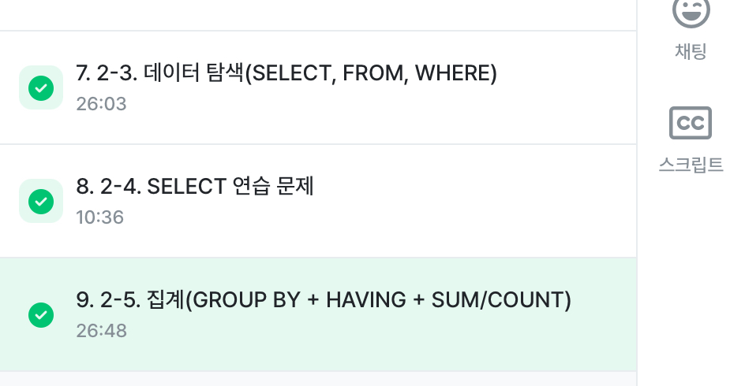

# SQL_BASIC 2주차 정규 과제 

📌SQL_BASIC 정규과제는 매주 정해진 분량의 `초보자를 위한 BigQuery(SQL) 입문` 강의를 듣고 간단한 문제를 풀면서 학습하는 것입니다. 이번주는 아래의 **SQL_Basic_2nd_TIL**에 나열된 분량을 수강하고 `학습 목표`에 맞게 공부하시면 됩니다.

**2주차 과제**는 1주차 과제처럼 SQL의 필요성이나 느낀점 위주가 아닌, **실제 강의 내용을 바탕으로 개념을 정리하고 학습한 내용을 집중적으로 기록**해주세요. 완성된 과제는 Github에 업로드하고, 링크를 스프레드시트 'SQL' 시트에 입력해 제출해주세요. 

**👀(수행 인증샷은 필수입니다.)** 

## SQL_BASIC_2nd

### 섹션 3. 데이터 탐색 - 조건, 추출, 요약

### 2-3. 데이터 탐색 (SELECT, FROM, WHERE)

### 2-4. SELECT 연습문제

### 2-5. 집계 (Group By + Having + Sum/Count)

## 🏁 강의 수강 (Study Schedule)

| 주차  | 공부 범위              | 완료 여부 |
| ----- | ---------------------- | --------- |
| 1주차 | 섹션 **1-1** ~ **2-2** | ✅         |
| 2주차 | 섹션 **2-3** ~ **2-5** | ✅         |
| 3주차 | 섹션 **2-6** ~ **3-3** | 🍽️         |
| 4주차 | 섹션 **3-4** ~ **4-4** | 🍽️         |
| 5주차 | 섹션 **4-4** ~ **4-9** | 🍽️         |
| 6주차 | 섹션 **5-1** ~ **5-7** | 🍽️         |
| 7주차 | 섹션 **6-1** ~ **6-6** | 🍽️         |

 

<!-- 여기까진 그대로 둬 주세요-->

---

# 1️⃣ 개념정리 

## 2-3. 데이터 탐색 (SELECT, FROM, WHERE)

~~~
✅ 학습 목표 :
* SQL 쿼리 구조를 이해할 수 있다. 
* SELECT, FROM, WHERE의 핵심 문법을 설명할 수 있다. 
~~~

<!-- 새롭게 배운 내용을 자유롭게 정리해주세요.-->
- 각각의 데이터 소스는 row와 column으로 구성
- SQL 커리문은 우선 SELECT, FROM, WHERE 문법을 사용함 
- FROM: 어떤 테이블에서 데이터를 활용할 것인지에 대해 명시 / AS 별칭 지정 가능 
- WHERE: 원하는 조건이 있다면 어떤 조건을 활용할 것인지
- SELECT: 테이블의 어떤 컬럼을 출력할 것인지 / AS뒤에는 별칭을 사용할 수 있음
- *: 모든 컬림을 출력하겠다는 의미(행이 적으면 크게 이슈가 없음, 실제로는 많이 사용하지 않음-비용이 많이 나감)
- *EXCEPT: 제외할 컬럼 
- 실행 순서: SELECT -> FROM -> WHERE
- 효율적으로 SQL을 활용하려면 집합의 관점에서 바라보면 됨
- 프로젝트 id는 꼭 명시할 필요는 없을 수도 있음(프로젝트가 단일이라면)
- 프로젝트를 여러개 사용한다면 명시하는 것이 좋음 => 쿼리를 실행할 때 어떤 프로젝트인지 확인하느 과정이 존재
- 프로젝트 명시 => 불편
- 프로젝트를 제외하고 사용해도 괜찮긴 함(여러 프로젝트를 쓸 때는 명시해야 함)
- 프로젝트 id를 제외하고 작성할 때는 ''이 없어도 괜찮음
- 데이터를 활용하고 싶은 목적이 있어야, 어떤 컬럼을 선택할지 알 수 있게 됨 
- 가독성 있는 쿼리
- 쿼리를 잘 읽을 수 있으려면 잘 작성해야 함 => 협업할 때 특히 중요 => 이후 강의에서 다룸
- ;(세미콜론): 하나의 쿼리문이 끝났다는 의미

## 2-5. 집계 (Group By / HAVING / SUM,COUNT)

~~~
✅ 학습 목표 :
* 데이터를 집계하고 그룹화하는 방법을 설명할 수 있다.
* GROUP BY, HAVING, ORDER BY, 집계함수(SUM/COUNT 등)을 활용하는 방법을 설명할 수 있다.
* having과 where의 차이에 대해서 설명할 수 있다.
~~~

<!-- 새롭게 배운 내용을 자유롭게 정리해주세요.-->
- 집계: GROUP BY(같은 값끼리 모아서 그룹화한다)
- -> 특정 칼럼을 기준으로 모으면서 다른 컬럼에서는 집계 가능(합, 평균 MAX, MIN 등)
- 정렬하고 싶은 경우에는 ORDER BY를 사용하면 됨
- 조건 설정하기 : 집계 후에는 HAVING을 사용(집계 후에도 조건을 설정할 수 있음!)
- 집계할 컬럼을 SELECT에 명시하고, 그 컬럼을 꼭 GROUP BY에 작성
- 사용하는 빈도가 높은 집계 함수: AVG, COUNT(row 세기), COUNTIF(특정 조건을 만족하는 row세기), MAX, MIN, SUM
- DISTINCT: 고유값을 알고 싶은 경우에 사용 => 중복을 제거하는 것임
- 데이터 분석하다가 그룹화하는 경우: 일자별 집계, 연령대별 집계, 특정 타입별 집계, 앱 화면별 집계 등
- 조건을 설정하고 싶은 경우: WHERE / HAVING
- WHERE: 테이블에 바로 조건을 설정하고 싶은 경우
- HAVING: GROUP BY한 후 조건을 설정하고 싶은 경우
- 서브쿼리: SELECT 문 안에 존재하는 SELECT 쿼리 / FROM 절에 또 다른 SELECCT 문을 넣을 수 있음 / 괄호로 묶어서 사용
- ORDER BY: DESC(내림차순), OSC(오름차순 = 디폴트 값) / 쿼리의 맨 마지막에 두고, 맨 마지막에만 작성하면 됨
- LIMIT: 쿼리문의 결과 ROW 수를 제한하고 싶은 경우 사용/ 쿼리문의 제일 마지막에 작성

# 2️⃣ 학습 인증란

  

---

# 3️⃣ 확인문제

## 문제 1

> **🧚Q. 포켓몬 마스터 승화는 포켓몬 데이터 조회하는 SQL문에 재미를 느껴서 혼자서 데이터를 조회하는 쿼리문을 짰습니다. 하지만 세 가지의 오류로 다음 코드가 실행이 안된다고 하는데, 각 오류의 위치와 이유를 설명하고, 올바른 쿼리문으로 수정해보세요.**

~~~sql
# 승화의 SQL Query문 
SELECT name AS '포켓몬 이름', ID; 
WHERE type = 'Electric'; 
FROM pokemon;
~~~

~~~
SELECT 
 name AS 포켓몬 이름, 
 ID; # AS에서 컬럼 이름에 따옴표를 넣는 경우는 오류가 발생
FROM pokemon
WHERE 
 type = 'Electric';

(1) SELECT name AS '포켓몬 이름': AS에서 컬럼 이름에 따옴표를 넣는 경우 오류가 발생하기 때문에 삭제해야 한다.
(2) SELECT name AS '포켓몬 이름', ID; : ;(따옴표)에 경우 하나의 쿼리문이 끝났음을 의미하기 때문에 쿼리를 중간에 끝내버려서 에러가 난다.  
(3) 
WHERE type = 'Electric'; 
FROM pokemon;: 에서 절의 순서가 바뀌었다. WHERE은 항상 FROM 뒤에 와야한다. 
~~~

## 문제 2

> **🧚Q. 앞서 SQL Query의 오류를 해결한 승화는 기분 좋게 이번에는 포켓몬 데이터에서 타입별 평균 공격력이 60 이상인 타입만 조회하려는 쿼리를 작성하려고 했습니다. 하지만 이번에도 실수를 하여 쿼리문이 실행되지 않거나 잘못된 결과가 나오고 있는데, 쿼리에서 잘못된 부분이 무엇인지 설명하고, 올바르게 수정한 쿼리를 작성해보세요.**

~~~sql
SELECT type, AVG(attack) AS avg_attack
FROM pokemon
WHERE AVG(attack) >= 60
GROUP BY type;
~~~

~~~
SELECT 
 type, 
 AVG(attack) AS avg_attack
FROM pokemon
GROUP BY type
HAVING AVG(attack) >= 60;

WHERE AVG(attack) >= 60 부분 오류: where절은 테이블에 바로 조건을 걸 대 사용하는데,
AVG(attack)은 이미 집계 함수라서 GROUP BY를 통해 그룹별로 계산된 후에 의미를 가질 수 있다. 
따라서 WHERE 안에서는 사용할 수 없고, 집계 이후에 조건을 거는 HAVING을 사용해야 한다. 
~~~

### 🎉 수고하셨습니다.
