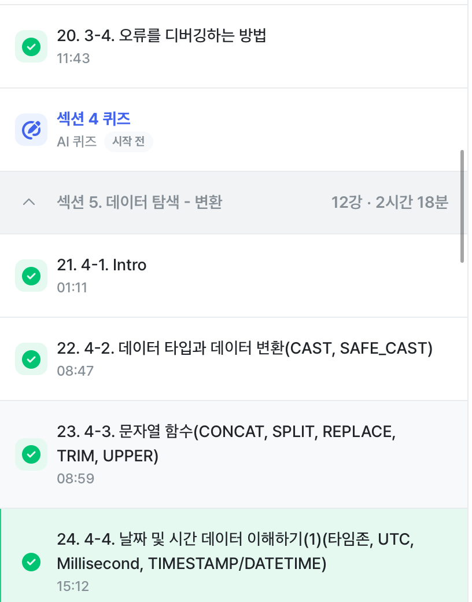
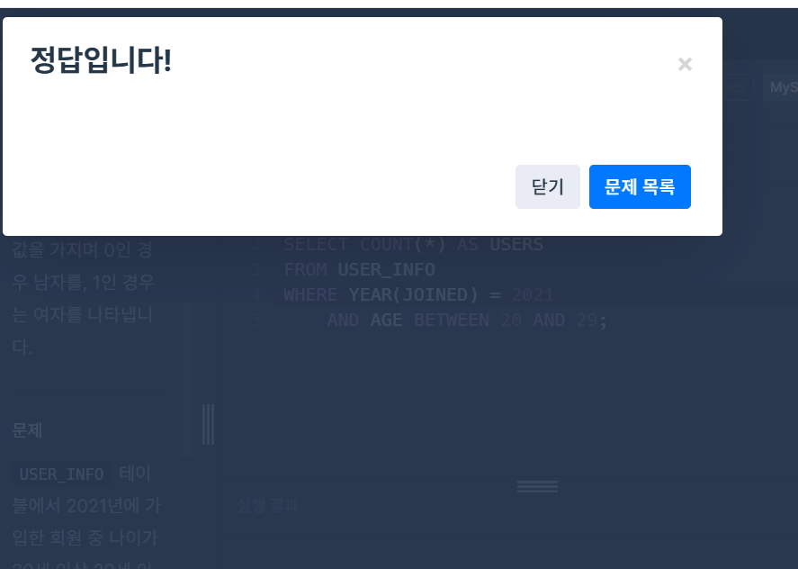

# SQL_BASIC 4주차 정규 과제 

📌SQL_BASIC 정규과제는 매주 정해진 분량의 `초보자를 위한 BigQuery(SQL) 입문` 강의를 듣고 간단한 문제를 풀면서 학습하는 것입니다. 이번주는 아래의 **SQL_Basic_4th_TIL**에 나열된 분량을 수강하고 `학습 목표`에 맞게 공부하시면 됩니다.

**4주차 과제부터는 강의 내용을 정리하는 것과 함께, 프로그래머스에서 제공하는 SQL 문제를 직접 풀어보는 실습도 병행합니다.** 강의에서는 **배운 내용을 정리하고 주요 쿼리 예제를 정리**하며, 프로그래머스 문제는 **직접 풀어본 뒤 풀이 과정과 결과, 배운 점을 함께 기록**해주세요. 완성된 과제는 Github에 업로드하고, 링크를 스프레드시트 'SQL' 시트에 입력해 제출해주세요.

**(수행 인증샷은 필수입니다.)** 

## SQL_BASIC_4th

### 섹션 4. 쿼리 잘 작성하기, 쿼리 작성 템플릿 및 오류를 잘 디버깅하기

### 3-4. 오류를 잘 디버깅하는 방법

## 섹션 5. 데이터 탐색 - 변환

### 4-1. INTRO

### 4-2. 데이터 타입과 데이터 변환(CAST, SAFE_CAST)

### 4-3. 문자열 함수(CONCAT, SPLIT, REPLACE, TRIM, UPPER)

### 4-4. 날짜 및 시간 데이터 이해하기(1) (타임존, UTC, Millisecond, TIMESTAMP/DATETIME)

## 🏁 강의 수강 (Study Schedule)

| 주차  | 공부 범위              | 완료 여부 |
| ----- | ---------------------- | --------- |
| 1주차 | 섹션 **1-1** ~ **2-2** | ✅         |
| 2주차 | 섹션 **2-3** ~ **2-5** | ✅         |
| 3주차 | 섹션 **2-6** ~ **3-3** | ✅         |
| 4주차 | 섹션 **3-4** ~ **4-4** | ✅         |
| 5주차 | 섹션 **4-4** ~ **4-9** | 🍽️         |
| 6주차 | 섹션 **5-1** ~ **5-7** | 🍽️         |
| 7주차 | 섹션 **6-1** ~ **6-6** | 🍽️         |

 

<!-- 여기까진 그대로 둬 주세요-->

---

# 1️⃣ 개념정리

## 3-4. 오류를 디버깅하는 방법

~~~
✅ 학습 목표 :
* 오류의 정의에 대해 설명할 수 있다. 
* 오류 메시지를 보고 디버깅이라는 과정을 수행할 수 있다. 
~~~

<!-- 새롭게 배운 내용을 자유롭게 정리해주세요.-->
~~~
- 오류: 부정확하거나 잘못된 행동을 의미
  * Syntax Error(문법오류)
  * count 함수에는 인자 수가 오직 한 개가 들어감
  * LIMIT는 삭제하거나 쿼리의 가장 아래에 작성하면 됨 
  * ()는 쓰면 반드시 끝까지 썼는지 확인해야 함
~~~

## 4-2. 데이터 타입과 데이터 변환(CAST, SAFE_CAST)

~~~
✅ 학습 목표 :
* 데이터 타입의 종류를 설명할 수 있다. 
* 데이터 타입을 변환하는 방법을 설명할 수 있다. 
~~~

<!-- 새롭게 배운 내용을 자유롭게 정리해주세요.-->
~~~
- 데이터 타입
  * 숫자
  * 문자
  * 시간, 날짜
  * 부울(Bool)
- CAST: 자료 타입을 변경하는 함수
  * SAFE: 변환이 실패할 경ㅇ우 NULL로 반환

~~~

## 4-3. 문자열 함수(CONCAT, SPLIT, REPLACE, TRIM, UPPER)

~~~
✅ 학습 목표 :
* 문자열 함수들의 종류를 이해하고 어떠한 상황에서 사용하는지 설명할 수 있다. 
~~~

<!-- 새롭게 배운 내용을 자유롭게 정리해주세요.-->

~~~
- 문자열로 할 수 있는 대표적인 연산
  * 문자열 붙이기 - CONCAT
  * 문자열 분리하기 - SPLIT
  * 특정 단어 수정하기 - REPLACE
  * 문자열 자르기 - TRIM
  * 영어 대문자 변환 - UPPER
~~~

## 4-4. 날짜 및 시간 데이터 이해하기(1) (타임존, UTC, Millisecond, TIMESTAMP/DATETIME)

~~~
✅ 학습 목표 :
* 날짜 및 시간 데이터 타입과 UTC의 개념을 설명할 수 있다. 
* DATE, DATETIME, TIMESTAMP 에 대해서 설명할 수 있다.
* 시간함수들의 종류와 시간의 차이를 추출하는 방법을 설명할 수 있다. 
~~~

<!-- 새롭게 배운 내용을 자유롭게 정리해주세요.-->
~~~
날짜 및 시간 데이터의 핵심
- 날짜 및 시간 데이터 타입 파악하기: DATE(날짜만 표시), DATETIME(날짜와 시간 표시), TIMESTAMP
  * millisecond
  * microsecond
- 날짜 및 시간 데이터 관련 알면 좋은 내용: UTC, Millisecond
- 날짜 밀 시간 데이터 타입 변환하기
- 시간 함수(두 시간의 차이, 특정 부분 추출하기)

- 타임존이 존재한다 = 특정 지역의 표준 시간대
~~~

수행인증샷

 

 

---

# 2️⃣ 확인문제 & 문제 인증

## 프로그래머스 문제 

> 조건에 맞는 회원 수 구하기 (SELECT, COUNT) 
>
> **먼저 문제를 풀고 난 이후에 확인 문제를 확인해주세요**
>
> 문제 링크 
>
> :  https://school.programmers.co.kr/learn/courses/30/lessons/131535#

<!-- 문제를 풀기 위하여 로그인이  필요합니다. -->

 

## 문제 1

> **🧚Q. 프로그래머스 문제를 풀던 서현이는 여러 번의 시행착오 끝에 결국 혼자 해결하기 어려워 오류 메시지를 공유하며 도움을 요청했습니다. 여러분들이 오류 메시지를 확인하고, 해당 SQL 쿼리에서 어떤 부분이 잘못되었는지 오류 메시지를 해석하고 찾아 설명해주세요.**

~~~sql
# 조건에 맞는 회원 수 구하기 (SELECT, COUNT) 
# 서현이의 SQL 첫 번째 풀이
SELECT COUNT(AGE, JOINED)
FROM USER_INFO
WHERE AGE BETWEEN 20 AND 29
  AND JOINED BETWEEN '2021-01-01' AND '2021-12-31';
  
오류 메시지 : Error: Number of arguments does not match for aggregate function COUNT
 
# 수정하고 난 이후 두 번째 풀이
SELECT AGE, COUNT(*)
FROM USER_INFO
WHERE AGE BETWEEN 20 AND 29
  AND JOINED BETWEEN '2021-01-01' AND '2021-12-31';
  
오류 메시지 : SELECT list expression references column AGE which is neither grouped nor aggregated
~~~

~~~
1차 수정
COUNT(AGE, JOINED) -> COUNT 함수는 인자가 하나만 올 수 있다. 다라서 두 개 이상의 컬럼을 넣으면 문법오류다. 

2차 수정
AGE, COUNT(*) -> AGE는 일반 컬럼이고 COUNT는 집계합수인데, 집계함수와 일반 컬럼을 합께 SELECT하려면 GROUP BY로 묶어야 한다. 
~~~

### 🎉 수고하셨습니다.
