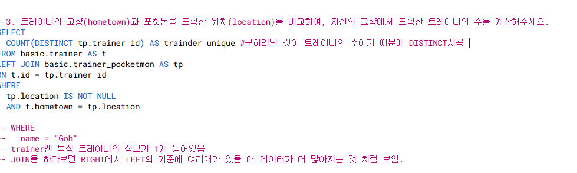
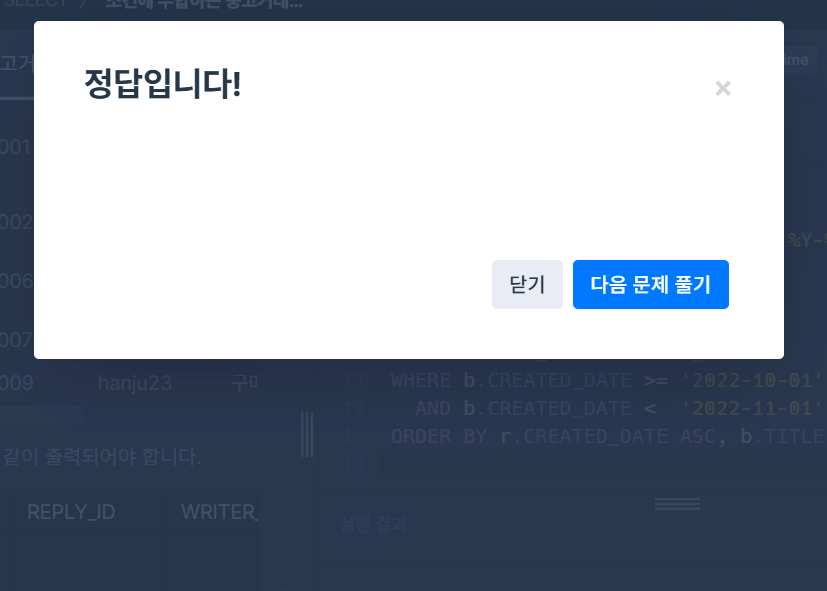
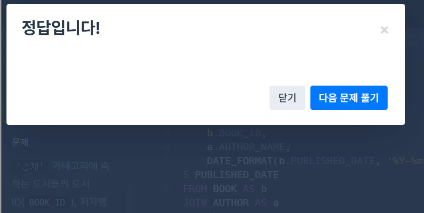

# SQL_BASIC 6주차 정규 과제 

📌SQL_BASIC 정규과제는 매주 정해진 분량의 `초보자를 위한 BigQuery(SQL) 입문` 강의를 듣고 간단한 문제를 풀면서 학습하는 것입니다. 이번주는 아래의 **SQL_Basic_6th_TIL**에 나열된 분량을 수강하고 `학습 목표`에 맞게 공부하시면 됩니다.

**6주차 과제는 강의 내용을 정리하는 것과 함께, 프로그래머스에서 제공하는 SQL 문제를 직접 풀어보는 실습도 병행합니다.** 강의에서는 **배운 내용을 정리하고 주요 쿼리 예제를 정리**하며, 프로그래머스 문제는 **직접 풀어본 뒤 풀이 과정과 결과, 배운 점을 함께 기록**해주세요. 완성된 과제는 Github에 업로드하고, 링크를 스프레드시트 'SQL' 시트에 입력해 제출해주세요.

**(수행 인증샷은 필수입니다.)** 

## SQL_BASIC_6th

### 섹션 6. 다량의 자료를 연결 : JOIN 

### 5-1. Intro

### 5-2. JOIN 이해하기

### 5-3. 다양한 JOIN 방법

### 5-4. JOIN 쿼리 작성하기 

### 5-5. JOIN을 처음 공부할 때 헷갈렸던 부분

### 5-6. JOIN 연습문제 1~2번

### 5-6. JOIN 연습문제 3~5번

### 5-7. 정리

## 🏁 강의 수강 (Study Schedule)

| 주차  | 공부 범위              | 완료 여부 |
| ----- | ---------------------- | --------- |
| 1주차 | 섹션 **1-1** ~ **2-2** | ✅         |
| 2주차 | 섹션 **2-3** ~ **2-5** | ✅         |
| 3주차 | 섹션 **2-6** ~ **3-3** | ✅         |
| 4주차 | 섹션 **3-4** ~ **4-4** | ✅         |
| 5주차 | 섹션 **4-4** ~ **4-9** | ✅         |
| 6주차 | 섹션 **5-1** ~ **5-7** | ✅         |
| 7주차 | 섹션 **6-1** ~ **6-6** | 🍽️         |

<!-- 여기까진 그대로 둬 주세요-->

 

---

# 1️⃣ 개념정리

## 5-2. JOIN 이해하기

~~~
✅ 학습 목표 :
* JOIN에 대한 정의와 필요성에 대해 설명할 수 있다.
~~~

<!-- 새롭게 배운 내용을 자유롭게 정리해주세요.-->
- SQL JOIN: 서로 다른 데이터 테이블을 연결하는 것 
- 컬럼이 추가됨
- 큰 table -> 작은 table이 join
- 공통적으로 존재하는 컬럼이 있다면 가능
- JOIN을 해야하는 이유:
    * 관계형 데이터베이스 설계시 정규화 과정을 거침
    * 정규화는 중복을 최소화하게 데이터를 구조화
    * User Table은 유저 데이터만, order table은 주문 데이터만
    => 데이터를 다양한 테이블에 저장해서 필요할 때 join해서 사용

## 5-3. 다양한 JOIN 방법

~~~
✅ 학습 목표 :
* JOIN 방법들의 종류를 설명할 수 있다. 
* 각 JOIN 방법들의 차이점에 대해서 설명할 수 있다. 
~~~

<!-- 새롭게 배운 내용을 자유롭게 정리해주세요.-->
- (INNER) JOIN: 두 테이블의 공통 요소만 연결 => 교집합
- LEFT/RIGHT (OUTER) JOIN: 왼쪽/오른쪽 테이블 기준으로 연결(일반적으로 LEFT 많이 사용)
    * LEFT JOIN의 경우 기준이 되는 테이블을 왼쪽에 두기 / 기준에는 기준값이 존재하고 우측에 데이터를 추가 
- FULL (OUTER) JOIN: 양쪽 기준으로 연결
- CROSS JOIN: 두 테이블의 각각의 요소를 곱하기 => 모두 다 조합

## 5-4. JOIN 쿼리 작성하기 

~~~
✅ 학습 목표 :
* JOIN을 사용한 문법에 대해 이해하여 적용할 수 있다.
* JOIN 을 활용한 쿼리를 작성할 수 있다. 
~~~

<!-- 새롭게 배운 내용을 자유롭게 정리해주세요.-->
- SQL JOIN 쿼리 작성하는 흐름
    * 테이블 확인: 테이블에 저장된 데이터, 컬럼 확인
    * 기준 테이블 정의: 가장 많이 참고할 기분(base) 테이블 정의
    * JOIN Key 찾기: 여러 Table과 연결할 Key(On)정리
    * 결과 예상하기: 결과 테이블을 예상해서 손,엑셀로 작성(일종의 정답지 역할)
    * 쿼리 작성 / 검증: 예상한 결과와 동일한 결과가 나오는지 확인
- 작성 시 테이블 이름이 길 수 있기 때문에 별칭(Alias)를 정의
- 쿼리 작성 템플릿에 예상하는 결과를 작성하고, 중간 결과도 생각하면서 찾아보기
- cross join은 ON이 필요하지 않음 

## 5-6. JOIN 연습문제 1~5번 

~~~
✅ 학습 목표 :
* 연습문제(3문제 이상) 푼 것들 정리하기
~~~

<!-- 새롭게 배운 내용을 자유롭게 정리해주세요.-->
1) 

3)

4) 

 

 

---

# 2️⃣ 확인문제 & 문제 인증

## 프로그래머스 문제 

https://school.programmers.co.kr/learn/courses/30/lessons/164673

> 조건에 부합하는 중고거래 댓글 조회하기 (JOIN)

https://school.programmers.co.kr/learn/courses/30/lessons/144854

> 조건에 맞는 도서와 저자 리스트 출력하기 (JOIN)

1) 

3) 

4) 
- 하나만 알고 싶을 경우 LIMIT 1
- LEFT JOIN을 두 번 이상 연속해서 사용할 수 있음 

---

# 3️⃣ 참고자료

JOIN 에 대해서 그림으로 쉽게 이해할 수 있는 자료들도 있어서 첨부합니다. 아래의 블로그도 학습할 때 같이 참고해주세요.

1. https://data-marketing-bk.tistory.com/entry/SQL-JOIN-%ED%95%9C-%EB%B0%A9%EC%97%90-%EC%A0%95%EB%A6%AC-%EA%B0%9C%EB%85%90%EB%B6%80%ED%84%B0-%EC%BD%94%EB%93%9C%EA%B9%8C%EC%A7%80-%EC%9D%B4%EA%B2%83%EB%A7%8C-%EB%B3%B4%EC%9E%90

2. https://velog.io/@wijoonwu/JOIN

 

### 🎉 수고하셨습니다.
