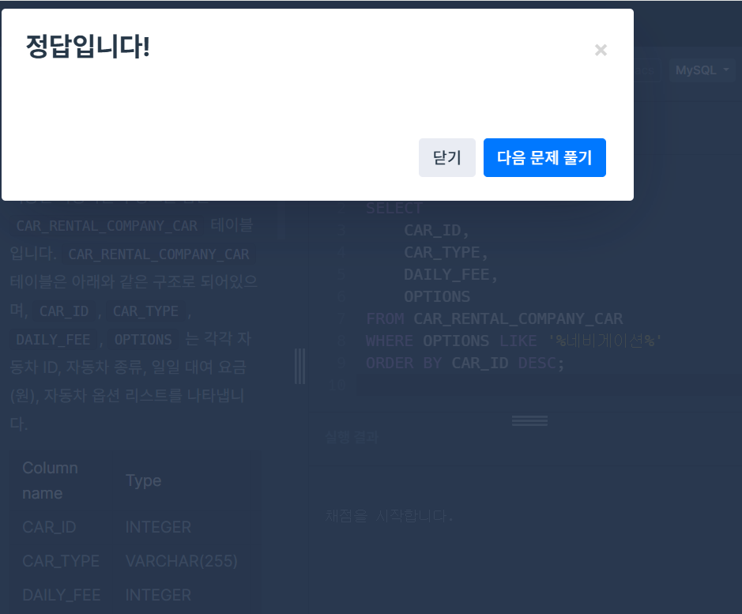
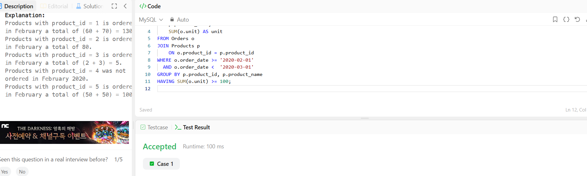

# SQL_BASIC 7주차 정규 과제 

📌SQL_BASIC 정규과제는 매주 정해진 분량의 `초보자를 위한 BigQuery(SQL) 입문` 강의를 듣고 간단한 문제를 풀면서 학습하는 것입니다. 이번주는 아래의 **SQL_Basic_7th_TIL**에 나열된 분량을 수강하고 `학습 목표`에 맞게 공부하시면 됩니다.

**7주차 과제는 강의 내용을 정리하는 것과 함께, 프로그래머스에서 제공하는 SQL 문제를 직접 풀어보는 실습도 병행합니다.** 강의에서는 **배운 내용을 정리하고 주요 쿼리 예제를 정리**하며, 프로그래머스 문제는 **직접 풀어본 뒤 풀이 과정과 결과, 배운 점을 함께 기록**해주세요. 완성된 과제는 Github에 업로드하고, 링크를 스프레드시트 'SQL' 시트에 입력해 제출해주세요.

**(수행 인증샷은 필수입니다.)** 

**(마지막 주차입니다. 조금만 더 힘내주세요~!!!)**

## SQL_BASIC_7th

### 섹션 7 데이터 결과 검증, 가독성 있는 쿼리 작성하기

### 6-1. Intro

### 6-2. 가독성을 챙기기 위한 SQL 스타일 가이드

### 6-3. 가독성을 챙기기 위한 WITH 문 & 파티션

### 6-4. 데이터 결과 검증 정의

### 6-5. 데이터 결과 검증 예시

### 6-6. 정리 

## 🏁 강의 수강 (Study Schedule)

| 주차  | 공부 범위              | 완료 여부 |
| ----- | ---------------------- | --------- |
| 1주차 | 섹션 **1-1** ~ **2-2** | ✅         |
| 2주차 | 섹션 **2-3** ~ **2-5** | ✅         |
| 3주차 | 섹션 **2-6** ~ **3-3** | ✅         |
| 4주차 | 섹션 **3-4** ~ **4-4** | ✅         |
| 5주차 | 섹션 **4-4** ~ **4-9** | ✅         |
| 6주차 | 섹션 **5-1** ~ **5-7** | ✅         |
| 7주차 | 섹션 **6-1** ~ **6-6** | ✅         |

 

<!-- 여기까진 그대로 둬 주세요-->

---

# 1️⃣ 개념정리

## 6-2. 가독성을 챙기기 위한 SQL 스타일 가이드

~~~
✅ 학습 목표 :
* 데이터 결과 검증하기 전에 실수가 발생하는 원인을 설명할 수 있다.
* SQL 쿼리를 가독성 있게 작성할 수 있다. 
~~~

<!-- 새롭게 배운 내용을 자유롭게 정리해주세요.-->
- 실수가 언제 발생하는가?
    * 문법을 잘못 알고 있는 경우
    * 데이터를 파악하지 않고 쿼리를 작성하는 경우
    * 쿼리가 복잡한 경우
- 컬럼 이름은 snake_case로 작성(파이썬): 아래바를 사용하는 케이스
- 명시적 - 암시적인 이름 : JOIN할 때 테이블 이름 명시적으로 할 수 있다면 명시적으로 + AS를 생략해서 별칭을 설정할 수도 있는 데 AS를 쓰는것도 명시적
- 왼쪽 정렬
- 예약어나 컬럼은 한 줄에 하나씩 쓰는 것을 권장 : 컬럼은 바로 주석처리 할 수 있다는 장점
- 쉼표는 컬럼 바로 뒤에 : 빅쿼리는 마지막 쉽표를 무시해서 뒤에 작성해도 무방

## 6-3. 가독성을 챙기기 위한 WITH문 & 파티션

~~~
✅ 학습 목표 :
* SQL 쿼리를 가독성 있게 작성할 수 있다. 
* WITH문과 파티션을 활용해서도 가독성을 챙길 수 있다. 
~~~

<!-- 새롭게 배운 내용을 자유롭게 정리해주세요.-->
- with 구문: 만약 아래 쿼리가 다른 곳에서도 필요하면 복사 붙여넣기 - 반복되면 점점 복잡해짐 이를 해결하기 위해 with문 사용
    * CTE(Common Table Expression)라고 표현
    * SELECT 구문에 이름을 정해주는 것과 유사
    * 쿼리 내에서 반복적으로 사용 가능
    * 테이블로 따로 저장할수도 있음
    * view(쿼리 덩어리)
- table엔 partition 존재 가능: (ex) 특정 시기에 들어온 물건을 찾고 싶을 때
    * 쿼리 성능 향상: 빠름
    * 데이터 관리 용이성: 특정 일자의 데이터를 모두 변경하거나 삭제해야 하면 파티션을 설정해서 삭제할 수 있음
    * 비용: 파티션에 해당되는 데이터만 스캔해서 비용 감소
- 데이터의 세부 정보를 보면 파티션을 나눈 기준을 확인할 수 있음

## 6-4. 데이터 결과 검증 정의 

~~~
✅ 학습 목표 :
* 데이터 결과 검증이 어떤 과정인지 설명할 수 있다. 
* 데이터 결과 검증에 대한 예시를 이해할 수 있다.  
~~~

<!-- 새롭게 배운 내용을 자유롭게 정리해주세요.-->
- 데이터 결과 검증: SQL 쿼리 후 얻은 결과가 예상과 일치하는지 확인하는 과정
    * 목적: 분석 결과의 정확성, 신뢰성 확보
    * 방법: 기대하는 예상 결과 정의 - 쿼리 작성 - 일치하는지 비교
- 대표적으로 활용하는 SQL 문법
    * COUNT(*): 행 수를 확인
    * NOT NULL: 특정 컬럼에 NULL이 존재하는지 혹은 필수 필드가 비어있지는 않은지 확인
    * DISTINCT: 데이터의 고유값을 확인해 중복 여부 확인
    * IF문, CASE WHEN: 의도와 같다면 TRUE, 아니면 FALSE
        * 조합을 해서 사용할 수 있음

 

 

---

# 2️⃣ 확인문제 & 문제 인증

## 프로그래머스 문제 

https://school.programmers.co.kr/learn/courses/30/lessons/157343

> 특정 옵션이 포함된 자동차 리스트 구하기

https://school.programmers.co.kr/learn/courses/30/lessons/59044

> 오랜 기간 보호한 동물(1) 

https://school.programmers.co.kr/learn/courses/30/lessons/59043

> 있었는데요 없었습니다.

## LeetCode 문제

https://leetcode.com/problems/combine-two-tables/description/

> 175. Combine Two Tables

https://leetcode.com/problems/list-the-products-ordered-in-a-period/

> 1327. List the Products Ordered in a Period

1. 특정 옵션이 포함된 자동차 리스트 구하기

2. 오랜 기간 보호한 동물(1)

3. Combine Two Tables

4. List the Products Ordered in a Period

## 문제 1

> **🧚예운이는 다음 SQL 쿼리를 다트비 정규과제에 제출했다. 제출한 쿼리는 다음과 같고, 이 쿼리는 에러 메시지 없이 잘 수행하는 쿼리이다.**

~~~sql
# 주영이가 작성한 가독성 나쁜 SQL 

select u.name , o.OrderID
, p.ProductName ,od.Quantity ,od.UnitPrice 	from Users u	join Orders o on u.id = o.userId
join OrderDetails od on o.OrderID = od.orderID	join Products p on od.ProductID = p.ProductID
where u.region= 'Busan'			order by o.OrderID
~~~

> **이에 과제를 검사하던 정우는 작성한 SQL을 보고 코드 리뷰를 진행하려고 했지만, 다음 쿼리를 보고 예운이에게 질문을 하였다. "예운아, 이 쿼리 가독성이 좀 안 좋은데 내가 고쳐도 괜찮을까? 가독성 좋게 SQL 가이드에 따라 정리해보려고 해"**
>
> 다음 SQL 쿼리를 **가독성 좋은 스타일로 다시 작성해보세요.** 

~~~
SELECT 
    u.name,
    o.OrderID,
    p.ProductName,
    od.Quantity,
    od.UnitPrice
FROM Users AS u
JOIN Orders AS o 
    ON u.id = o.userId
JOIN OrderDetails AS od 
    ON o.OrderID = od.orderID
JOIN Products AS p 
    ON od.ProductID = p.ProductID
WHERE u.region = 'Busan'
ORDER BY o.OrderID;
~~~

 

 

<!-- 이렇게 SQL BASIC 과제가 마무리되었습니다. SQL은 범위가 넓고 처음 접할 때 어렵게 느껴지는 학문이지만, 이번 기수에서는 지난 기수에도 활용했던 인프런 무료 강의를 통해 기초를 탄탄히 다질 수 있도록 구성했습니다. 환경 세팅 과정이 다소 복잡했을 수도 있지만, 이번 과제를 통해 기본적인 쿼리 작성과 SELECT 명령어의 개념을 충분히 익혔을 거라 생각합니다. BASIC을 통해 데이터를 추출하는 기초를 다졌으면, 이제 ADVANCED 트랙에서 실무에 맞게 더 복잡한 문접과 분석 쿼리, 그리고 MASTER 트랙에서 실제 데이터베이스를 다루는 실무 명령어까지 배워갈 수 있습니다. 앞으로의 SQL 학습에도 화이팅이고, 부족한 템플릿이었지만 끝까지 함께해줘서 진심으로 감사드립니다.  -->

### 🎉 수고하셨습니다.
