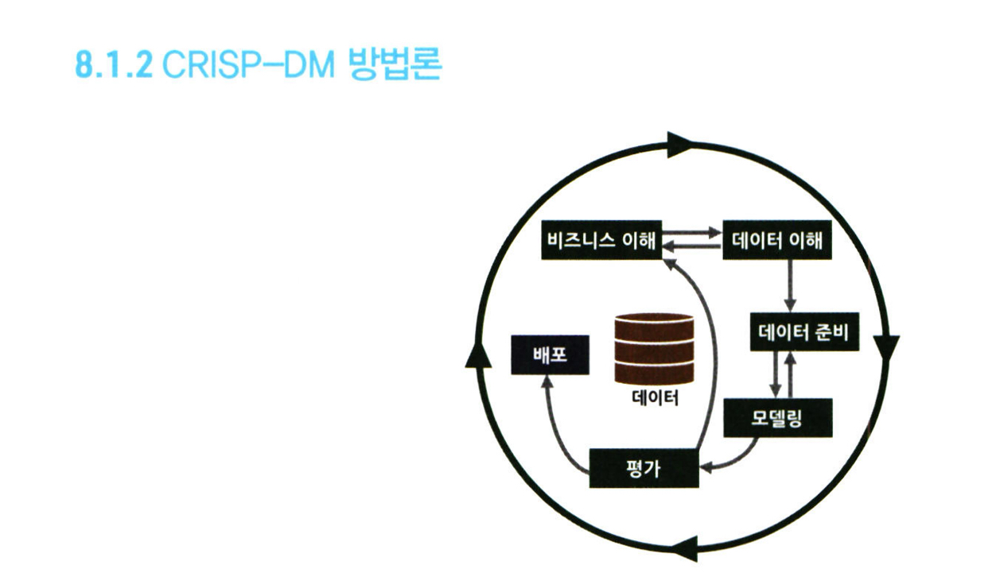
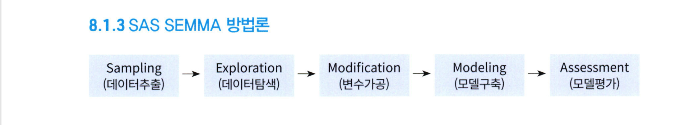

# 통계학 3주차 정규과제

📌통계학 정규과제는 매주 정해진 분량의 『*데이터 분석가가 반드시 알아야 할 모든 것*』 을 읽고 학습하는 것입니다. 이번 주는 아래의 **Statistics_3rd_TIL**에 나열된 분량을 읽고 `학습 목표`에 맞게 공부하시면 됩니다.

아래의 문제를 풀어보며 학습 내용을 점검하세요. 문제를 해결하는 과정에서 개념을 스스로 정리하고, 필요한 경우 추가자료와 교재를 다시 참고하여 보완하는 것이 좋습니다.

3주차는 `2부-데이터 분석 준비하기`를 읽고 새롭게 배운 내용을 정리해주시면 됩니다


## Statistics_3rd_TIL

### 2부. 데이터 분석 준비하기

### 08. 분석 프로젝트 준비 및 기획

### 09. 분석 환경 세팅하기


## Study ScheduleStudy Schedule

| 주차  | 공부 범위     | 완료 여부 |
| ----- | ------------- | --------- |
| 1주차 | 1부 p.2~46    | ✅         |
| 2주차 | 1부 p.47~81   | ✅         |
| 3주차 | 2부 p.82~120  | ✅         |
| 4주차 | 2부 p.121~167 | 🍽️         |
| 5주차 | 2부 p.168~202 | 🍽️         |
| 6주차 | 3부 p.203~250 | 🍽️         |
| 7주차 | 3부 p.251~299 | 🍽️         |

<!-- 여기까진 그대로 둬 주세요-->


# 1️⃣ 개념 정리 

## 08. 분석 프로젝트 준비 및 기획

```
✅ 학습 목표 :
* 데이터 분석 프로세스를 설명할 수 있다.
* 비즈니스 문제를 정의할 때 주의할 점을 설명할 수 있다.
* 외부 데이터를 수집하는 방법에 대해 인식한다.
```
<!-- 새롭게 배운 내용을 자유롭게 정리해주세요.-->
- 데이터 분석의 궁극적인 목표는 의사결정 프로세스를 최적화하는 것
- 데이터 분석 프로젝트의 전체 프로세스
* 설계 단계: 과제 정의 및 범위 설정 / 인력 구성 및 PM 확보 / 실무자 & 데이터 분석가 간 협의 체계 수립
* 분석 및 모델링 단계: 데이터 분석을 위한 데이터 MART 구축/ 데이터 준비, 가공, 분석 및 모델 도출 / 모델 검증 및 실무, 경영진 협의
* 구축 및 활용 단계: 모델 적용 및 시스템 구출 / 성과 평가 및 추가, 보완 프로젝트 검토
- CRISP - DM 방법론:

- SAS SEMMA 방법론

- MECE(Mutually Exclusive Collectively Exhaustive): 비즈니스 문제를 올바르게 정의하기 위한 논리적 접근법 
-> 세부 정의들이 서로 겹치지 않고 전체를 합쳤을 때는 빠진 것 없이 완전히 전체를 이루는 것
- 페이오프 매트릭스: GE에서 개발한 문제해결 우선순위 결정 방식
* 최종 실행과제는 실행가능성과 사업성 모두를 충족하는 1번 영역
* 중장기 과제는 EXTRA INNUNGS에 해당하는 것 일부 선정
* STOLEN BASE, STRIKE OUT에 해당되는 과제는 제외 
- 외부 데이터 수집 방법
* 데이터 구매
* 오픈 데이터 수집
* 크롤링: 웹 페이지가 주어지면 그 페이지 내에 링크들을 따라가면서 모든 내용을 다 가져오는 것


## 09. 분석 환경 세팅하기

```
✅ 학습 목표 :
* 데이터 분석의 전체적인 프로세스를 설명할 수 있다.
* 테이블 조인의 개념과 종류를 이해하고, 각 조인 방식의 차이를 구분하여 설명할 수 있다.
* ERD의 개념과 역할을 이해하고, 기본 구성 요소와 관계 유형을 설명할 수 있다.
```

<!-- 새롭게 배운 내용을 자유롭게 정리해주세요.-->
- SAS:
* 장점: 높은 신뢰도, 주요 산업군과 대기업에서 사용 / GUI 지원을 통한 쉬운 사용 환경 / 공식 서비스 지원 제공
* 단점: 높은 라이선스 비용 / 딥러닝 등 신기술에 대한 늦은 적용
- R:
* 장점: 무료 오픈소스 / 방대한 라이브러리와 커뮤니티 / 최신 방법론의 빠른 적용 및 패치 
* 단점: 가파른 학습 곡선 / 유저 인터페이스 미지원 / 공식 서비스 지원 없음
- 파이썬:
* 장점: 무료 오픈소스 / 방대한 라이브러리와 커뮤니티 / 프로그래밍 기반의 다양한 사용성
* 단점: 프로그래밍 기반의 지식 필요 / 유저 인터페이스 미지원 / 공식 서비스 지원 없음
- SQL: 데이터 관리 및 처리하기 위해 설계된 언어
- 데이터 흐름: OLTP -> DW(ODS) -> DM -> OLAP
- OLTP(On-Line Transaction Processing): 실시간으로 데이터를 트랜잭션 단위로 수집, 분류, 저장하는 시스템
- DW(Data Warehouse): 수집된 데이터를 사용자 관점에서 주제별로 통합하여 쉽게 원하는 데이터를 뺴낼 수 있도록 저장해 놓은 통합 데이터베이스
- DM(Data Mart): 사용자의 목적에 맞도록 가공된 일부의 데이터가 저장되는 곳 
* 저장된 데이터의 처리 프로세스: ETL(extract, transform, load)0
- 분사데이터 처리
* scale-up: 하나의 컴퓨터의 용량을 늘리고 더 빠른 프로세서를 탑재하는 것
* scale-out: 여러 대의 컴퓨터를 병렬적으로 연결하는 것 
* HDF
* Mapreduce
- 테이블 조인
* 이너조인:두 테이블 모두에서 조건에 맞는 행만 가져옴(교집합)
* 레프트 조인:왼쪽 테이블의 모든 행 + 조건 맞는 오른쪽 데이터 (없으면 NULL)
* 라이트 조인:오른쪽 테이블의 모든 행 + 조건 맞는 왼쪽 데이터 (없으면 NULL)
* 풀 조인:양쪽 테이블의 모든 행을 합쳐서 가져옴 (없으면 NULL 채움)

<br>
<br>

---

# 2️⃣ 확인 문제

## 문제 1.

> **🧚 아래의 테이블을 조인한 결과를 출력하였습니다. 어떤 조인 방식을 사용했는지 맞춰보세요.**

> 사용한 테이블은 다음과 같습니다.

| **emp_cd** | **emp_nm** | **job** | **dep_cd** |
| ---------- | ---------- | ------- | ---------- |
| 1001       | 김권택     | 부장    | 30         |
| 1002       | 김미정     | 과장    | 20         |
| 1003       | 이지민     | 대리    | 20         |
| 1004       | 장동혁     | 사원    | 10         |
| 1005       | 이승화     | 사원    | 30         |
| 1006       | 곽주영     | 과장    | 40         |
| 1007       | 조용호     | 사장    | NULL       |
| 1008       | 가나다     | 대리    | 40         |
| 1009       | 홍길동     | 차장    | 10         |

| **dep_cd** | **dep_nm** | **location** |
| ---------- | ---------- | ------------ |
| 10         | 인사팀     | 서울         |
| 20         | 경리팀     | 서울         |
| 30         | 영업팀     | 과천         |
| 40         | 전산팀     | 대전         |
| 50         | 법무팀     | 인천         |

> 보기: INNER, LEFT, RIGHT 조인

<!-- 테이블 조인의 종류를 이해하였는지 확인하기 위한 문제입니다. 각 테이블이 어떤 조인 방식을 이용하였을지 고민해보고 각 테이블 아래에 답을 작성해주세요.-->

### 1-1. 

| **emp_cd** | **emp_nm** | **job** | **dep_cd** | **dep_nm** | **location** |
| ---------- | ---------- | ------- | ---------- | ---------- | ------------ |
| 1001       | 김권택     | 부장    | 30         | 영업팀     | 과천         |
| 1002       | 김미정     | 과장    | 20         | 경리팀     | 서울         |
| 1003       | 이지민     | 대리    | 20         | 경리팀     | 서울         |
| 1004       | 장동혁     | 사원    | 10         | 인사팀     | 서울         |
| 1005       | 이승화     | 사원    | 30         | 영업팀     | 과천         |
| 1006       | 곽주영     | 과장    | 40         | 전산팀     | 대전         |
| 1007       | 김태연     | 사장    |            |            |              |
| 1008       | 최철원     | 대리    | 40         | 전산팀     | 대전         |
| 1009       | 노동희     | 차장    | 10         | 인사팀     | 서울         |

```
left join
```


### 1-2. 

| **emp_cd** | **emp_nm** | **job** | **dep_cd** | **dep_nm** | **location** |
| ---------- | ---------- | ------- | ---------- | ---------- | ------------ |
| 1001       | 김권택     | 부장    | 30         | 영업팀     | 과천         |
| 1002       | 김미정     | 과장    | 20         | 경리팀     | 서울         |
| 1003       | 이지민     | 대리    | 20         | 경리팀     | 서울         |
| 1004       | 장동혁     | 사원    | 10         | 인사팀     | 서울         |
| 1005       | 이승화     | 사원    | 30         | 영업팀     | 과천         |
| 1006       | 곽주영     | 과장    | 40         | 전산팀     | 대전         |
| 1008       | 최철원     | 대리    | 40         | 전산팀     | 대전         |
| 1009       | 노동희     | 차장    | 10         | 인사팀     | 서울         |

```
inner join
```


### 1-3. 

| **emp_cd** | **emp_nm** | **job** | **dep_cd** | **dep_nm** | **location** |
| ---------- | ---------- | ------- | ---------- | ---------- | ------------ |
| 1004       | 장동혁     | 사원    | 10         | 인사팀     | 서울         |
| 1009       | 홍길동     | 차장    | 10         | 인사팀     | 서울         |
| 1002       | 김미정     | 과장    | 20         | 경리팀     | 서울         |
| 1003       | 이지민     | 대리    | 20         | 경리팀     | 서울         |
| 1001       | 김권택     | 부장    | 30         | 영업팀     | 과천         |
| 1005       | 이승화     | 사원    | 30         | 영업팀     | 과천         |
| 1006       | 곽주영     | 과장    | 40         | 전산팀     | 대전         |
| 1008       | 최철원     | 대리    | 40         | 전산팀     | 대전         |
|            |            |         | 50         | 법무팀     | 인천         |

```
right join
```


### 🎉 수고하셨습니다.
