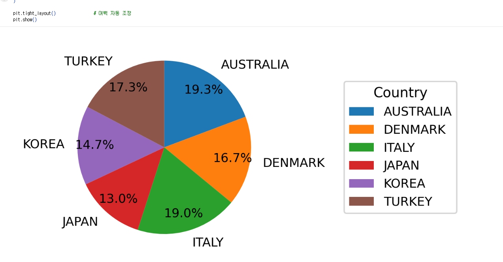
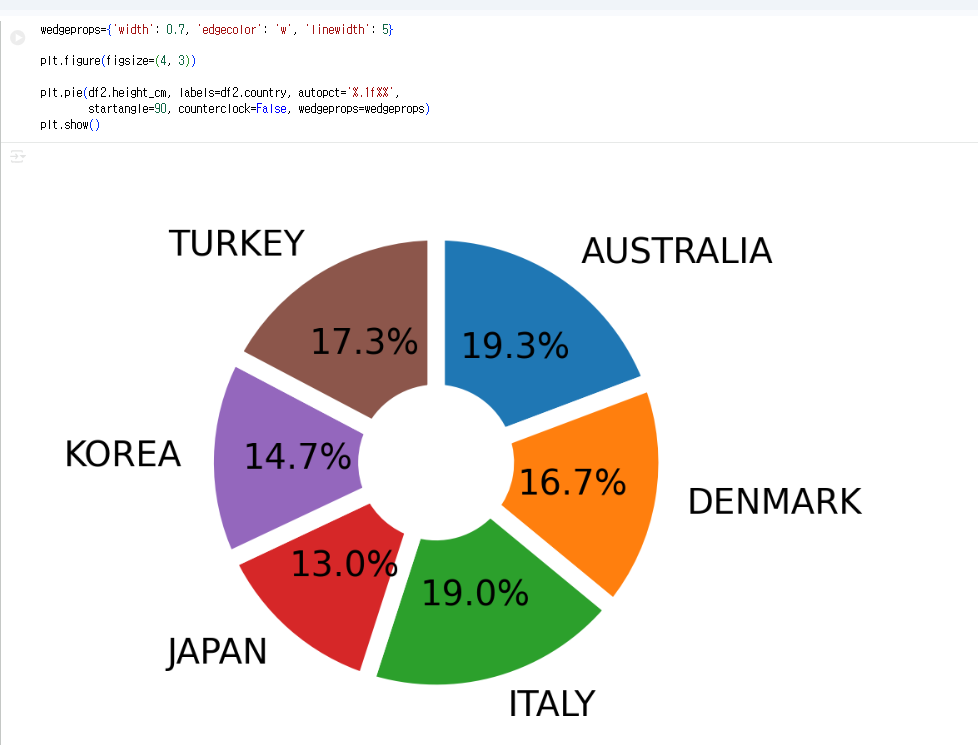
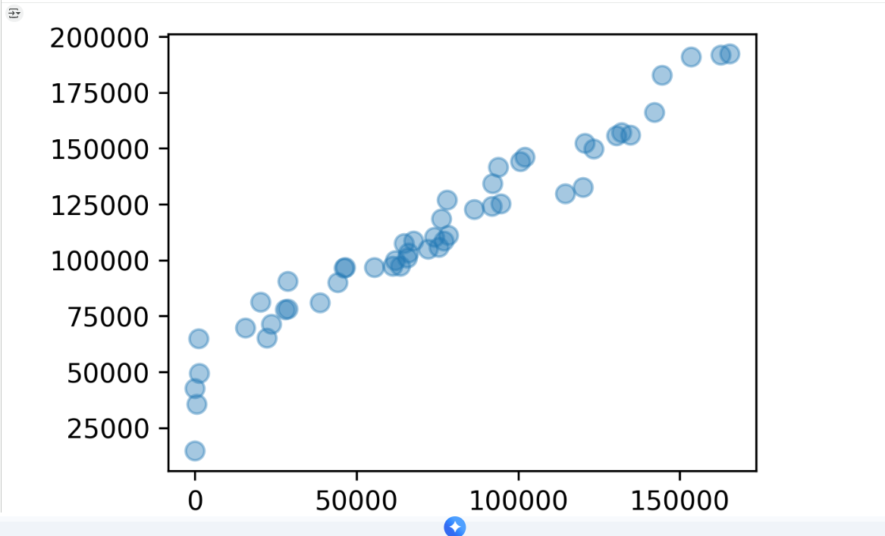
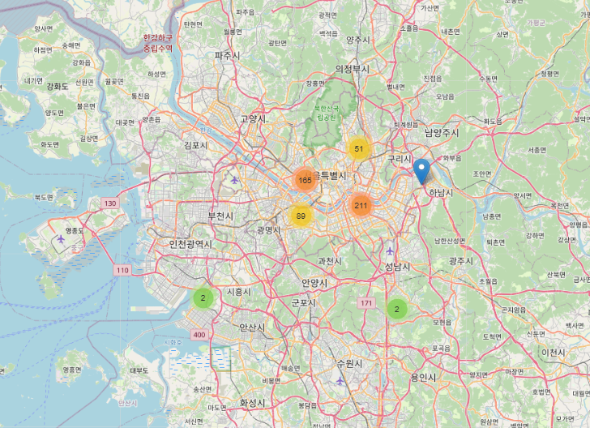
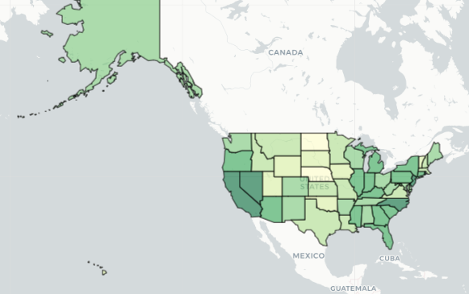
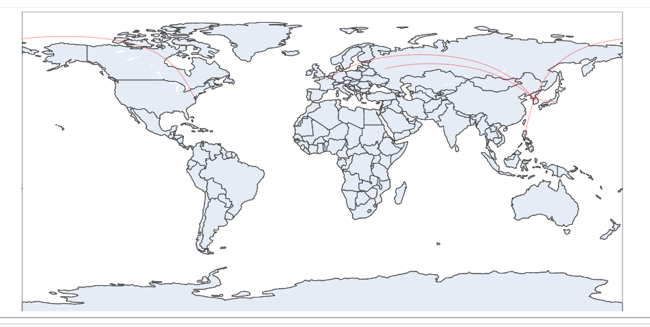

# 통계학 5주차 정규과제

📌통계학 정규과제는 매주 정해진 분량의 『*데이터 분석가가 반드시 알아야 할 모든 것*』 을 읽고 학습하는 것입니다. 이번 주는 아래의 **Statistics_5th_TIL**에 나열된 분량을 읽고 `학습 목표`에 맞게 공부하시면 됩니다.

아래의 문제를 풀어보며 학습 내용을 점검하세요. 문제를 해결하는 과정에서 개념을 스스로 정리하고, 필요한 경우 추가자료와 교재를 다시 참고하여 보완하는 것이 좋습니다.

5주차는 `2부-데이터 분석 준비하기`를 읽고 새롭게 배운 내용을 정리해주시면 됩니다


## Statistics_5th_TIL

### 2부. 데이터 분석 준비하기

### 10. 데이터 탐색과 시각화

- 10.5 분포 시각화부터 10장 마지막 10.8 박스 플롯까지 진행해주시면 됩니다.

**(수행 인증샷은 필수입니다.)** 

<!-- 이번주는 확인 문제가 없고, 교재의 실습에 있는 부분을 따라해주시면 됩니다. 데이터셋과 참고자료는 노션의 정규과제란에 있는 깃허브를 활용해주시면 됩니다. -->

## Study ScheduleStudy Schedule

| 주차  | 공부 범위     | 완료 여부 |
| ----- | ------------- | --------- |
| 1주차 | 1부 p.2~46    | ✅         |
| 2주차 | 1부 p.47~81   | ✅         |
| 3주차 | 2부 p.82~120  | ✅         |
| 4주차 | 2부 p.121~167 | ✅         |
| 5주차 | 2부 p.168~202 | ✅         |
| 6주차 | 3부 p.203~250 | 🍽️         |
| 7주차 | 3부 p.251~299 | 🍽️         |

<!-- 여기까진 그대로 둬 주세요-->

---

# 1️⃣ 개념 정리 

## 10. 데이터 탐색과 시각화

```
✅ 학습 목표 :
* EDA의 목적을 설명할 수 있다.
* 주어진 데이터셋에서 이상치, 누락값, 분포 등을 식별하고 EDA 결과를 바탕으로 데이터셋의 특징을 해석할 수 있다.
* 공분산과 상관계수를 활용하여 두 변수 간의 관계를 해석할 수 있다.
* 적절한 시각화 기법을 선택하여 데이터의 특성을 효과적으로 전달할 수 있다.
```
 10.5 분포 시각화
- 분포시각화는 연속형과 같은 양적 척도인지, 명목형과 같은 질적 척도인지에 따라 구분해서 그린다. 
    * 명목형: 이름이나 분류
- 구성 요소가 복잡한 질적 척도를 표현할 때는 트리맵 차트를 이용하면 보다 효과적으로 표현할 수 있다. 
    트리맵 차트 장점: 사각형 안에 더 작은 사각형을 포함시켜서 위계구조를 표현할 수 있음 

10.6 관계 시각화
- 산점도를 그릴 때는 극단치를 제거하고서 그리는 것이 좋음 -> 주요 분포 구간이 압축되어 시각화의 효율이 떨어지기 때문 
- 산점도를 시각화 할 때 데이터가 너무 많아 점들이 서로 겹쳐서 정보를 제대로 확인하기 어려울 때 투명도를 활용하면 됨
    * 산점도는 두 개의 변수 간 관계만 표현할 수 있다는 단점
- 버블차트를 이용하면 세 가지 요소의 상관관계를 표현할 수 있음 -> 버블 크기를 통해 한 가지 요소를 추가적으로 표현 가능
    * 관측치가 너무 많게 되면 정보 전달의 효율 감소
    * 해석할 때 원의 지름이 아닌 면적을 통해 크기를 판단하도록 주의해야 함 

10.7 공간 시각화
- 공간 시각화는 위치 정보인 위도와 경도 데이터를 지도에 매핑하여 시각적으로 표현 
    * 이점: 지도를 확대하거나 위치를 옮기는 증 인터랙티브한 활용이 가능 -> 거시적에서 미시적으로 진행되는 분석 방향과 같이 스토리라인을 잡고 시각화를 적용하는 것이 좋음 
- 도트맵: 지리적 위치에 동일한 크기에 작은 점을 찍어 해당 지역의 데이터 분포나 패터을 표현하는 기법
    * 시각적으로 데이터의 개요를 파악하는 데 유리하지만, 정확한 값을 전달하는 데에는 적합하지 않음
    * 이를 보완하기 위해 축소해서 보면 숫자로 정확한 수치를 표현하고 확대하면 점으로 표시 되도록 하는 기법 사용
- 버블맵: 버블차트를 지도에 그대로 옮겨 둔 것
    * 값이 지나치게 큰 버블이 다른 지역의 버블과 영역이 겹칠 수 있기 때문에 이를 잘 조절해야 함
- 코로플레스맵(= 단계 구분도): 데이터 값의 크기에 따라 색상의 음영을 달리하여 해당 지역에 대한 값을 시각화하는 기법
- 커넥션맵 OR 링크맵: 지도에 찍힌 점들을 곡선 또는 직선으로 연결하여 지리적 관계 표현 + 연속적 연결을 통해 지도에 경로를 표현 할 수 있음

10.8 박스 플롯
- 박스 플롯: 네모 상자 모양에 최댓값과 최솟값을 나타내는 선이 결합된 모양의 데이터 시각화 방법
    * 양적 척도 데이터의 분포 및 편향성, 평균과 중앙값 등 다양한 수치를 보기 쉽게 정리해줌 + 두 변수의 값을 비교할 때 효과적
    * 최솟값: 제1사분위에서 1.5IQR을 뺀 위치
    * 제1사분위(Q1): 25%의 위치
    * 제2사분위(Q2): 50%의 위치(중앙값을 의미)
    * 제3사분위(Q3): 75%의 위치
    * 최댓값: 제3사분위에서 1.5IQR을 더한 위치


<br>
<br>

---

# 2️⃣ 확인 과제

> **교재에 있는 실습 파트를 직접 따라 해보세요. 실습을 완료한 뒤, 결과화면(캡처 또는 코드 결과)을 첨부하여 인증해 주세요.단순 이론 암기보다, 직접 손으로 따라해보면서 실습해 보는 것이 가장 확실한 학습 방법입니다.**
>
> > **인증 예시 : 통계 프로그램 결과, 시각화 이미지 캡처 등**

- 10.5.1 분포 시각화 실습
    * 히스토그램


    - isin 함수 : 특정 값이 포함되어 있는가?

    * 파이차트

    - plt.figure(figsize=(4,3)) -> 그래프 사이즈 조정
    - bbox_to_anchor=(1.3, 0.5) -> 범례 위치 이동

    * 도넛 차트


    * 트리 차트


    * 와플차트


- 10.6.1 관계 시각화 실습
    * 산점도
    
    - alpha -> 투명도 조절
    * 산점도에 회귀선 추가
    
    * 버블차트
    

- 10.7. 공간 시각화 실습
    * 기본 지도 시각화
    
    * 옵션 추가(stamen toner로 형태를 변환하려 시도했으나 오류 발생으로 기본 형태로 변경)
    
    * 스타벅스 지점 수 시각화
    
    * 스타벅스 지점 수 도트맵 시각화
    
    * 스타벅스 지점 수 집계 및 중심점 산출
    
    - circlemarker(): 버블을 표현해주는 함수
    * 미국지도 + 실업률 시각화
    
    - folium.Choropleth로 변경
    * 커넥션맵
    

- 10.8.1 박스 플롯 실습
    * 세로 박스 플롯
    
    * 가로 박스 플롯
    
    * 그룹별 박스 플롯
    
    * 박스 플롯 추가 옵션 적용
    


~~~
인증 이미지가 없으면 과제 수행으로 인정되지 않습니다.
~~~


### 🎉 수고하셨습니다.
