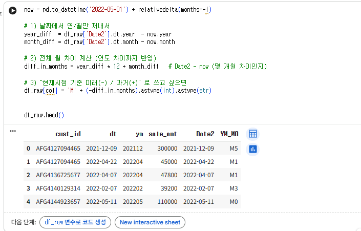
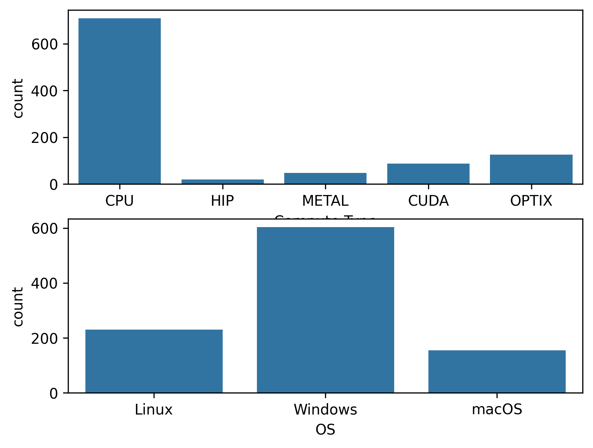
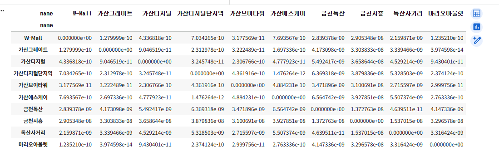

# 통계학 7주차 정규과제

📌통계학 정규과제는 매주 정해진 분량의 『*데이터 분석가가 반드시 알아야 할 모든 것*』 을 읽고 학습하는 것입니다. 이번 주는 아래의 **Statistics_7th_TIL**에 나열된 분량을 읽고 `학습 목표`에 맞게 공부하시면 됩니다.

아래의 문제를 풀어보며 학습 내용을 점검하세요. 문제를 해결하는 과정에서 개념을 스스로 정리하고, 필요한 경우 추가자료와 교재를 다시 참고하여 보완하는 것이 좋습니다.

7주차는 `2부-데이터 분석 준비하기`를 읽고 새롭게 배운 내용을 정리해주시면 됩니다


## Statistics_7th_TIL

### 2부. 데이터 분석 준비하기

### 11. 데이터 전처리와 파생변수 생성

<!-- 11.5 모델 성능 향상을 위한 파 변수 생성부터 11장 끝까지 진행해주시면 됩니다.-->

## Study ScheduleStudy Schedule

| 주차  | 공부 범위     | 완료 여부 |
| ----- | ------------- | --------- |
| 1주차 | 1부 p.2~46    | ✅         |
| 2주차 | 1부 p.47~81   | ✅         |
| 3주차 | 2부 p.82~120  | ✅         |
| 4주차 | 2부 p.121~167 | ✅         |
| 5주차 | 2부 p.168~202 | ✅         |
| 6주차 | 2부 p.203~250 | ✅         |
| 7주차 | 2부 p.251~299 | ✅         |

<!-- 여기까진 그대로 둬 주세요-->


---

# 1️⃣ 개념 정리 

## 11.데이터 전처리와 파생변수 생성

```
✅ 학습 목표 :
* 결측값과 이상치를 식별하고 적절한 방법으로 처리할 수 있다.
* 데이터 변환과 가공 기법을 학습하고 활용할 수 있다.
* 모델 성능 향상을 위한 파생 변수를 생성하고 활용할 수 있다.
```

### 11.5. 모델 성능 향상을 위한 파생 변수 생성

<!-- 새롭게 배운 내용을 자유롭게 정리해주세요. -->
- 파생변수: 원래 있던 변수들을 조합하거나 함수를 적용하여 새로 만들어낸 변수
  * 파생변수는 데이터의 특성을 이용하여 분석 효율을 높이는 것이기 때문에 전체 데이터에 대한 파악이 중요할 뿐만 아니라 해당 비즈니스 도메인에 대한 충분한 이해가 수반되어야 한다. 
  * 무작정 변수를 가공해서 만드는 것이 아니라 데이터의 특성과 흐름을 충분히 파악한 후 아이디어를 얻어서 만드는 것이 효과적 
  * 파생변수는 기존의 변수를 활용해서 만들어낸 변수이기 때문에 다중공선성 문제가 발생할 가능성이 높음 -> 파생변수를 만든 다음에는 상관분석을 통해 변수간의 상관성을 확인해야 함


### 11.6. 슬라이딩 윈도우 데이터 가공

<!-- 새롭게 배운 내용을 자유롭게 정리해주세요. -->
- 슬라이딩 윈도우: 실시간 네트워크 패킷 데이터를 처리하는 기법 
  * 특징: 각각의 데이터 조각들이 서로 겹치며 데이터가 전송되는 것 
  * 쪼개어 전송하는 이유는, 패킷 전송 후 그 패킷의 전송을 확인받지 않고도 곧바로 다음 패킷을 보낼 수 있어 네트워크를 효율적으로 사용할 수 있음
  * 핵심: 데이터를 겹쳐 나눔으로써 전체 데이터가 증가하는 원리를 차용한 것

### 11.7. 범주형 변수의 가변수 처리

<!-- 새롭게 배운 내용을 자유롭게 정리해주세요. -->
- 더미 변수 = 가변수 처리: 범주형 변수를 0과 1의 값을 가지는 변수로 변환해 주는 것을 뜻한다. 
    * 가변수를 만드는 이유: 범주형 변수는 사용할 수 없고 연속형 변수만 사용 가능한 분석 기법을 사용하기 위함이다. 
    * 범주가 3개 이상인 경우 -> 변수의 수를 늘리면 되지만, 범주의 개수보다 하나 적게 가변수를 만들어야 한다. 
    * 가변수 처리를 하는 것은 기존 하나의 변수를 여러 개의 변수로 나눠준 것 -> 각각의 변수는 독립성을 가지고 있어야 한다. 
      => 값들이 서로 완벽히 예측 가능해지는 구조(완전중복)가 되면 다중공산성 

### 11.8. 클래스 불균형 문제 해결을 위한 언더샘플링과 오버샘플링

<!-- 새롭게 배운 내용을 자유롭게 정리해주세요. -->
- 불균형이 심하면 원하는 대로 학습이 안됨 -> 대부분의 분류 모델에서 적은 비중의 클래스를 분류하는 것이 중요하기 때문
- 일반적인 기계학습 분류 모델은, 적은 비중의 클래스 든 큰 비중의 클래스 든 중요도에 차별을 두지 않고 전체적으로 분류를 잘 하도록 학습된다. 
    = 적은 비중의 클래스든 큰 비중의 클래스든 모델은 따로 중요도를 부여하지 않고 전체 정확도만 높이면 된다고 생각
- 데이터 불균형 문제 해결 방법
    * 가중치 밸런싱: 모델 자체에서 중요도가 높은 클래스에 정확도 가중치-> 특정 클래스의 분류 정확도가 높아지도록 조정
    * 불균형 데이터 자체를 균형에 맞도록 가공한 다음 모델을 학습 
        - 언더샘플링: 큰 비중의 클래스 데이터를 작은 비중의 클래스 데이터만큼만 추출하여 학습(램덤 언더샘플링 - EasyEnsemble - Condensed Nearest Neighbor)
        - 오버샘플링: 작은 비중의 클래스 데이터를 늘림 (랜덤 오버샘플링 - Synthetic Minority Over Sampling Technique - ADASYN)
        - 오버샘플링을 적용할 떄는 먼저 학습 셋과 테스트 셋을 분리한 다음에 적용을 해야함 - 

### 11.9. 데이터 거리 측정 방법

<!-- 새롭게 배운 내용을 자유롭게 정리해주세요. -->
- 데이터 거리 측정 = 데이터 유사도 측정: 관측치 A를 기준으로 B와 C 중 어느 관측치가 더 가까이 있는가를 판단하기 위한 것 
- 데이터 거리를 측정하기 전에 데이터 표준화나 정규화 가공을 해줘여 함 
- 유클리드 거리: 피타고라스 정리 활용 -> 관측치 간의 직선거리를 특정하는 것 
    * 유클리드 거리 값이 0에 가까울수록 데이커 간의 거리가 짧다는 것 = 유사도가 높음 
- 맨해튼 거리: 체계적인 도시 계획으로 구성된 맨해튼의 격자 모양 도로에서 최단거리를 구하는 원리를 이용함 
- 민코프스키 거리: 옵션값을 설정하여 거리 기준을 조정할 수 있는 거리 측정 방법
- 체비쇼프 거리: 민코프스키 거리의 p값을 무한대로 설정했을 때, 체비쇼프 거리 혹은 맥시멈 거리 - 군집 간의 최대 거리를 구할 때 사용
- 마할라노비스 거리: 유클리드 거리에 공분산을 고려한 거리 측정 방법 
- 코사인 거리: 코사인 유사도(두 벡타의 사이각을 구해서 유사도를 구하는 것)
    * 코사인 거리는 -1 ~ 1 사이의 값, 두 벡터의 방향이 완전히 동일하면 1의 값(서로 유사도가 매우 높음을 의미)
    * 코사인 유사도는 벡터의 각도만으로 유사도를 판단해도 무방할 때 사용 = 변수간 스케일이 아닌, 각 관측치의 스케일이 다를 때 코사인 유사도가 좋은 성능을 나타냄 
    * 코사인 유사도를 거리로 환산하기 위해서는 1에서 코사인 유사도를 빼면 됨 
<br>
<br>

---

# 2️⃣ 확인 과제

> **교재에 있는 실습 파트를 직접 따라 해보세요. 실습을 완료한 뒤, 결과화면(캡처 또는 코드 결과)을 첨부하여 인증해 주세요.**
>
> **단순 이론 암기보다, 직접 손으로 따라해보면서 실습해 보는 것이 가장 확실한 학습 방법입니다.**
>
> > **인증 예시 : 통계 프로그램 결과, 시각화 이미지 캡처 등**

1) 11.5.1 모델 성능 향상을 위한 파생 변수 생성 

- 오류: ValueError: time data "13/01/2016" doesn't match format "%m/%d/%Y" => pd.to_datetime(df['Date'], format='%d/%m/%Y') 수정

2) 11.6.1 슬라이딩 윈도우 데이터 가공 

- 오류: ValueError: Unit 'M' is not supported. Only unambiguous timedelta values durations are supported. Allowed units are 'W', 'D', 'h', 'm', 's', 'ms', 'us', 'ns' = np.timedelta64는 달 단위를 지원하지 않음 -> M' + (-diff_in_months).astype(int).astype(str) 수정

3) 11.7.1 범주형 변수의 가변수 처리

- 카테고리 변수의 빈도 분포 
- CPU가 압도적으로 많이 사용되고 있음
- GPU 기반 연산(CUDA, OPTIX)은 상대족으로 적게 사용됨 

- 범주형 변수들을 모두 0/1(T/F) 컬럼으로 쪼갠 뒤, 그걸 Median Score와 함께 넣어둠 

4) 11.8.1 언더샘플링과 오버 샘플링 

- 불균형 데이터 균형을 맞추기 위해 SMOTE를 활용해 소수클래스를 synthetic sample로 증가시키는 것이 목적(기존 데이터 사이에 새로운 데이터 생성)
- k_neighbors = 2 -> 소수 샘플 근처 2개의 이웃을 사용 

5) 11.9.2 데이터거리측정방법
- 위도 경도 두 변수만 추출
- scipy.spatial.distance.cdist() 함수를 이용해 금천구 매장들 간의 모든 쌍 거리 행렬을 계산

- 코사인 거리 계산 사진 

~~~
인증 이미지가 없으면 과제 수행으로 인정되지 않습니다.
~~~


---

# 3️⃣ 실습 과제 (마지막 과제)

>  **🧚Q. 마지막 과제는 다음과 같습니다. 『데이터 분석가가 반드시 알아야 할 모든 것』 2부를 마무리하는 주차로,그동안 배운 데이터 전처리 및 파생변수 생성 내용을 실제 데이터에 적용해 보는 실습형 과제입니다. 단순히 함수를 실행하는 데서 그치지 않고, "왜 이 전처리 방법을 선택했는가" 와 "데이터가 말해주는 인사이트는 무엇인가'를 중심으로 EDA(탐색적 데이터 분석)를 함께 수행해주세요.**
>
> (정규과제 업로드 시트에 과제를 수행한 Git 링크와 코랩도 같이 올려주세요) 

<!-- 4주차 과제부터 실습하면서 배운 파이썬 문법을 적용하면서 실습을 진행해주세요 -->

~~~
과제 가이드라인

1. 실습 데이터셋 불러오기
Kaggle : Students Performance in Exams
- 출처: https://www.kaggle.com/datasets/spscientist/students-performance-in-exams
- 설명:
미국 고등학생 1000명의 성적과 배경 요인(성별, 인종, 부모 학력, 점심 여부, 시험 준비 과정 등)을 담은 데이터입니다.
math score, reading score, writing score 3가지 점수를 기준으로
학업 성취에 영향을 미치는 요인을 분석해볼 수 있습니다.

2. 데이터 전처리 진행하기
교재에서 배웠던 개념들을 적용해면서 전처리를 진행해봅시다. 
- 결측값 처리, 이상치 처리, 스케일링 등 
- (Optional) 범주형 변수 인코딩, 파생 변수 생성

3. EDA (탐색적 데이터 분석)
전처리된 데이터를 바탕으로 자유롭게 시각화 및 요약 분석을 수행하세요. 
- 점수 간 상관관계 분석
- 그룹 별 비교
- 여러 과정에 따른 성적 분포 비교
- 변수 간 관계 시각화 

4. 주석이나 코드 설명에서 들어가야 할 부분
- 교재에 있는 어떤 통계 개념을 적용했는지
- 각 개념이 데이터 분석에서 어떻게 활용되었는지를 스스로 설명해보세요.
- 단순한 코드 작성보다, 통계 개념 -> 코드 적용 -> 해석 -> 배운 점의 흐름을 명확히 드러내는 것이 핵심 기준입니다. 
~~~


<!-- 이것으로 통계학 정규과제가 마무리 되었습니다.  자료실에서 보면 아시겠지만, 이번 통계학 정규과제는 2부까지만 진행을 하였습니다. 3부부터는 모델에 대한 개념이 등장하기 때문에, 수학적 통계학을 배우고 분석의 기초를 다지는 부분에 여러분이 더 집중할 수 있도록 구성했습니다. 또한 전체 분량이 길기 때문에 학습 부담을 줄이기 위한 결정입니다. 따라서 이번 주차를 끝으로 정규 과제는 마무리되지만, 머신러닝 모델에 대해 더 깊이 공부하고 싶은 분들은 3부를 개인적으로 학습해보는 것을 추천드립니다. 그동안 과제를 열심히 하느라 고생하셨습니다. -->

### 🎉 수고하셨습니다.
